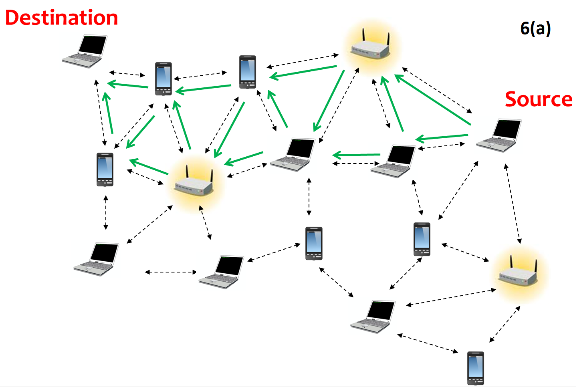
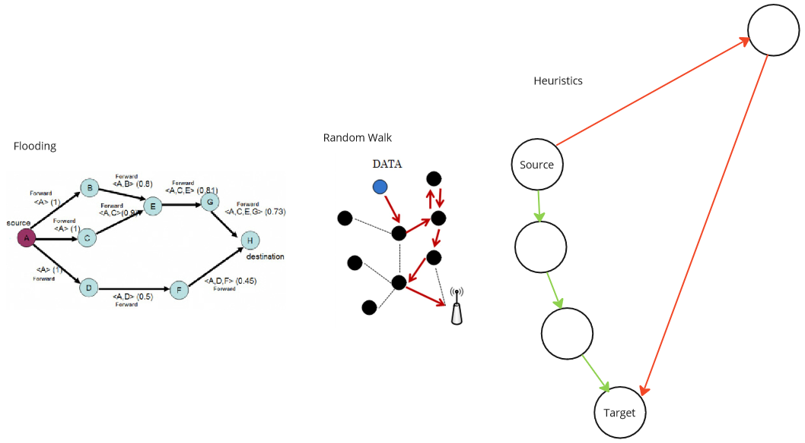
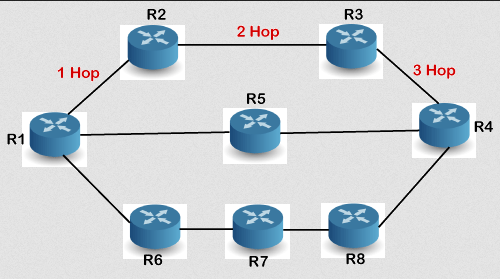

**Main Source:**

- **[Routing — Wikipedia](https://en.wikipedia.org/wiki/Routing)**
- **[Routing protocol — Wikipedia](https://en.wikipedia.org/wiki/Routing_protocol)**

**Routing** is the process of selecting the optimal path for network traffic to travel from the source device to the destination device across an interconnected network. A device will be connected to another device first called [router](/computer-networking/router). Router is responsible for sending and determining the path.

When a device wants to send data over a network, it breaks the data into smaller units called packets. Each packet contains the source and destination addresses along with a portion of the actual data being transmitted. The routing process involves making decisions on how to forward these packets based on the destination address.

When a packet arrives at a router, the router examines the destination address in the packet's header and determine the next hop or interface to forward the packet. The process continues at each router along the path until the packet reaches its final destination. By the way, this process is called **packet forwarding**.

  
Source: https://training.ukdw.ac.id/berita/lihat/12

### Static & Dynamic Routing

In packet forwarding, there are two main approach:

- **Static Routing**: Static routing is a manual method of configuring the route of packet forwarding. In static routing, the routing paths are predetermined and do not change automatically based on network conditions. This mean if there is network failures, static routing can't adapt.

- **Dynamic Routing**: Dynamic routing protocols automate the process of deciding the route in packet forwarding. Router that forwards packet to the router will also send information about network topology, reachability, and link status. Based on this information, routers dynamically calculate the best paths for forwarding packets.

### Routing Technique

Some techniques to route packets are:

- **Flooding**: Flooding is a simple but less efficient routing technique where a router broadcasts a message to all its neighboring routers. Each receiving router, except the one from which the message was received, further broadcasts the message to its neighbors. The process continues until the message reaches the intended recipient(s) or a certain hop limit is reached.
- **Random Walks**: Random walk-based routing algorithms are probabilistic approach that involve making random jumps across the network to locate the desired destination. Routers hop to a random neighbor at each step, gradually approaching the target.
- **Heuristic-based Routing**: Heuristic-based routing algorithms rely on metrics or heuristics to guide routing decisions. These algorithms use common sense or experience to determine the routing process. One commonly used metric is the shortest path, which prioritizes routing packets to routers physically closer to the target rather than minimizing the number of hops. However, it's important to note that heuristics are not always optimal.

  
  Source: [Flooding](https://www.researchgate.net/figure/Route-discovery-through-flooding-algorithm_fig1_271060468), [random walk](https://www.researchgate.net/figure/Random-Walk-Routing-Data-dissemination_fig10_45908491)

### Routing Protocol

Routing protocol are the standardized specification of how router should route its packet. Routing protocol should serve as:

- Decides the optimal path to forward the packet
- Identify and establish connections with other routers in the network to exchange information such as network addresses and network reachability.

The information related to network destinations and the paths to reach them are stored by router in **routing table**. Table are updated dynamically if things such as link failures, network additions, or topology modifications happens.

#### Routing Information Protocol (RIP)

There are many routing protocols, one of the oldest, simplest, and relatively used for small to medium-sized network is the **Routing Information Protocol (RIP)**.

- RIP uses routing table to maintain information about the networks, these table includes how many _hops_ or router it takes to reach them. The table is periodically shared with other neighboring router, and each router will update their table accordingly.
- RIP uses a simple metric called _hop count_ to measure the distance to a network. Each router adds one to the hop count when it forwards a packet. So, if a packet goes through three routers to reach a network, the hop count would be three.
- RIP has a limitation since it is only able to hop maximum 15 times. The minimum hop count is 0, which means it is directly connected to the router. The maximum is 16 that denote it is unreachable.

  
Source: https://www.javatpoint.com/rip-protocol
