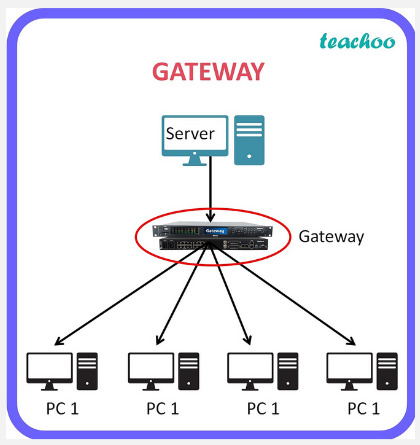
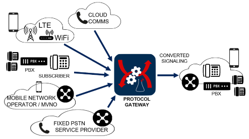

**Main Source:**

- **[Default Gateway Explained — PowerCert](https://youtu.be/pCcJFdYNamc)**
- **[Gateway (telecommunications) — Wikipedia](<https://en.wikipedia.org/wiki/Gateway_(telecommunications)>)**

**Gateway** is a networking device or software component that serves as an entry point or exit point between two different networks. It acts as a bridge or translator, enabling data to flow between networks that use different protocols, addressing schemes, or communication technologies.

Gateway is different with [routers](/cs-notes/computer-networking/router), gateway is a more broader term that refers to any device or software that acts as bridge between networks. Router is a more specific device, it is a type of gateway.

Although, a gateway can be a combination of router, [switch](/cs-notes/computer-networking/switch), and [modem](/cs-notes/computer-networking/dial-up-modem). Basically it act as a device that connects to external network while also able to connect device inside the local network. It communicate with external networks by using telephone lines just like modem.

  
Source: https://www.teachoo.com/16666/3775/Question-5/category/Past-Year---1-Mark-Questions/

### Gateway Types

There are several type of gateway, here are some common types:

- **Default Gateway**: Every device connected to a local network requires a default gateway to communicate with devices on other networks, such as the internet. The default gateway is usually the [IP address](/cs-notes/computer-networking/ip-address) of router that connects the local network to the internet.

- **Protocol Gateway**: A protocol gateway connects networks that use different network protocols. It translates network protocols to enable communication between networks that would otherwise be incompatible. For example, it can be used to connect a local network using Internet Protocol version 4 (IPv4) to a network that uses Internet Protocol version 6 (IPv6).

- **Application Gateway**: An application gateway, also known as an application-level gateway or proxy server, operates at the application layer of the network stack. It acts as an intermediary for specific applications or services, providing functions such as protocol conversion, data caching, security filtering, and load balancing. Application gateways are often used for web traffic, email, or other specific applications.

  
Source: https://labcomsistemas.com.br/en/applications/protocol-gateway/
