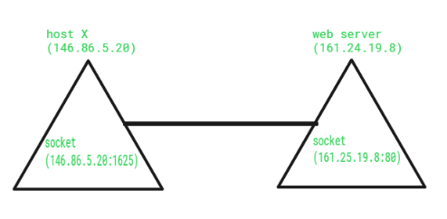
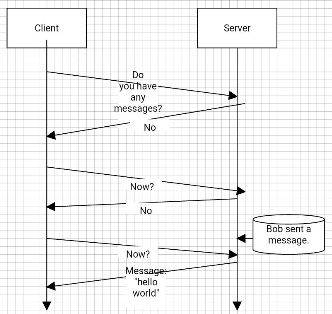

**Main Source: [Oracle Socket](https://docs.oracle.com/javase/tutorial/networking/sockets/definition.html) and some other source from Google and Youtube**

**Socket** is a terms that is more related to software. A socket refers to a software interface that allows programs to communicate with each other over a network. It provides a programming abstraction for network communication, enabling applications to send and receive data across a network. By using socket as an API, programmers are able to make network connection easily.

Socket act as an endpoint between two connected device. A socket is identified by a unique combination of an IP address and a port number. The IP address specifies the destination or source network interface, and the port number identifies a specific endpoint or service on that interface. This combination is often referred to as a **socket address**.

  
Source: https://www.geeksforgeeks.org/socket-in-computer-network/

### How does it works (in high level)

The creation of socket takes what type of [IP address](/computer-networking/ip-address) to use (IPv4 or IPv6) and which type of socket to use. The type of socket refers to what protocol is used to transfer data. Socket provide reliable data transfer by using protocols like [Transmission Control Protocol (TCP)](/computer-networking/tcp-protocol) and [User Datagram Protocol (UDP)](/computer-networking/udp).

After the creation, socket need to be bound to a specific IP address and port number. The socket then transition to a listening state, waiting for incoming connection requests. When a client socket wants to communicate, it establish a connection to the corresponding server's IP address and port number.

Once a connection is established, both the client and server sockets can send and receive data by the appropriate protocol used. When the communication is complete or the application decides to terminate the connection, the sockets will be closed to release the network resources associated with the socket.

  
Source: https://www.cloudnweb.dev/2019/6/what-are-web-sockets-implementing-web-sockets-in-node-js
(WebSocket that uses TCP protocol)
