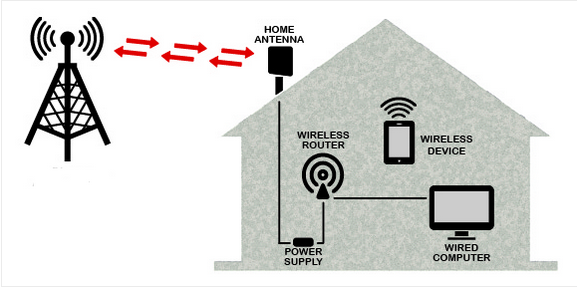

**Main Source: [Cable vs DSL vs Fiber Internet | PowerCert](https://youtu.be/qQYiwmamq38?si=LGH54X5pVZtU64XM)**

**Broadband** refers to high-speed internet access that provides faster data transmission rates compared to traditional [dial-up connections](/computer-networking/dial-up-modem#dial-up-connection). Broadband has become the standard method of internet access, broadband connections are "always-on", meaning there is no need to dial in or establish a connection each time you want to go online.

Unlike dial-up connections, which utilize a single analog channel, broadband connections use a wider range of frequencies or channels to transmit data simultaneously. This allows for faster data transfer rates and the ability to handle more substantial amounts of data.

### Broadband Technology

Broadband technologies differs in some aspects including the medium used for transmission, the data transfer rates they can achieve, and the availability of the technology. Here are some common techonology:

- **DSL (Digital Subscriber Line)**: DSL utilizes existing telephone lines to transmit data, it uses copper wires which traditionally also used for telephone communication. DSL separates the telephone line into two frequency bands, one for voice communication and the other for data transmission. This separation enables simultaneous voice and internet access without interfering with each other.

    
   Source: https://id.aliexpress.com/item/33015194864.html?gatewayAdapt=Msite2Pc

  There are different variants of DSL technology, including:

  - **ADSL (Asymmetric Digital Subscriber Line)**: A DSL technology that offers faster download speeds compared to upload speeds. This is useful for home user that typically download more data than they upload, such as web browsing, streaming media, and downloading files.

  - **SDSL (Symmetric Digital Subscriber Line)**: Offers the same download and upload speeds, typically used in businesses.

  - **VDSL (Very High Bitrate Digital Subscriber Line)**: VDSL provides faster download and upload speeds, although it is more deployed in areas with shorter distances between the user and the telephone exchange.

      
    Source: https://youtu.be/qQYiwmamq38?si=6BejcFALoPHg6Vx4&t=192

- **Cable Internet**: Cable internet is a type of broadband internet access that uses the same coaxial cable infrastructure that delivers cable television signals from (Internet Service Providers ISP) to provide high-speed internet connectivity. It offers faster data transfer rates compared to traditional dial-up and DSL connections.

  The cable can be attached to [gateway](/computer-networking/gateway) that combines router, switch, and modem together. Cable internet connections are typically shared among multiple users within the same neighborhood or local area. This may result in slower connection speed during peak usage periods.

    
  Source: https://youtu.be/qQYiwmamq38?si=5-r9fAH45DVueiEC&t=128

- **Fiber Optic Broadband**: Also known as fiber internet or fiber optic internet, uses fiber optic cables to transmit data. It offers significantly faster speeds and higher bandwidth capacity compared to traditional copper-based broadband technologies like DSL or cable internet. Fiber optic cables are immune to electromagnetic interference, signal loss, and degradation, which can occur with copper-based cables.

  Fiber optic uses pulse of light to transmit data. Digital data are transformed into electrical signal and transformed again into light signal through the process called modulation. Typically uses method such as amplitude modulation (AM) where the amplitude of the light signal is varied based on the voltage levels of the electrical signal.

  Fiber optic broadband also supports hybrid infrastructure. We can use fiber optic to transmit data over long distance, and use copper cable to distribute the data into smaller area.

    
   Source: https://www.lightspeed.co.uk/blog/introducing-full-fibre-broadband

- **Wireless Broadband**: Wireless broadband is a type of broadband internet connection that is delivered wirelessly, without the need for physical cables or wires. Some common wireless technologies include [Wi-Fi (Wireless Fidelity)](/computer-networking/wi-fi) and [cellular networks (such as 3G, 4G, and 5G)](/computer-networking/cellular-networking).

    
   Source: https://www.jks.co.id/wireless-boradband/
