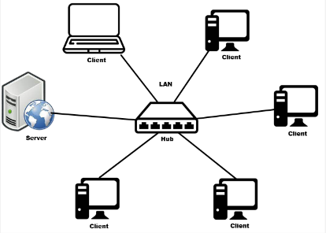
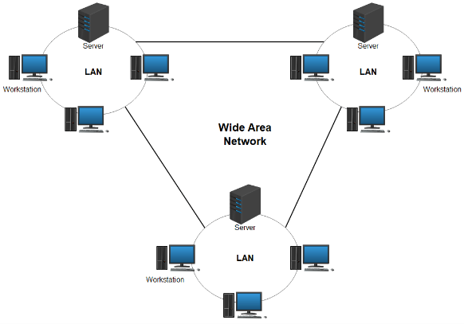
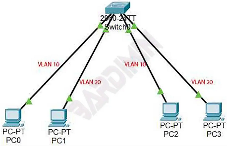

**Main Source:**

- **[Local area netweork — Wikipedia](https://en.wikipedia.org/wiki/Local_area_network)**
- **[LAN, WAN, SUBNET - EXPLAINED — PowerCert](https://youtu.be/NyZWSvSj8ek?si=cWLETY4kctAN1tBz)**
- **[VLAN Explained — PowerCert](https://youtu.be/jC6MJTh9fRE?si=CHBC4RogtqYM7v5c)**

### LAN

**Local Area Network (LAN)** is a computer network that covers small geographic area, typically in single building or group of building that are closes. LANs are commonly used in homes, offices, schools, and other small-scale environments.

LANs connect multiple devices within the network, such as computers, printers, servers, switches, and routers. These devices are interconnected using wired technologies like [Ethernet cables](/computer-networking/ethernet) or wireless technologies like [Wi-Fi](/computer-networking/wi-fi).

LANs also supports the sharing of resources among connected devices. This includes sharing files, printers, internet access, and other network-connected devices or services.

  
Source: https://www.arduinoindonesia.id/2023/05/penjelasan-tentang-jaringan-lan-local-area-network.html

### WAN

**Wide Area Network (WAN)** on the other hand is a type of computer network that spans a large geographic area, connecting multiple LANs (Local Area Networks) or other networks together. These locations can include offices, campuses, data centers, or remote sites and larger area such as city and country.

WANs often rely on the services of telecommunication companies or internet service providers (ISPs) to establish the connectivity and data transmission between locations. Because of long distance, the speed may be lower than LAN, although this also depend to the cable or infrastructure used.

WANs also support a wide range of applications and services, including file sharing, email, video conferencing, remote access, cloud computing, and centralized data storage.

  
Source: https://www.sangfor.com/glossary/cloud-and-infrastructure/what-is-wide-area-network-wan

### Virtual Local Area Network (VLAN)

**Virtual Local Area Network (VLAN)** is a technique used to create logical, isolated networks within a physical local area network (LAN). Devices within a VLAN can communicate with each other as if they were connected to the same physical network, even if they are physically located in different areas or connected to different switches.

By dividing network traffic, VLAN offers simpler network, traffic reduction, and better security. Devices in one VLAN cannot directly communicate with devices in another VLAN unless specific routing or [firewall](/computer-security/network-security#firewall) rules are in place.

Network division works by assigning VLAN ID or VLAN tag to each VLAN. These IDs are used to uniquely identify which VLAN a network packet or frame belongs to. Network devices such as [switch](/computer-networking/switch) may be configured to associate specific ports with particular VLANs. This association determines which VLAN a device belongs to. Devices connected to the same VLAN-configured ports are considered members of the same VLAN.

  
Source: https://bardimin.com/network/mengenal-vlan-dalam-jaringan/
