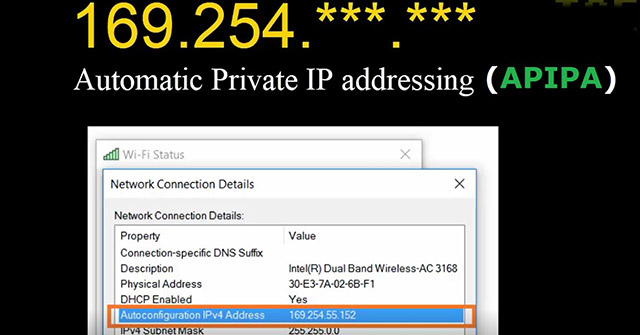

**Main Source:**

- **[DHCP Explained - Dynamic Host Configuration Protocol — PowerCert](https://youtu.be/e6-TaH5bkjo?si=rdy-8mWmonsaucyb)**
- **[ APIPA Explained - Automatic Private IP Addressing — PowerCert](https://youtu.be/0tEjUR6tjBU?si=QJqOaTbiLSZTWg6o)**

In a network, all devices are identified by [IP address](/cs-notes/computer-networking/ip-address), **Dynamic Host Configuration Protocol (DHCP)** is the protocol used to automatically assign IP addresses and other network configuration parameters to devices on a network.

DHCP simplifies the process of network administration by dynamically allocating IP addresses to devices as they connect to the network, rather than requiring manual configuration of each device.

  
Source: https://youtu.be/e6-TaH5bkjo?si=3Kpy1MftxbzUlcfY&t=164

#### Static vs Dynamic IP Address

An IP address that was assigned by network administrator or the user itself is called **static IP address**, if it's configured automatically by DHCP, then it's called **dynamic IP address**.

A static IP address provides predictability, because it can't be changed. It may be suitable for small network. A dynamic IP address is "leased" to a device for specific period. If the address is expired, the device will need to extend the lease. This approach is flexible for larger networks where devices frequently connect and disconnect.

### APIPA

**Automatic Private IP Addressing (APIPA)** is a feature in the Windows operating system that allows devices to automatically assign themselves a private IP address.

When a device are unable to obtain an IP address from a DHCP server for whatever reason, it can still obtain a private IP address. This mean the device can still communicate within the local network, but it can't connect to the internet.

The private IP address obtained will range from `169.254.0.1` to `169.254.255.254` with a 16-bit subnet mask.

  
Source: https://tipsmake.com/learn-about-apipa
