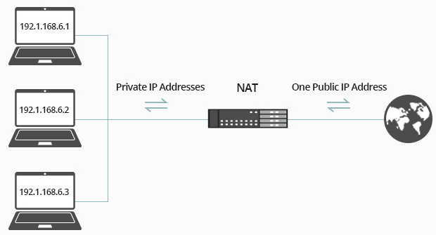

**Main Source:**

- **[NAT Explained - Network Address Translation —PowerCert](https://youtu.be/FTUV0t6JaDA?si=UgboPGAiFC3Rxcug)**

**Network Address Translation (NAT)** is a service in a [router](/cs-notes/computer-networking/router) that translates an IP address into another IP address. One of the primary purpose of NAT is to conserve the limited number of [IPv4 IP address](/cs-notes/computer-networking/ip-address#ipv4).

There are approximately 4.3 billion unique IPv4 addresses. However, this is not enough to uniquely identify all devices around the world. To address this, engineers introduced two types of IP addresses: [public and private](/cs-notes/computer-networking/ip-address#public--private-ip-address). Public IP addresses are used to uniquely identify devices and are publicly registered on the internet. Any device that wants to connect to the internet needs a public address. Private IP address, on the other hand, are not registered to the internet and only used within local or private network such as homes or business.

Using a combination of public and private IP addresses, the router has the public IP address while all the devices within the network use private addresses. This allows us to overcome the limitations of the limited pool of public IP addresses.

NAT acts as a service that translates the public IP owned by the router into private addresses and the router will assign private address to each devices. It can also do the otherwise, if a device wants to connect to the internet, the private address will be translated into public address along with the [port number](/cs-notes/computer-networking/ports) and outgoing packet of data.

  
Source: https://community.fs.com/blog/what-is-nat-and-what-are-the-benefits-of-nat-firewalls.html
