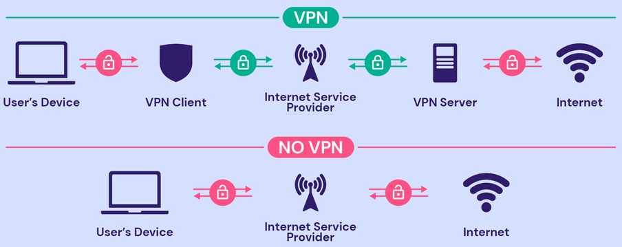

**Main Source: [VPN (Virtual Private Network) Explained | PowerCert](https://youtu.be/R-JUOpCgTZc?si=vIQRWPCVOFV5-vun)**

**Virtual Private Network (VPN)** is a technology used to create a secure connection over a public network such as the internet. It allows users to send and receive data as if their devices were directly connected to a private network, even when they are accessing the internet through a public or untrusted network.

A computer that connects to a server can be monitored by ISP, government, or other malicious actor. By using VPN service, we can secure our connection. A VPN service can be thought as a virtual shield of the connection we establish.

Instead of connecting directly to the server, a VPN service which is operated in a **VPN server**, act as the intermediary of our connection to the server (we make connection to VPN server using a software tool called **VPN client**). So, the VPN server will handle the connection to the actual server we are accessing. It includes requesting, receiving, and sending the response back to us from the server.

VPN is similar with [proxy](/cs-notes/computer-networking/proxy), the difference is a VPN server provides a more secure connection and other benefits.

  
Source: https://www.hostinger.com/tutorials/what-is-vpn

### VPN Benefits

- **Privacy**: VPN will secure your internet traffic and hide your IP address while connecting to a server, a VPN helps protect your privacy and makes it difficult for third parties, such as hackers or government agencies, to monitor your online activities.

- **Security**: VPNs use encryption protocols to secure your data, making it unreadable to anyone who intercepts it. In simple term, the request or data sent from server will be converted into a format that is not readable by human and it can only be transformed back by the intended recipient. This is especially important when connecting to public Wi-Fi networks, which are often unsecured and vulnerable to attacks.

- **Remote Connection**: We can use VPN as a private network. All the devices will be equiped by VPN services. Even if the devices are in remote places, we can connect it to a central location as if it was a local "private" network. Along with security benefits, we can be sure for transferring sensitive data.

- **Bypass Restrictions**: VPNs can help bypass censorship and geolocation restrictions by allowing you to connect to servers located in different regions. This can be useful for accessing blocked websites or services in your country. This works because we are not actually connecting to the actual server, instead the VPN server is the one who connects. We can choose to connect from a VPN server located in a country where the website is not blocked from there.

:::tip
Refers to [computer security cryptography](/cs-notes/computer-security-intro) section to know more about security and encryption.
:::
