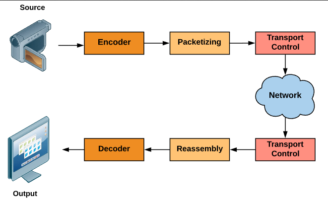

**Main Source: [Real-time Tranport Protocol Wikipedia](https://en.wikipedia.org/wiki/Real-time_Transport_Protocol)**

**Real-time Transport Protocol (RTP)** is a network protocol used for the real-time transmission of audio and video data in the [TCP/IP standard](/cs-notes/computer-networking/tcp-ip-model). RTP is commonly used in applications such as video conferencing, streaming media, and other multimedia applications that require real-time delivery of continuous data.

RTP uses [User Datagram Protocol (UDP)](/cs-notes/computer-networking/udp), which is a simple, lightweight, and efficient mechanism to send data over network. Compared to [TCP protocol](/cs-notes/computer-networking/tcp-protocol), it doesn't guarantee that all data will be sent. UDP's low overhead and reduced latency make it suitable for time-sensitive applications.

### RTP Process

RTP is used for media transmission, so before the transmission happens, these media file need to be encoded first.

1. **Payload Packetization**: RTP packetizes the encoded media into smaller units called RTP packets. Each RTP packet consists of an RTP header and a payload, these packet are numbered in sequence to detect packet loss. The header contains version of RTP, payload type or the type of data being carried, timestamp to maintain synchronization, and other information. The payload is the actual media data.
2. **Transmission**: RTP relies on the [UDP protocol](/cs-notes/computer-networking/udp), the UDP layer delivers the packets to the appropriate receiving application based on the destination port number.

3. **Packet Reassembly**: The received RTP packets are reassembled based on their sequence numbers. This ensures that the media data is reconstructed in the correct order.

4. **Playout Timing**: The timestamp in each RTP packet assists in maintaining proper playout timing at the receiving end. By using the timestamp information, the receiving application or media player can synchronize the playback of the media data.

5. **Media Decoding**: Once the RTP packets are reassembled, they are typically decoded using the appropriate codec. The decoding process reverses the compression applied during encoding, allowing the media data to be rendered or played out accurately. After being decoded, the media is ready to be played by the application.

     
   Source: https://www.oreilly.com/library/view/advanced-infrastructure-penetration/9781788624480/5ce761e5-1024-4556-a0b0-0864a1856de1.xhtml
