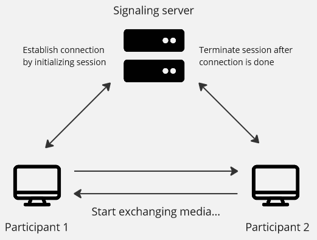
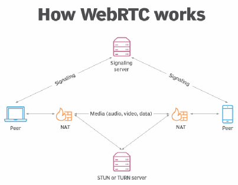

**Main Source:**

- **[How Does WebRTC Work? — heyletscode](https://youtu.be/SsN4gl_wV_8?si=AMKXMF-PNW-0YUJB)**
- **[WebRTC in 100 Seconds — Fireship](https://youtu.be/WmR9IMUD_CY?si=QsSM0JlQ2FnAHcgF)**

**Real Time Communication (RTC)** is a networking protocol used to transmit real-time communication data including voice calls, video calls, instant messaging, and file sharing over the networks. RTC is based on [TCP/IP standard](/cs-notes/computer-networking/tcp-ip-model), it can use the [TCP protocol](/cs-notes/computer-networking/tcp-protocol) or the [UDP protocol](/cs-notes/computer-networking/udp). Although, UDP is more used due to its lower latency and better real-time performance, it prioritizes speed over reliability.

### RTC Process

RTC is a peer-to-peer connection, meaning it doesn't involve server and the participants communicate directly. Server is only involved at the beginning and at the end of communication. RTC is based on session, session is a period of a particular activity. In the context of RTC, it is a period of interaction or communication between participants.

1. **Session Initialization**: The RTC protocol begins with session initialization, where participants indicate their intention to communicate. This is typically achieved through a signaling process and through a signaling server. Signaling is a process of coordinating between participants, it includes setting up and closing connection. This process is necessary to inform participants to communicate and synchronize their actions.

2. **Media Exchange**: Once the session is established, the RTC protocol facilitates the exchange of real-time media streams, such as audio, video, or data. Media streams are typically packetized into smaller units and transmitted over the network. [Real-Time Transport Protocol (RTP)](/cs-notes/computer-networking/rtp) is commonly used for this.

3. **Session Termination**: When participants conclude their communication, the session will be terminated. This involves signaling the end of the session to all participants, releasing resources, and closing the communication channels. Cleanup tasks may include releasing network connections, freeing up system resources, and updating session state information.

   

### WebRTC

WebRTC is a web real-time communication technology that uses RTC protocol. It establishes the same peer-to-peer connections for voice calling, video chat, file sharing, and other forms of real-time communication.

To begin connection, the participant need to send an "offer" to the signaling server. It contains necessary information including protocol version, session name, session identifier, session title, email address, phone number, and other important information. The signaling server will exchange the information between each participant.

Peer-to-peer connection could bring some problems, many devices uses private IP address assigned by [Network Address Translation (NAT)](/cs-notes/computer-networking/nat). These private IP addresses are not directly reachable from the public internet. Another problem is some devices have a [firewall](/cs-notes/computer-security/network-security#firewall) as network security.

WebRTC uses standard called Interactive Connectivity Establishment (ICE). ICE helps avoiding private IP address problem by utilizing STUN (Session Traversal Utilities for NAT) servers. It enables devices to determine their public IP addresses by contacting these servers, allowing them to communicate with the outside world.

ICE also helps overcoming firewall by utilizing TURN (Traversal Using Relays around NAT) servers. TURN servers act as intermediaries, relaying data between devices when direct connections are not possible.

  
Source: https://www.techtarget.com/searchunifiedcommunications/definition/WebRTC-Web-Real-Time-Communications
