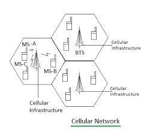
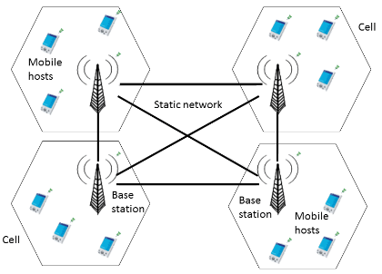
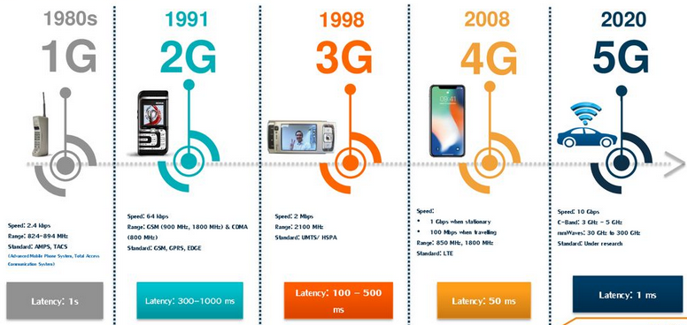

**Main Source:**

- **[How does your mobile phone work? | ICT #1 — Lesics](https://youtu.be/1JZG9x_VOwA?si=FYo3p5nqdAnIhNF0)**

**Cellular Networking** is a technology and infrastructure that enables wireless communication between mobile devices using cellular networks. It uses electromagnetic waves to transfer the data. Digital data in binary digits (1 and 0) will be transformed into high and low frequency respectively. The phone antenna will then emit the signal.

### Cellular Tower

However, there are many problem emitting the electromagnetic signal, there may be obstacle, interference, and limited range of signal transmission. To avoid this, sender's mobile device doesn't send the signal directly to the receiver device. Instead they will send it to a **cellular tower**.

Cellular towers are a freestanding tower designed to support wireless communication. The tower's height helps extend the range of the cellular signal and improve coverage. The tower are spread around a region called **cells**, the cells are hexagon shaped. The purpose of hexagon shape is to cover a region of area without overlapping with other tower.

  
Source: https://www.rfwireless-world.com/Tutorials/cell-phone-tower-basics-and-cell-phone-tower-types.html

Each tower are connected physically, typically using [fiber optic cable](/digital-signal-processing/signal-transmission-medium#guided-transmission). By using fiber optic cable, we can overcome the limitation of electromagnetic signal. The tower will communicate with each other to forward the data received from the sender in the form of light pulse. The tower may receive help from Mobile Switching Center (MSC). MSC will handle a request and determines the appropriate destination or which cell tower to send the data.

  
Source: https://www.researchgate.net/figure/Cellular-network-architecture-for-a-mobile-distributed-system_fig1_323861058

### Cellular Networking Generation

Cellular networking has go through different stage or generation of the technology, this includes advancement in terms of data speeds, capacity, network architecture, and capabilities.

1. **1G (First Generation)**: 1G networks were the first commercially deployed cellular networks. They were analog systems introduced in the 1980s and provided basic voice communication. It uses **Frequency Division Modulation Access (FDMA)**, the data speed is 2.4 Kbps.

2. **2G (Second Generation)**: 2G networks is the transition from analog to digital cellular networks. They introduced digital voice communication and improved data services (such as SMS or text messaging). Notable 2G technologies include **Global System for Mobile Communications (GSM)** and **CDMA (Code Division Multiple Access)**. 2G data speeds ranges from 9.6 Kbps to 384 Kbps.

3. **3G (Third Generation)**: 3G networks were a significant leap forward in terms of data transfer speeds and capabilities. They enabled higher-quality voice calls, faster data connections, and the introduction of services such as video calling, mobile internet access, and multimedia streaming. Technologies like Universal **Mobile Telecommunications System (UMTS)**, **Wideband Code Division Multiple Access (WCDMA)**, and **CDMA2000** were used for 3G networks. On average, 3G networks offered download speeds of around 1-2 Mbps and upload speeds of up to 500 kbps.

4. **4G (Fourth Generation)**: 4G networks represented a major advancement in cellular technology. They provided significantly faster data speeds, lower latency, and improved network capacity compared to 3G. 4G networks enabled high-definition video streaming, online gaming, cloud services, and a wide range of mobile applications. The most widely used 4G technology is **LTE (Long-Term Evolution)**. It uses the **Multiple Input Multiple output (MIMO)** and **Orthogonal Frequency Divsion Multi Access (OFDMA)**. Typical 4G speeds can range from 5 Mbps to over 100 Mbps for downloads, with upload speeds ranging from 1-50 Mbps.

5. **5G (Fifth Generation)**: 5G is the latest generation of cellular networking technology. It offers even higher data transfer speeds, ultra-low latency, massive network capacity, and advanced capabilities. 5G networks are designed to support emerging technologies such as virtual reality, augmented reality, autonomous vehicles, industrial automation, and the Internet of Things (IoT). 5G speeds can range from 100 Mbps to several gigabits per second (Gbps) for downloads, with upload speeds ranging from 50 Mbps to several hundred Mbps.

  
Source: https://slideplayer.com/slide/16305995/
