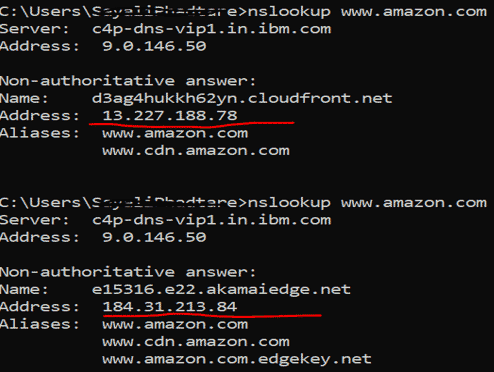
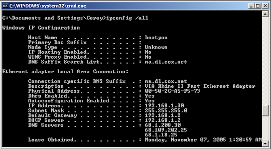
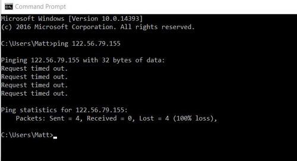
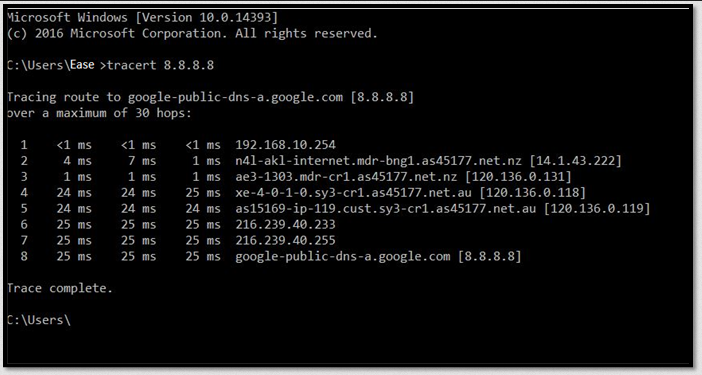
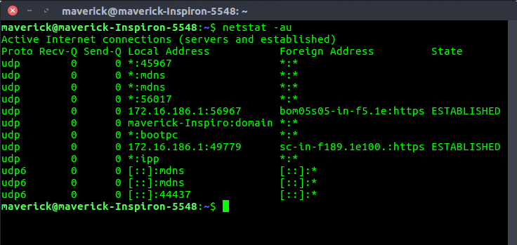

**Main Source:**

- **[IPCONFIG Explained - Flush DNS Cache — PowerCert](https://youtu.be/ZKhorleA5aA?si=ryGAucxqelZAEB4r)**
- **[Traceroute (tracert) Explained - Network Troubleshooting — PowerCert](https://youtu.be/up3bcBLZS74?si=dcs7Jog1w_AyEhMh)**
- **[PING Command - Troubleshooting Networks — PowerCert](https://youtu.be/IIicPE38O-s?si=bvzJYh_-lNDtqp3W)**
- **[NETSTAT Command Explained — PowerCert](https://youtu.be/8UZFpCQeXnM?si=RKd7IngyMP2zx0A-)**

**Networking Command** used to manage and troubleshoot network connections and configurations. They are typically executed in a command-line interface (CLI) or terminal window.

  
Source: https://www.educba.com/windows-networking-commands/

Here are some commonly used networking commands:

### ipconfig

ipconfig displays network configuration within a TCP/IP network providing information such as [IP addresses](/computer-networking/ip-address), [subnet masks](/computer-networking/subnet-mask), and [default gateways](/computer-networking/gateway). The specific command depends on the operating system. On Windows, it's ipconfig, while on Unix-like systems (Linux, macOS), it's ifconfig.

The ipconfig /all displays the full TCP/IP configuration of your network adapters. There is also a is commonly used command, ipconfig /flushdns. It is used to clear the locally stored [Domain Name System (DNS)](/computer-networking/dns) information on a device. These cache are stored to speed up future request to the same domain.

  
Source: https://en.wikipedia.org/wiki/Ipconfig

### ping

The ping command is a commonly used network utility that sends **Internet Control Message Protocol (ICMP)** echo request packets to a specific IP address or domain name and measures the round-trip time (RTT) for the packets to reach their destination and return.

The primary purpose of the ping command is to check the connectivity and reachability of a network host or IP address and to measure the network latency or response time. It is often used for troubleshooting network connectivity issues and diagnosing network problems.

For example, we may send a request to a server to know how long would it take to get a response. The packet loss refers to how many data in packets are lost in delivery, the higher means the worse connectivity.

  
Source: https://support.n4l.co.nz/s/article/How-to-use-Ping

### tracert

tracert command is a network diagnostic tool available on Windows operating systems. It is used to trace the route that packets take from your computer to a target destination (IP address or domain name) on a network.

The tracert command works by sending a series of Internet Control Message Protocol (ICMP) Echo Request packets with incrementally increasing Time to Live (TTL) values. Each packet is sent to the target destination, and as it passes through routers along the network path, the routers decrement the TTL value. When the TTL reaches zero, the router discards the packet and sends an ICMP Time Exceeded message back to the sender. By analyzing these ICMP messages, the tracert command determines the IP addresses of the routers that the packets traverse.

  
Source: https://www.easeus.com/knowledge-center/tracert-traceroute-command.html

### netstat

netstat, short for network statistics is a command-line network utility available on various operating systems, including Windows, Linux, and macOS. It provides information about network connections, network interfaces, and network statistics.

Some of the information are:

- **Active Network Connections**: netstat can show a list of currently active network connections on the system. This includes information such as the local and remote IP addresses, port numbers, connection state (e.g., established, listening, closed), and the process ID (PID) associated with each connection.

- **Listening Ports**: It can display a list of network ports on which the system is listening for incoming connections. This information can be useful to identify which services or applications are actively accepting network connections.

- **Network Interface Statistics**: netstat can provide statistics and information about the network interfaces on the system, including the number of packets sent and received, errors, collisions, and other interface-specific details.

- **Routing Table**: It can show the system's routing table, which contains information about network routes, gateways, and interface assignments. This information is crucial for determining how network traffic is routed between different networks.

  
Source: https://www.geeksforgeeks.org/netstat-command-linux/
