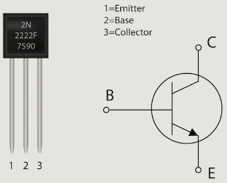
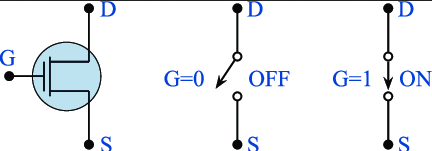
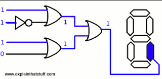
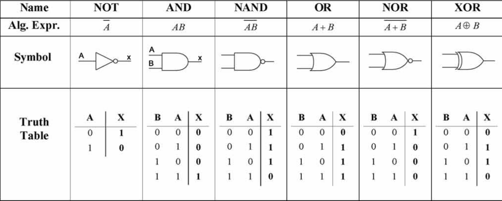
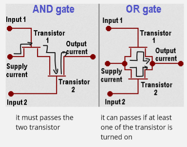

**Main Source:**

- **[Boolean Logic & Logic Gates: Crash Course Computer Science #3 — CrashCourse](https://youtu.be/gI-qXk7XojA?si=eiT1ByweED5m8IpH)**

**Boolean Logic** is algebraic logic that deals with **boolean** value, which is a binary value that can be **true** or **false**. In boolean logic, we are concerned of what we can do with boolean values. It is the formal system of logic used for reasoning in our daily life.

For example, when deciding whether to go outside, we might consider the conditions "Is it raining?" and "Do I have an umbrella?" If it is raining (true) and we have an umbrella (true), then the logical outcome might be to go outside. If either of these conditions is false, we might decide to stay indoors.

Boolean logic allows us to represent and analyze these kinds of logical relationships systematically. We can analyze their behavior and properties abstractly, without relying on examples.

:::tip
[Bitwise operation](/computer-and-programming-fundamentals/bitwise-operation) is the operation that operates on individual bits of binary data, which uses boolean logic as the rules and principles.
:::

### Transistor

Computer can only understand binary 1s and 0s. In electronic systems, such as computers, under the hood, anything is represented and processed using electrical voltages. These voltages can be either high (binary digit 1) or low (binary digit 0).

From high-level language, translated to machine language, then it will be interpreted by each computer hardware, which built in electronic circuits and will be able to generate electrical signals.

Transistor is the building blocks of modern electronic circuits. It is simply a switch that will let current flow from the source (collector) to the target (emitter). When the transistor is turned on, significant current will flow through it. When it is turned off, no significant current will flow through it. Transistor will be turned on or off based on the input voltage or current applied from the source (base).

  
Source: https://builtin.com/hardware/transistor

The electric signal will be interpreted as 0, when the transistor is turned off. When the hardware interprets electric signal as 1, the transistor must be turned on. Many more transistors will be used together to construct an electronics system.

  
Source: https://www.researchgate.net/figure/Transistor-symbol-and-binary-interpretation-as-ON-OFF-switch-The-digital-operation-of_fig1_340062372

### Logic Gates

When doing complex logic or computation, computer will rely on other component of digital circuits. The logic gates are the building blocks of digital circuits, it performs logical operations on one or more binary inputs to produce a binary output. Basically, logic gate is what makes bitwise operation possible in computer.

  
Source: https://www.explainthatstuff.com/logicgates.html

- **AND**: Takes two input, only produces (1), if both input are (1).
- **OR**: Takes two input, only produces (1), if any of the input is (1).
- **NOT (Inverter)**: Takes one input, produces the inverse. Taking input (1) will produce (0) and vice versa.
- **XOR (Exclusive OR)**: Takes two input, only produces (1), if only the input is different. It is similar to OR, with difference, the two input must be different.
- **NAND (NOT-AND)**: Combination of AND followed by NOT gate. It produces the complement of AND gate.
- **NOR (NOT-OR)**: Combination of OR followed by NOT gate. It produces the complement of OR gate.

And many more...

  
Source: https://computerscienceigsce.wordpress.com/chapter-3/

Under the hood, each logic gates will have different kind of electrical construct. They consist of transistors, which act as switches to control the flow of current.

For example, the OR gate can be constructed using two transistors. The two transistors will be connected in parallel, with the common emitter or the same supply current. When any input produces 1s, transistor will be turned on, allowing current to flow. When the transistor is turned on, the current from emitter will go through it to the output current.

  
Source: https://www.pctechguide.com/cpu-architecture/principles-of-cpu-architecture-logic-gates-mosfets-and-voltage (with modification)
