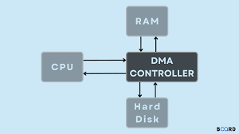

**Main Source:**

- **[UNIKOM powerpoint](https://repository.unikom.ac.id/50439/1/pertemuan6.pptx)**

CPU receives data and instructions from higher-level programs, which typically depend on external input devices like mice and microphones. Additionally, the programs may require the use of external output devices, such as speakers, to produce sound output.

These various I/O devices needs to communicate to the CPU. I/O devices will first capture the input and there will be a hardware component that is responsible for converting the captured input to instruction for CPU to execute. Similarly, we will also need hardware component for converting the processed data to output devices.

These hardwares are called **I/O modules**, they facilitate the communication between I/O devices and the CPU or memory in a computer system. These modules provide the necessary interfaces and protocols for connecting various types of I/O devices to the system and enable the exchange of data between the devices and the CPU.

### I/O Modules

An I/O modules typically consist of **interface** and **controller**.

#### Interfaces

**Interfaces** are the electrical or physical connectors, such as USB ports for variety of I/O devices, Ethernet ports for networking, or audio jacks for I/O related to audio. The component in CPU talks to each other using **system buses**, specifically I/O bus for I/O interaction. It serves as a shared link that allows data to be exchanged between the CPU, memory, and I/O devices. I/O interfaces makes it possible for I/O devices to connect with the buses.

  
Source: https://edurev.in/t/97679/Input-Output-interface-Computer-Organization-and-A

  
Source: https://study.com/learn/lesson/nic-network-interface-card-types-function.html

#### I/O Controller

I/O controller is the hardware component which will handle the necessary protocols and logic for data transfer. It acts as an intermediary between the CPU, memory, and the I/O devices, that handles data transfer and communication.

Function of I/O controller:

- **Data Buffering**: I/O controller may use data buffers or temporary storage areas to handle the flow of data between the CPU/memory and the I/O devices systematically.
- **Error Detection & Interrupt Handling**: Notify the CPU about interrupt events, data availability, or any error that happens in the I/O devices.

  
Source: https://witscad.com/course/computer-architecture/chapter/io-communication-io-controller

While I/O controller is the hardware level for handling communication, **device driver**, specifically **I/O driver**, is the component which enables communication in the software level between the operating system (OS) with the I/O controller.

Device driver provides a standardized interface to the operating system, allowing it to send commands, requests, status, or data to the I/O controller or device.

  
Source: https://repository.unikom.ac.id/50439/1/pertemuan6.pptx

### I/O Technique

There are various approaches and strategies to manage input and output operations between a computer system and its peripheral devices.

#### Interrupt-Driven I/O

Interrupt is a signal that is used to indicate that the normal execution of the CPU should be diverted to handle a specific event or condition. It is a hardware or software-generated signal that notifies the CPU to suspend its current task and execute an interrupt handler routine, which will handles the event or condition that triggered the interrupt.

In interrupt-driven IO, the CPU initiates an I/O operation and then continues with other tasks. Once the I/O operation is completed, the I/O device sends an interrupt signal to the CPU, indicating that the data transfer is finished. The CPU then suspends its current task, services the interrupt, and transfers the data between the I/O device and memory. Interrupt-driven IO reduces CPU involvement in data transfers, allowing for multitasking and improved system performance.

#### Programmed I/O

In this technique, the CPU directly controls the data transfer between the I/O device and the main memory. The CPU issues specific I/O instructions to transfer data between the device and memory and will wait for the operation to complete. Everything is done by CPU, I/O devices will not be able to interrupt. Programmed IO is simple to implement but can be inefficient since the CPU is involved in each data transfer, leading to slower overall system performance.

#### DMA

DMA is a technique that allows data transfer between an I/O device and memory without direct CPU involvement. CPU will not be involved during the data transfer, the I/O device, which is managed by a DMA controller will transfer the data directly from the I/O device to the memory. This techinque can significantly reduces CPU overhead and improves I/O performance, especially for large data transfers.

  
Source: https://www.boardinfinity.com/blog/direct-memory-access/

#### Memory-mapped I/O

**Memory-mapped I/O** is a technique where the CPU assign a specific range of memory addresses that it can use to send and receive data. The CPU can access the I/O device by reading from or writing to these memory addresses just like it would for regular memory operations.

When the CPU issues a read/write operation to a memory address, there will be an address decoder, which will routes the request to the appropriate I/O device instead of main memory.

  
Source: https://embeddedsystemvn.wordpress.com/2021/08/07/memory-mapped-i-o/
