**Main Source:**

- **[Assembly language — Wikipedia](https://en.wikipedia.org/wiki/Assembly_language)**
- **[Assembly Language in 100 Seconds — Fireship](https://youtu.be/4gwYkEK0gOk?si=faihHjHQNrGx28NV)**
- **Chapter 10, Introduction to Compilers and Language Design - Douglas Thain**


**Assembly Language (asm)** is a low-level programming language that is between the machine code (binary instructions understood by the computer's hardware) and high-level programming languages (which is readable by humans). asm can be thought as a human-readable representation of machine code instructions. With asm, programmers can see the code that interacts directly with the computer's hardware.

Due to the direct interaction with the hardware, asm is specific to a particular computer architecture or processor family. Different processors have their own assembly languages, tailored to their instruction sets, registers, and addressing modes. Therefore, code written in assembly language is not portable across different hardware platforms without modification. Similarly, this what makes one program can't always be run in any platform, because it has to be compiled to different asm.

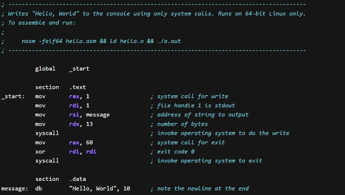  
Source: https://www.investopedia.com/terms/a/assembly-language.asp

### Translation to Machine Code

Assembly language uses mnemonic instructions, which are short and easy to remember symbol that represent a single instruction in the machine. The instructions are then combined with operands, which are values or addresses that the instructions operate on.

Once assembly language is written, it needs to be translated into machine code, this process is known as **assembly**. An assembler is used to convert the mnemonic instructions and symbolic names into the binary instructions understood by the target processor. The assembler looks up on the instruction table how the mnemonic instructions map to the binary codes. It will also perform other necessary steps, such as, calculating memory addresses, calculating constant expressions, combining the instruction with the operands, etc.

Assembly language also provide a way for programmers to define instruction that are not executed by the processor but provide instructions to the assembler, they are called **directives**. They help programmer to organize and control the assembly code.

Assembler translates assembly language into machine code called **object files**. An assembly program that depends on external source files or libraries needs to be linked together. After object file of each is produced, a linker will resolve all external references to them. It locates and loads various definition of function to create the final executable.

#### Example

For example, we can write instruction (or produced from compilation) like `MOV AL, 61h`, which instructs the processor to move the immediate value `61h` (number 61 hexadecimal or 97 in decimal) to the register `AX`. The assembler will translate this particular instruction to binary code: `10110000 01100001`.

- `10110` is the `MOV` instruction in binary.
- Register `AX` is identified by `000`.
- The binary equivalent of hexadecimal `61` is `01100001`.

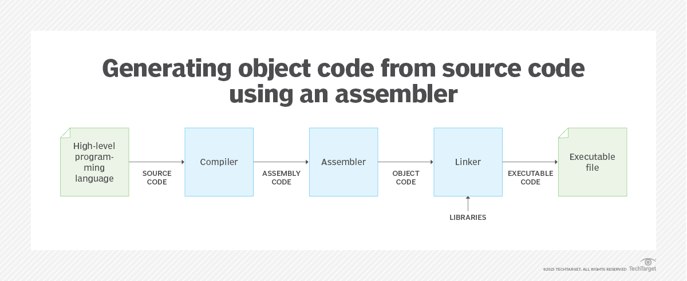  
Source: https://www.techtarget.com/searchdatacenter/definition/assembler

### Type of Instruction

Common type of instructions in assembly language:

- **Data Movement Instructions**: These instructions move or copy data between registers, memory, and I/O devices.
- **Arithmetic and Logic Instructions**: These instructions perform arithmetic operations such as addition, subtraction, and multiplication; and logical operations such as bitwise AND, OR, NOT, and XOR on data.
- **Control Flow Instructions**: These instructions control the flow of execution within a program. Examples include changing program flow with or without a condition, or jumping to specific part of program after a function finishes its execution.
- **Input/Output Instructions**: These instructions facilitate communication between the processor and I/O devices.
- **Stack and Memory Management Instructions**: These instructions manipulate the stack (pushing or popping values) and manage memory operations such as allocating and deallocating memory.

### Syntax & Instructions

Three elements of assembly code:

- **Directives**: Directives start with a dot, which indicates starting position of a section. Assembly code is divided into several sections, there are sections for code, which contains the actual logic of the program, section to declare variable and constants, and defining linker.
- **Labels**: End with a colon, indicating a point of interest in the program, which can be used in the code section, such as the beginning of a subroutine, a loop, or a branch target.
- **Instructions**: The actual assembly code, which is typically written line by line, with each line representing a single instruction.

There are many instruction keywords in asm:

- **Instructions**

  - **MOV (Move)**: Copies the value from one location to another. It is used to transfer data between registers, memory locations, and immediate values.
  - **ADD (Addition)**: Performs addition between two values and stores the result.
  - **SUB (Subtraction)**: Performs subtraction between two values and stores the result.
  - **MUL (Multiplication)**: Performs multiplication between two values and stores the result.
  - **DIV (Division)**: Performs division between two values and stores the quotient.
  - **INC (Increment)**: Increments the value of a register or memory location by 1.
  - **DEC (Decrement)**: Decrements the value of a register or memory location by 1.

- **Bitwise Operations**

  - **AND (Bitwise AND)**: Performs a bitwise AND operation between two values.
  - **OR (Bitwise OR)**: Performs a bitwise OR operation between two values.
  - **XOR (Bitwise XOR)**: Performs a bitwise XOR operation between two values.

- **Registers**

  - **AX, BX, CX, DX, EBX (general-purpose registers)**
  - **AL (accumulator low)**
  - **EAX (extended accumulator)**
  - **SP (stack pointer)**
  - **BP (base pointer)**
  - **SI (source index)**
  - **DI (destination index)**
  - **IP (instruction pointer)**
  - **FLAGS (flags register)**

- **Control Flow**

  - **CMP (Compare)**: Compares two values and sets the flags based on the result.
  - **JMP (Jump)**: Transfers program control to a specified location in the code.
  - **JZ (Jump if Zero)**: Jumps to a specified location if the zero flag is set.
  - **JNZ (Jump if Not Zero)**: Jumps to a specified location if the zero flag is not - set.
  - **JE (Jump if Equal)**: Jumps to a specified location if the equal flag is set.
  - **JNE (Jump if Not Equal)**: Jumps to a specified location if the equal flag is not set.
  - **CALL (Call)**: Calls a subroutine or function at a specified location. This instruction actually include jumping to the function address and leaving a return address for the stack pointer to return after the subroutine is finished.
  - **RET (Return)**: Returns from a subroutine to the calling code.

- **Stack Operations**

  - **PUSH (Push)**: Pushes a value onto the top of the stack.
  - **POP (Pop)**: Removes a value from the top of the stack.

- **Directives**

  - **DB (define byte)**
  - **DW (define word)**
  - **DD (define doubleword)**
  - **DQ (define quadword)**

- **Data Types**

  - **BYTE**: A single byte of data
  - **WORD**: 16-bit value or two bytes of data.
  - **DWORD**: 32-bit value or four bytes of data.
  - **QWORD**: 64-bit value or eight bytes of data.

#### Example

Example of asm code for adding two number

```asm
section .data
    num1 db 5     ; Define a variable called num1, which is a byte and has the value of 5
    num2 db 3     ; Define a variable called num2, which is a byte and has the value of 3

section .text
    global _start
_start:
    ; Load num1 into al register
    mov al, [num1]

    ; Add num2 with num1 in al
    add al, [num2]

    ; Store the result in another variable
    mov [result], al

    ; Exit the program
    mov eax, 1       ; System call number for exit
    xor ebx, ebx     ; Exit status code (0 for success)
    int 0x80         ; Perform the system call

section .data
    result db 0      ; Variable to store the result
```

The `section .data` is a section directive to define and initialize data such as variables, constants, and strings. The `section .text` is the section for program's executable instructions. `_start` is a label that marks the entry point of the program.

### x86 Assembly Language

They are assembly language that represent instructions for [x86 architecture](/computer-organization-and-architecture/isa#x86), which originate from the original Intel 8086 processor.

#### x86 Registers

There are 16 general purpose register for the 64-bit x86 architecture.

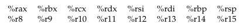  
Source: Book 1 page 152

- `%rax`: Accumulator register
- `%rbx`: Base register
- `%rcx`: Counter register
- `%rdx`: Data register
- `%rsi`: Source index register
- `%rdi`: Destination index register
- `%rbp`: Base pointer register
- `%rsp`: Stack pointer register
- `%r8` - `%r15`: Additional general-purpose registers

Each register has evolved sizing from 8 bits, 16 bits, 32 bits, and 64 bits. For example `%rax` was known ax `%eax` in 32 bits.

#### x86 Addressing Modes

To specify the location of data operands or instructions (also known as **addressing modes**):

- Instruction is provided with the data types for its operand. The `MOV` instruction moves data between registers and memory. `MOVB`, `MOVW`, `MOVL`, `MOVQ`, moves byte (8 bits), word (16 bits), long (32 bits), and quadword (64 bits), respectively.
- **Global addressing**: Operand is global value, can be a defined label.
- **Immediate addressing**: The operand 42 is a constant value `MOVQ %rax, 42`.
- **Register addressing**: Operand `rbx` originate from a register `MOVQ %rax, %rbx`.
- **Indirect addressing**: Operand is indirectly located in a register by memory address, such as the stack pointer `%rsp`.
- **Base-relative addressing**: Operand is specified from an address added with constant (e.g., `-16(%rcx)`, 16 bytes before `%rcx`).
- **Complex addressing**: Used to address element in an array in the form of `D(Ra, Rb, C)`, which refers to the value at address `Ra + Rb * C + D`. `Ra` and `Rb` are general purpose registers, which gives size of the array and index of the array, respectively. `C` gives the size of the items in the array and `D` is offset relative to that item.
  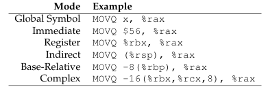  
  Source: Book 1 page 155

#### x86 Arithmetic

`ADD` and `SUB` adds and subtracts, respectively, both require two operands, which a source and target. For example, `ADDQ %rbx, %rax` adds `%rbx` to `%rax`, overwriting previous content of `%rax`.

More complex example can be translated into:

```
c = a + b + b

MOVQ a, %rax
MOVQ b, %rbx
ADDQ %rbx, %rax
ADDQ %rbx, %rax
MOVQ %rax, c
```

`IMUL` (integer multiply) of two 64 bits integer can potentially result in 126 bits integer. To multiply, we must provide one operand in the `IMUL` instruction and place one operand in `%rax`. The lower 64 bits of the result is stored in `%rax`, while the higher one is placed implicitly in `%rdx`.

```
c = b * (b + a)

MOVQ a, %rax
MOVQ b, %rbx
ADDQ %rbx, %rax
IMULQ %rbx
MOVQ %rax, c
```

`IDIV` instruction performs division by dividing a 128-bit dividend, by a specified divisor. The low 64 bits and high 64 bits are stored in `%rax` and `%rdx`, respectively. The quotient is then stored in `%rax`, and the remainder is stored in `%rdx`.

`INC` and `DEC` increment and decrement register destructively.

```
a = ++b

MOVQ b, %rax
INCQ %rax
MOVQ %rax,b
MOVQ %rax, a
```

`AND`, `OR`, `XOR` perform [bitwise operations](/computer-and-programming-fundamentals/bitwise-operation) on two values, while `NOT` performs on one value.

```
c = (a & ~b)

MOVQ a, %rax
MOVQ b, %rbx
NOTQ %rbx
ANDQ %rax, %rbx
MOVQ %rbx, c
```

#### x86 Comparisons & Jumps

`JMP` may be used to jump between part of program. It can be used with label to create a loop:

```
      MOVQ $0, %rax
loop: INCQ %rax
      CMPQ $5, %rax
      JLE loop
```

This initializes `%rax` with the value 0. It is then incremented with `INCQ` and compared with the value 5 using the `CMPQ` instruction. If the comparison fails, it jumps back to the starting loop. Under the hood, the comparison should set internal registers (called `EFLAGS`) to 0 or 1, indicating the result. We don't need to look at that register directly; it is done implicitly.

If we were to remove comparison and use `JMP` instead of `JLE`, this would result in infinite loop.

#### x86 Stack

Stack operation that pushes and pops element from the stack is done by manipulating the stack pointer (`%rsp`).

```
SUBQ $8, %rsp
MOVQ %rax, (%rsp)
```

This is essentially pushing `%rax` to the stack. Stack pointer, keeping track the bottom-most item on the stack (actually the top of stack because the stack grows to bottom), is subtracted by 8 (the size of `%rax` in bytes), then we move content of `%rax` to the location pointed by the stack pointer.

Popping a value is kind of the reverse process.

```
MOVQ (%rsp), %rax
ADDQ $8, %rsp
```

Both operation is frequently used that they have their own instructions, namely `PUSH` and `POP`.

#### x86 Calling Function

A function can be called with the `CALL` instruction. Under the hood, it pushes the current instruction pointer (return address) onto the stack, then jump to the code location of the function. Also, we need to place the function arguments (as well as evaluate them) in some specified registers, this is same for the return value.

Registers need to be preserved and restored across function call. Depending on the language, it can either be the caller or the callee that saves the value. See [calling sequences](/compilers-and-programming-languages/subroutines#calling-sequences).

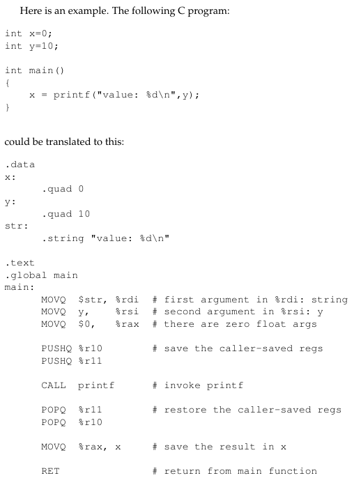  
Source: Book 1 page 161

:::tip
See also [call stack](/compilers-and-programming-languages/subroutines#call-stack)
:::

### ARM Assembly Language

The [ARM](/computer-organization-and-architecture/isa#arm) assembly starts from 32 bits. It is based on [RISC](/computer-organization-and-architecture/isa#risc), rather than [x86](/computer-organization-and-architecture/isa#x86) which is based on [CISC](/computer-organization-and-architecture/isa#cisc).

#### ARM Registers

ARM-32 has 16 general purposes registers, named from `r0` to `r15`.

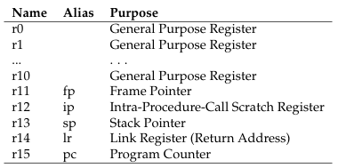  
Source: Book 1 page 167

There are additional registers which can't be accessed directly, namely Current Program Status Register (CPSR) and Saved Program Status Register (SPSR). They are used to store processor's status and control information, such as the result of comparison instruction.

Data types in ARM:

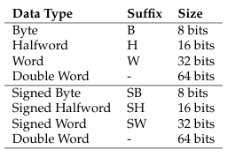  
Source: Book 1 page 168

#### ARM Addressing Modes

ARM separates instruction to copy data between registers and between registers and memory. `MOV` can be used to copy data and constants between register, `LDR` (load) and `STR` (store), to move data between registers and memory.

This is an example of moving data between registers using `MOV`. Immediate value is denoted with `#`, and they must be lower than 16 bits, else `LDR` should be used. ARM places destination register on the left, while source is on the right (except for `STR`).

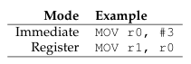  
Source: Book 1 page 168

- Move value 3 to register r0.
- Move value of register r0 to register r1.

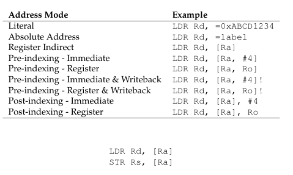  
Source: Book 1 page 169

- Rd: destination register
- Rs: source register
- Ra: register that holds address

Moving between registers and memory using `LDR` and `STR`, we typically denote address given by register with square brackets. Both takes the destination (for `LDR`) or source register (for `STR`) as the first argument, and source (for `LDR`) or destination (for `STR`) memory address as the second argument.

For example, to load a value from an address and store it in register:

```
LDR r0, =address
LDR r1, [r0]
```

We must do it in two instruction. ARM assembly does not have a single instruction that loads a value from a given memory address directly into a register. Address must be loaded to register first, then the address is actually loaded when moving it to another register.

For a large literal or absolute address, which do not fit in 32 bits, they must be stored in **literal pool**. It is section of the program that stores data and can be accessed using `=` sign. It is similar to accessing a label.

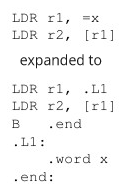  
Source: Book 1 page 170

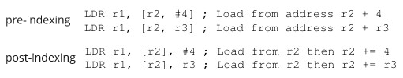  
Source: Book 1 page 169, 170

The pre-indexing means that we are modifying the source address before it is loaded, while the post-indexing modifies the source address after the load, both happen before the `LDR` instruction. The pre-indexing is useful to specify offset relative to the base address, while the post-indexing is useful to specify offset relative to the loaded address.

#### ARM Arithmetic

Basic arithmetic are performed with `ADD`, `SUB`, and `MUL`. There are also `ADC` and `SBC` to add and subtract with carried value from the register flag.

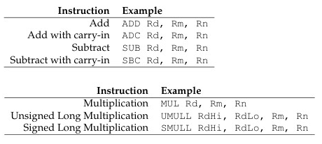  
Source: Book 1 page 171

These take destination register as the first argument, in which it performs the desired operation using the two operands provided in the second and third argument.

Multiplication instruction is different to add and subtract, similar to x86. The multiplication between two 32-bit number can possibly result in 64-bit value, so the result of the multiplication is stored in two 32-bit registers (the `RdHi` and `RdLo`).

:::info
ARM doesn't support `DIV` instruction directly due to its relatively complex operation. Implementing a dedicated hardware unit for division would increase complexity and require more cost. Instead, division is performed by standard library that implement division using other method, typically involving other arithmetic operators and bitwise operations.
:::

Below is bitwise operations on ARM.

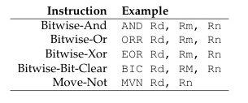  
Source: Book 1 page 171

#### ARM Comparisons & Branches

As mentioned before, result of comparison is stored in the CPSR. It may result in:

- Z (zero): Operands are equal
- N (negative): First operand is less than second operand

For example, when comparing between register and immediate value, we put the immediate value in the second operand:

```
CMP Rd, Rn
CMP Rd, #imm
```

:::tip
Arithmetic instruction can also modify the CPSR. It is done by appending "S" to instruction (e.g., `SUBS`). This will do the desired arithmetic operation and storing the result, while also updating the CPSR.
:::

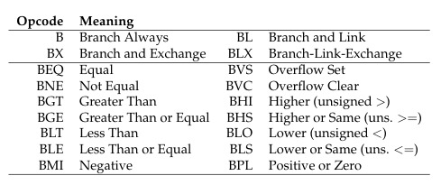  
Source: Book 1 page 172

With comparison, we can now construct loops. There are various branching mechanism in ARM. For example, to loop from 0 to 5:

```
      MOV r0, #0
loop: ADD r0, r0, 1
      CMP r0, #5
      BLT loop
```

:::tip
In addition, ARM provides way to reduce branching by providing arithmetic instruction that checks the CPSR after comparison.

```
CMP r0, r1
ADDLT r0, r0, #1
ADDGE r1, r1, #1
```

Depending on the flag, either ADD less than or ADD greater than is executed.
:::

#### ARM Stack

The stack pointer register is known as `sp`. Pushing an item, such as register `r0` require us to subtract the `sp` and store (using `STR`) the `r0` into `sp`.

```
SUB sp, sp, #4
STR r0, [sp]
```

Recall that `STR` place destination on the right and source on the left. This can be simplified with pre-indexing: `STR r0, [sp, #-4]!`. `sp` is added with `-4`, and the result is also written back to `sp` (using the `!`), then the result serve as the destination for `r0`.

Further, can be simplified into the `PUSH` instruction: `PUSH {r0, r1, r2}`

It's the opposite for pop.

```
LDR r0, [sp]
ADD sp, sp, #4

LDR r0, [sp], #4

POP {r0,r1,r2}
```

#### ARM Calling Function

ARM describes the convention of calling function below.

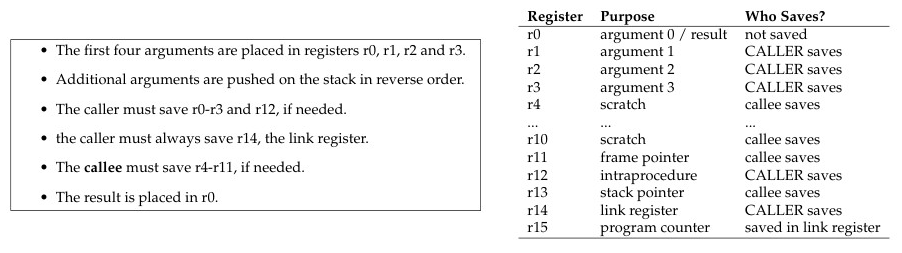  
Source: Book 1 page 174

Jumping to a function is done with `BL` instruction. Example of C function and its ARM assembly.

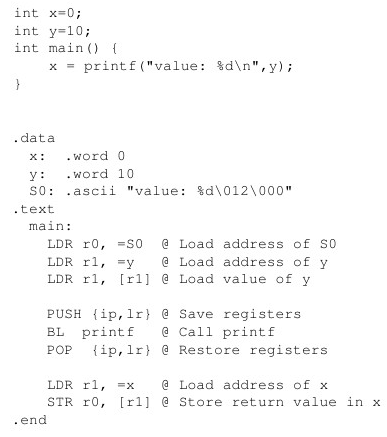  
Source: Book 1 page 174, 175
