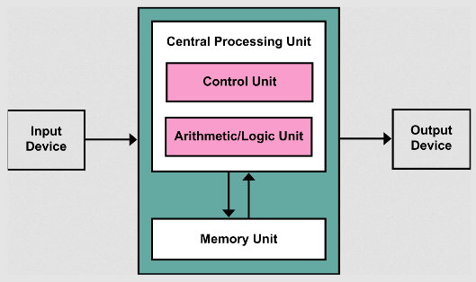

**Main Source:**

- **[System bus](https://en.wikipedia.org/wiki/System_bus)**
- **[Von Neumann architecture — Wikipedia](https://en.wikipedia.org/wiki/Von_Neumann_architecture)**

**Von Neumann architecture** is a fundamental computer architecture design, which consists of CPU including control unit and ALU, memory unit, and input/output devices.

### System Buses

**System buses** is an important component in computer system. Its primary function is to provide a communication pathway used to transfer data, instructions, and control signals between the components of a computer system. It serves as a physical connection that allows different hardware components to interact and exchange information.

The system bus combines several other buses:

- **Data Bus**: The data bus carries the actual data being transferred between components. It is bidirectional, meaning it can transmit data in both directions. The width of the data bus determines the amount of data that can be transferred simultaneously.
- **Address Bus**: The address bus is responsible for transmitting memory addresses. It carries the location information of data or instructions in the system's memory. The width of the address bus determines the maximum addressable memory capacity.
- **Control Bus**: The control bus carries control signals that coordinate and synchronize the activities of various components in the system. It includes signals such as read/write signals, interrupt signals, clock signals, and bus control signals.

  
Source: https://www.learncomputerscienceonline.com/computer-bus/

  
Source: https://winstartechnologies.com/introduction-to-computer-bus/

### Architecture

The von Neumann architecture is a theoretical framework for designing and constructing digital computers. The architecture proposes a digital computer consists of:

1. **Central Processing Unit (CPU)**: The main processing unit, which includes the [ALU](/computer-organization-and-architecture/alu) for mathematical and logical operations and [control unit](/computer-organization-and-architecture/control-unit) that interprets and coordinates instructions.

   The CPU will also contain some [registers](/computer-organization-and-architecture/registers-and-ram#registers) such as [instruction register and program counter register](/computer-organization-and-architecture/registers-and-ram#type-of-registers) that will store necessary processing information.

2. **Memory**: Main memory such as [RAM](/computer-organization-and-architecture/registers-and-ram#ram) that will store the data and instructions from the program.
3. **Larger Memory**: Larger memory such as hard disk to store larger volume of data.
4. **[Input/Output](/computer-organization-and-architecture/input-output)**: Component that will handle the necessary input and output process between computer with I/O devices including keyboards, mice, displays, printers, disk drives, and network interfaces.

  
Source: https://en.wikipedia.org/wiki/Von_Neumann_architecture

The von Neumann architecture is based on the **stored-program concept**, which states that both instructions and data are stored in the same memory and treated the same way, allowing programs to be modified easily.

Prior to the stored-program concept, computers were typically designed to perform specific tasks and had their instructions and data hardwired into the machine. This limited their flexibility and made it difficult to modify or reprogram them for different tasks.

The stored-program concept allows for greater flexibility, CPU fetches instructions from memory, decode them, and execute them. To make a computer execute different task or programs, we can simply load different instructions into memory.

#### Bottleneck

The data and instructions are stored in the same memory, the retrieval of data is done via a bus. The bus acts as a communication pathway between the CPU and memory for data transfer.

The problem come from the limitation of the bus, a bus can't be accessed multiple times simultaneously, due to some physical and electrical characteristics. The bottleneck occurs because the bus has limited bandwidth and can only transfer a certain amount of data at a time. This limitation can slow down the overall performance of the system. When the CPU needs to fetch data or instructions from memory, it has to wait for the bus to be available. Similarly, when the CPU wants to write data back to memory, it needs to wait for the bus to be free.

One way to mitigate the performance bottleneck is providing a [cache memory](/computer-organization-and-architecture/cpu-design#cache--memory) between the CPU and the main memory. The cache memory is located closer to the CPU, it stores frequently accessed data and instructions. By having a faster cache memory, the CPU can access data and instructions more quickly, reducing the need to access the main memory via the bus.
