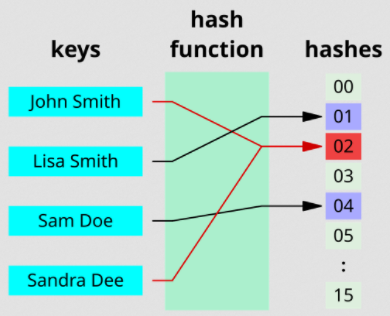
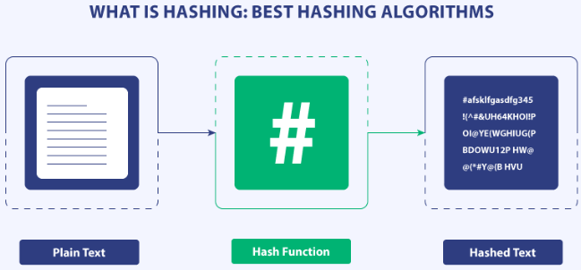
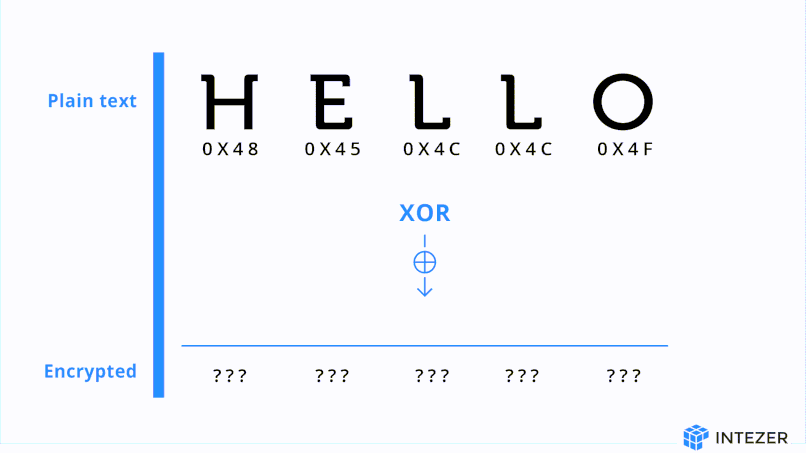
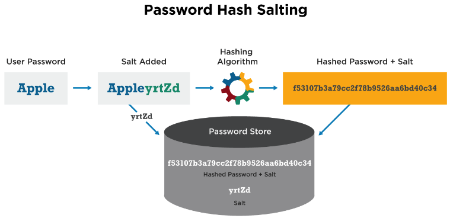
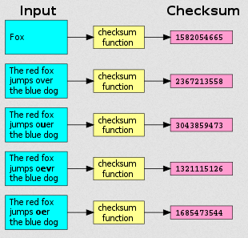

**Main Source:**

- **[Hash function — Wikipedia](https://en.wikipedia.org/wiki/Hash_function)**

A **hash function** is a mathematical function that takes an input of arbitrary size and produces a fixed-size output, called **hash values/codes**. The same input will always (ideally) produce the same output.

An example of using a hash function is password verification. Instead of storing a plain-text password, the hash of the password is stored. To verify the password, the input is hashed using the same hash function, and the results are compared. This process relies on the fact that the same input password produces the same output hash.

Hash functions are also used in [hash table/map](/data-structures-and-algorithms/hash-table) data structures. The hash function maps a key to a hash code (a number), which determines where the index of an element. To access an element, the corresponding key for that element is passed through the hash function, generating an output that indicates its location.

### Collision

A hash function doesn't have to be an advanced cryptographic function. It can even be as simple as a function that just return its input length. However, this will result in many inputs to have the same hash code. A **collision** occurs when different input produces the same hash code.

  
Source: https://en.wikipedia.org/wiki/Hash_collision#/media/File:Hash_table_4_1_1_0_0_1_0_LL.svg

### Properties & Example

Hash function have some properties:

- **Deterministic**: A hash function must be deterministic, in other word, the same input should always produce the same output.
- **Fixed Output, Variable Input**: While there are some hash function that produces variable-length output, a hash function typically produces fixed output. The thing is, the hash function should be able to take variable input length.
- **Irreversibility**: Hash functions are designed to be [one-way functions](/computer-security/computer-security-fundamentals#one-way-function), meaning it is computationally infeasible to get the original input from the output.
- **Uniformity**: Hash function must be able to produce a good distribution of hash codes, minimizing the chance of different key producing same hash code.
- **Avalanche Effect**: A small change in the input should result in a significantly different hash value.
- **Efficiency**: A good hash function should be fast and efficient, capable of processing large amounts of data quickly.

  
Source: https://signmycode.com/resources/best-hashing-algorithms

A hash function can range from a simple algorithm like **[division hash function](/data-structures-and-algorithms/hash-table#example)** (non-cryptographic hash functions) to a complex algorithm like [SHA](/computer-security/sha) (cryptographic hash functions) that can guarantee a high level of security, in terms of irreversibility and collision resistance.

#### XOR Hash Function

The XOR hash function uses [bitwise XOR](/computer-and-programming-fundamentals/bitwise-operation#xor) on the individual bits of the input data with a specific key. This hash function leverages the way bitwise operations work at the bit level. Even a single bit difference results in a different data representation.

  
Source: https://intezer.com/blog/research/unraveling-malware-encryption-secrets/

### Salting

Salting is a hash preprocessing technique that involves adding a random or unique value to the input data before it is hashed.

According to the hash function properties, hash function should have the avalanche effect, which states that a small change in the input should result in a significantly different hash value. However, in some hash function, there is still a chance for [collision](#collision) to occur. By adding a random or unique value to the input data, we can reduce the chance of collision.

Another benefit of salting is to mitigate the [rainbow table attack](/computer-security/other-attack-and-exploit#rainbow-table-attack). Rainbow tables are precomputed lookup tables that map hash values to their original input. Attackers generate these tables in advance to quickly find the original password corresponding to a hash value. However, rainbow tables are only effective for unsalted hashes.

  
Source: https://cyberhoot.com/cybrary/password-salting/

### Checksums

Checksums are a form of error detection used to verify the integrity or correctness of data. A checksum is a value that is computed from input data using a specific algorithm. This value is then compared with a previously computed or expected checksum to determine if the data has been modified or corrupted.

Checksums differ from hash functions. The purpose of a hash function is to map an input to a specific output, while a checksum is primarily used to detect accidental errors during transmission or storage. A single change in the input causes a significant difference in the output of a hash function. However, checksums are not as secure as hash functions; it is relatively easy to generate the same checksum even if the data has been tampered with or modified.

  
Source: https://en.wikipedia.org/wiki/Checksum#/media/File:Checksum.svg
