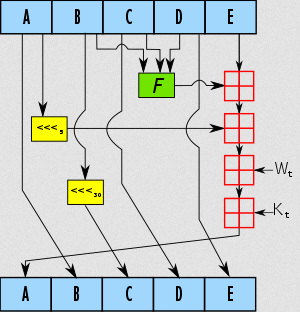
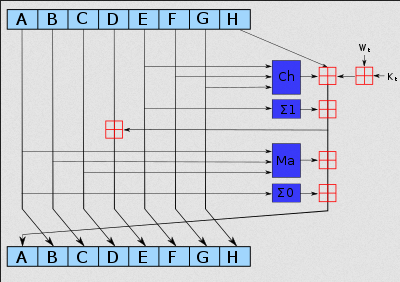
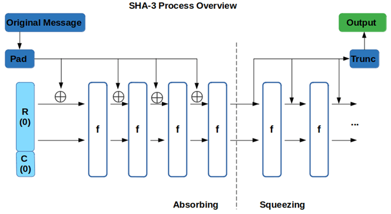

**Main Source:**

- **[SHA-1 — Wikipedia](https://en.wikipedia.org/wiki/SHA-1)**
- **[SHA-2 — Wikipedia](https://en.wikipedia.org/wiki/SHA-2)**
- **[SHA-3 — Wikipedia](https://en.wikipedia.org/wiki/SHA-3)**

**SHA (Secure Hash Algorithm)** is a family of cryptographic hash functions, it includes many variant such as SHA-0, SHA-1, SHA-224, SHA-256, SHA-384, and SHA-512, where the number in the name represents the size of the hash value it produces in bits (except for SHA-0 and SHA-1 that produces 160-bit value). Each iteration uses different algorithm, but they share some similarities.

### SHA-1

SHA-0 is the first SHA algorithm, many collisions were found, and it is considered not secure, therefore SHA-1 is developed.

Here is the high-level overview of the SHA-1 algorithm:

1. **Preprocessing**: The input message is padded to a multiple of the block size. The padding includes adding a 1-bit followed by a series of 0-bits until the desired length is reached (it should be [congruent](/cs-notes/computer-security/math-concepts#congruence) to $−64 ≡ 448 \space (\text{mod } 512)$).

   After that, append the original length of the message (in bits) as a 64-bit integer in big-endian format. This means representing the length using 8 bytes (64 bits) and placing the most significant byte first.

2. **Initialization**: Initialize five 32-bit variables (A, B, C, D, E) with predetermined constants (initial hash values). These variables will be updated during the hashing process.

3. **Chunk Processing**: Message are broken up into 512-bit chunks, each chunk goes through a series of rounds that involve logical functions, [bitwise operations](/cs-notes/computer-and-programming-fundamentals/bitwise-operation), and [modular arithmetic](/cs-notes/computer-security/math-concepts#modular-arithmetic). Each of the operations is divided within different rounds, rounds 0-19, rounds 20-39, rounds 40-59, rounds 60-79. For example, rounds 0-19 involve the bitwise operation and shifting, rounds 40-59 involve calculating the parity (odd or even) of the inputs.

4. **Update Variables**: The internal state, which was initialized with some initial hash values, is updated after each block processing round.

5. **Final Hash**: After processing all the blocks, the final hash value is derived from the updated internal state. It is produced by concatenating the final values of A, B, C, D, and E in big-endian to get the 160-bit hash value.

     
   Source: https://en.wikipedia.org/wiki/SHA-1

### SHA-2

SHA-2 changes significantly from the previous version, SHA-1. It has 6 variant: SHA-224, SHA-256, SHA-384, SHA-512, SHA-512/224, SHA-512/256, they differ in their output size and the number of internal rounds they perform.

Here is the algorithm for SHA-256:

1. **Padding**: Append padding bits to the message to ensure its length is a multiple of 512 bits. The padding includes a single '1' bit followed by a series of '0' bits, and the length of the original message is appended to the end. Specifically, the padding needs to be (L + 1 + K + 64), where L is the message length and K is the number of '0' bits needs to be added.

2. **Initialize Variables**: Initialize eight 32-bit variables (A, B, C, D, E, F, G, H) with the initial hash values, they are the first 32 bits of the fractional parts of the square roots of the first 8 primes 2 to 19.

3. **Process Chunk: Message Schedule**: Message is broken up into 512-bit chunks. An array called **message schedule** (typically denoted as W) will be created, it ranges from W[0] to W[63], and it contains a set of words derived from the input messages, which will be used for later steps.

   The original message chunk is copied to the first 16 words of the message schedule array. The remaining 48 words from 16 to 63 will be populated by extending the initial 16 words. The populating process includes bitwise process such as rotate, shifting, and XOR logical operation.

4. **Initialize**: Using the current hash value (the initial hash values if it's the first time), initializes variables A, B, C, D, E, F, G, H.

5. **Compression Function**: The compression function is the main step of the algorithm, it involves updating the current hash value with the message schedule array. It consists of a series of logical and arithmetic operations.

6. **Update Variables**: Update the variables A, B, C, D, E, F, G, H with the results of the compression function.

7. **Final Hash**: After processing all chunks, concatenate the final values of A, B, C, D, E, F, G, H to obtain the hash value (big-endian).

     
   Source: https://upload.wikimedia.org/wikipedia/commons/thumb/7/7d/SHA-2.svg/400px-SHA-2.svg.png

### SHA-3

SHA-3 is the latest member of SHA cryptographic hash function family, the variants are SHA3-224, SHA3-256, SHA3-384, SHA3-512. The design of SHA-3 differs with SHA-1 and SHA-2, it is based on the **Keccak sponge construction**, in contrast SHA-1 and 2 uses the **Merkle-Damgård construction**.

The Merkle-Damgård construction works by processing the input message in fixed-size chunks, each chunk is sequentially hashed and combined with the previous output (or the initial hash), the final step combines all the hash state together.

The Keccak sponge construction uses a "sponge function" that absorbs and squeezes. It begins by padding the input and breaking it down into fixed-size chunk. The sponge construction has some internal state, by XOR-ing the input and the internal state, the chunk will be absorbed to the portion of the state.

The absorbed data undergoes a permutation operation to introduce more complexity, this includes series of nonlinear transformations and bitwise operations. After the permutation, a portion of the state is extracted for the hash output, this is the squeezing phase.

  
Source: https://codesigningstore.com/hash-algorithm-comparison
