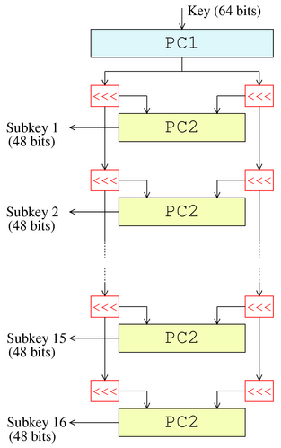
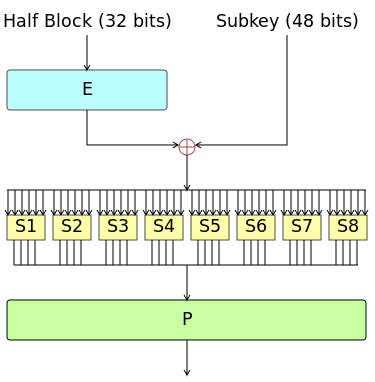

**Main Source:**

- **[Data Encryption Standard — Wikipedia](https://en.wikipedia.org/wiki/Data_Encryption_Standard)**

**Data Encryption Standard (DES)** is a [symmetric encryption](/computer-security/encryption#symmetric--asymmetric-encryption) algorithm, meaning it uses the same [private key](/computer-security/encryption#public--private-key) to encrypt and decrypt the data.

### Algorithm

The DES algorithm processes plaintext inputs in fixed-size blocks of 64 bits. The key used for encryption and decryption is 56 bits in length, although the actual key size is 64 bits, with 8 bits reserved for parity checking purposes. The relatively short key length used in DES makes it vulnerable.

Here is the high-level overview of DES:

1.  **Padding**: Padding is added to the message if required, the message should be multiple of 64 bits.

2.  **Key Schedule**: The original 64-bit key undergoes an initial permutation called PC-1. Only 56-bit key is taken, the remaining 8-bit is discarded or used as parity check. The remaining 56-bit key is then split into two 28-bit halves, known as the left half (C0) and the right half (D0). During encryption, the key is rotated left by one or two bits, depending on the specific round of encryption. After rotation, a 48-bit subkey will be derived from the combined halves by another permutation process called PC-2.

      
    Source: https://en.wikipedia.org/wiki/File:DES-key-schedule.png

3.  **Encryption Rounds**: The main encryption process is divided into rounds of transformations. The transformation process is called **Feistel cipher**, or **Feistel (F) function**, it takes half size of block (32-bit) and a key. It involves key mixing, substitution, permutation to introduce confusion and diffusion.

   :::note
    **Feistel structure** is the general design principle for cipher that divides the input data into two equal halves and applies a series of rounds to these halves. On the other hand, **Feistel cipher** is a specific type of symmetric encryption algorithm that employs the Feistel structure.
   :::

    1. **Initial Permutation (IP)**: The 64-bit plaintext block goes through an initial permutation (IP) step. The permuted plaintext block is divided into two 32-bit halves, known as the left half and the right half. In each round, the left half will be swapped with the right half from the previous round.
    2. **Expansion**: The 32-bit half-block is expanded to 48 bits using an expansion permutation table (E-box). The table contains bits which will determine the specific order in which the bits of the input and output blocks are arranged.
    3. **Key Mixing**: The expanded half is combined with the 48-bit key for that round using XOR operation, derived from the original 56-bit key in the key scheduling process.
    4. **Substitution**: The combined result is then passed through eight S-boxes (substitution boxes), which substitute 6-bit values with 4-bit values based on predefined tables.
    5. **Permutation**: The outputs of the S-boxes are rearranged by permutation operation according to a fixed permutation called P-box (P). The result of the P-box permutation is then XOR-ed with the left half from the previous round to produce the new right half. Also, The new left half (Li) is set equal to the previous right half (Ri-1).

       
       Source: https://en.wikipedia.org/wiki/File:Data_Encription_Standard_Flow_Diagram.svg

4.  **Final Steps**: After the 16 rounds of encryption, the left and right halves are concatenated. It then goes through a final permutation (FP), which is the inverse of the initial permutation. The resulting 64-bit block is the ciphertext.

In summary, DES follows the Feistel cipher that operates on blocks of data by dividing them into two halves and applying a series of transformations. In each round, the right half of the data undergoes expansion, combined with key (which is also permutated), substitution, and permutation operations, while the left half remains unchanged. The output of these operations is then XOR-ed with the left half, and the resulting values become the new right and left halves for the next round. This process repeats for the specified number of rounds.

The alternating nature of processing the left and right halves in each round provide cryptographic security and diffusion throughout the encryption process.

  
Source: https://medium.com/@murshedsk135/cryptographic-evolution-from-feistel-cipher-to-triple-des-and-beyond-3aa0f8e08541
