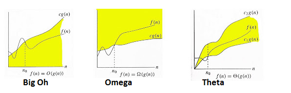

**Main Source:**

- **[Analysis of algorithms — Wikipedia](https://en.wikipedia.org/wiki/Analysis_of_algorithms)**
- **[Why do we ignore coefficients in Big O notation? — stackoverflow](https://stackoverflow.com/questions/29954109/why-do-we-ignore-co-efficients-in-big-o-notation)**

**Analysis of Algorithms** is the study of evaluating the efficiency and performance characteristics of algorithms. It encompasses evaluating the speed at which an algorithm executes, known as **time complexity**, as well as the memory it requires, known as **space complexity**.

### Time & Space Complexity

An algorithm performance typically depends on the characteristics and the size of its input. The time and memory requirements to execute an algorithm can vary depending on the nature of the input. For instance, algorithms may take different amounts of time and memory to process large amounts of input compared to small amounts.

#### Best, Average, and Worst Scenario

There are three different scenarios we can consider in order to evaluate the performance of an algorithm.

- **Best-case Scenario**: The best-case scenario represents the optimal conditions under which an algorithm performs at its best. The scenario has input that leads to the most efficient execution or the lowest time or space complexity. However, this is not realistic and may not happen frequently.

- **Average-case Scenario**: The average-case scenario takes into account the expected or average performance of an algorithm over a range of inputs. The average-case analysis provides a more realistic estimate of an algorithm's performance when dealing with typical inputs.

- **Worst-case Scenario**: The worst-case scenario represents the input that leads to the least efficient execution or the highest time and space complexity for an algorithm. It represents the most unfavorable conditions the algorithm may encounter in terms of input data. The worst-case analysis is commonly used to measure the algorithm's performance as it helps identify any potential limitations.

For example, the [linear search algorithm](/cs-notes/data-structures-and-algorithms/search#linear-search) is an algorithm that search for specific element in some collection. The algorithm works by checking each element one by one and decide if it is the element we are looking for. This algorithm typically starts from the left until the rightmost element.

  
Source: https://sushrutkuchik.wordpress.com/2020/05/24/searching-algorithms-visualized/

In the best-case scenario, the target element is found as the first element in the collection. The average scenario typically occurs when the element is located somewhere in the middle of the collection, which is probably the more common situation. The worst-case scenario occurs when the target element is the rightmost element, encountered as the last element during the search process.

### Big O Notation

**Big O notation** is a mathematical notation used to describe the performance characteristics (time and space complexity) of an algorithm. As explained before, algorithm performance may depend on the size of the input, the big O notation represent the algorithm growth toward the size of input using a mathematical function.

The notation is typically written as $O(f(n))$, where $f(n)$ represents the growth rate function and $n$ denotes the input size.

Using the similar example as before, the linear search algorithm, as we can see, the algorithm checks each element one by one, starting from the left and moving towards the rightmost element. As the input size increases, the algorithm needs to check a greater number of elements.

Notice that there is a direct correlation between the number of elements in the collection and the number of comparisons required. If there are `n` elements in the collection, the algorithm may need to check each element until it finds the target or reaches the end of the collection (the worst case scenario). This means that as the input size increases, the time taken by the linear search algorithm to find the target element increases **linearly** with the input size. In other words, if the input size doubles, the algorithm's execution time will also roughly double.

The appropriate growth rate function for linear search algorithm is a **linear function**, therefore, the big O notation for linear search algorithm is **$O(n)$**.

There are many more growth rate function commonly encountered in algorithms:

- **$O(1)$ — Constant Complexity**: The algorithm's time or memory usage remains constant regardless of the input size. By constant, it doesn't mean the algorithm require no time or memory, it describes that whatever the input size is, the algorithm will always perform the same.
- **$O(\log n)$ — Logarithmic Complexity**: The growth rate of time or memory increases logarithmically (typically log base-10) with the input size.
- **$O(n)$ — Linear Complexity**: The growth rate is directly proportional to the input size.
- **$O(n \log n)$: Linearithmic Complexity**: The growth rate is a multiplication of linear and logarithmic factors.
- **$O(n^2)$ — Quadratic Complexity**: The growth rate is proportional to the square of the input size.
- **$O(2^n)$ — Exponential Complexity**: The growth rate doubles with each increase in input size.
- **$O(n!)$ — Factorial Complexity**: The growth rate increase factorially with input size.

For instance, if we denote this notation as the number of operation done in an algorithm, when we have input size of `n = 1000` and the algorithm we are using has a logarithmic complexity $O(\log n)$, then the number of operation is roughly 3 times (log base 10 of 1000 is 3).

  
Source: https://www.freecodecamp.org/news/all-you-need-to-know-about-big-o-notation-to-crack-your-next-coding-interview-9d575e7eec4/

#### Big O as Asymptotic Notation

Big O notation describe the upper bound of the growth rate of an algorithm's time or space complexity. We are interested in how algorithm's performance scales with increasing input sizes. In the actual analysis, we do not typically measure the number of operation directly. Instead, Big O notation provides an abstract representation of the growth rate of an algorithm's time or space complexity.

In Big O analysis, the primary focus is on the dominant term or the most influential factor that determines an algorithm's growth rate. For instance, if an algorithm has a time complexity of $O(2n^2 + n + 1)$, we concentrate on function in the dominant term, which is $n^2$, while disregarding the coefficient $2$, lower-order term $n$, and the constant term $1$. This simplification is based on the assumption that the input size, denoted as $n$, approaches infinity (asymptotically). As a result, the lower-order term becomes insignificant and does not significantly impact the algorithm's growth rate.

#### Big Omega & Theta Notation

There are many variants of big O notation, another common notation is the **Big Omega Notation** and the **Big Theta Notation**.

- **Big O Notation**: The big O notation measure the **upper bound** or the **worst case scenario** of an algorithm.
- **Big Omega Notation $(\Omega)$**: The big omega notation measure the **lower bound** or the **best case scenario** of an algorithm.
- **Big Theta Notation $(\Theta)$**: The big theta notation provides both an upper bound and a lower bound on the growth rate of an algorithm's time or space complexity. It represents the **tightest bound** or the **exact rate of growth**.

  
Source: https://tarunjain07.medium.com/complexity-asymptotic-analysis-e9cd6d4b766e

### Runtime Complexity

While the big O notation provides a way to evaluate an algorithm time and space complexity, it does a lot of simplification such as removing coefficients, lower-order term, and constant terms. Theoretically with big O notation, an algorithm with time complexity of $O(100n)$, which will be simplified to $O(n)$ will have the same time complexity with an algorithm that has time complexity of just $O(n)$.

While they have the same performance analytically, in the real computation, they probably take different amount of time and memory in the execution. **Runtime complexity** is the more precise measurement of an algorithm's performance. The runtime or actual execution time can be achieved through technique like **profiling** and **benchmarking**. Profiling involves collecting data on how much time is spent executing different parts of the program. On the other hand, benchmarking involves running the program or algorithm on different inputs and measuring the execution time.
