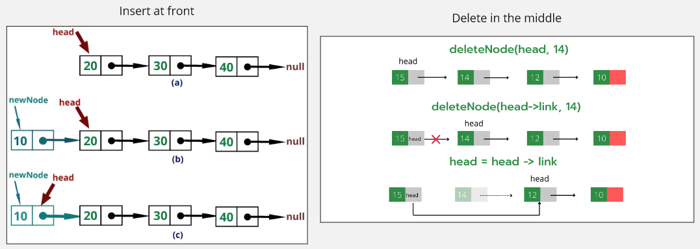
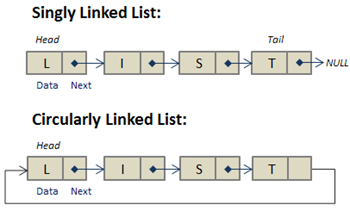

**Main Source:**

- **[Linked list — Wikipedia](https://en.wikipedia.org/wiki/Linked_list)**
- **[Skip list — Wikipedia](https://en.wikipedia.org/wiki/Skip_list)**

**Linked List** is a data structure where each element is not accessed by its memory location. In contrast, [array](/cs-notes/data-structures-and-algorithms/array) data structure uses index as the location of an element in a contiguous block of memory.

Linked list element doesn't have to be within a contiguous block of memory, each element can be accessed through a "linked" connection. In linked list, a single element is called a **node**, a node has value it stores and it has a **[reference](/cs-notes/computer-and-programming-fundamentals/memory#pointer--reference)** or a connection to other node that will form a linkage between them. The reference stored by each node is the **memory address** of the other node.

  
Source: https://www.freecodecamp.org/news/how-linked-lists-work/

In the image above, we have a linked list containing 3 elements. The first element contains number 11, it has reference of the address of the next element, which is in the address 200. The next element in the address 200 has the value of 18 and has a link to another node holding the value 24. The last node, points to a [null](/cs-notes/computer-and-programming-fundamentals/memory#null) or an empty address, indicating the end of the linked list.

When accessing an element in an array, it is necessary to calculate the memory address based on the index and the **data type**. This calculation prevents arrays from storing different types of data. In contrast, linked lists do not rely on memory addresses for accessing elements, which gives them an advantage over arrays. Linked lists can store different types of elements within the same collection without being constrained by memory-based indexing.

### Linked List Operation

The first element in a linked list is often referred as the **head** of list, while the last element is called **tail**.

- **Access & Search / Traversal**: Accessing or searching an element involve going in the linked list from the head to the tail, we can access it by position by counting how many elements we have encountered in the list. Searching an element in linked list is basically similar to [linear search](/cs-notes/data-structures-and-algorithms/search#linear-search), it involves checking each node in the list one by one.
- **Insertion**: There are three different insertion in linked list. The first is inserting an element at the beginning of the list, we can do this by making a new head and make it points to the old head. The second is inserting an element at the end of the list, we can do it easily by making the tail or the last element point to the new element. The third is inserting an element at a specific position in the middle, this involves traversing the list to the specific position, make the node in the position to point to the new element instead, and we will make the new element points to the originally next node.
- **Deletion**: We can either delete at the beginning, at the end, or at specific position in the middle. The operation is quite similar to insertion, the difference is we remove element instead of adding new element.

In the worst case scenario, all the linked list operation has the time complexity of $O(n)$. The worst scenario is when the element we are looking for is at the end of the linked list.

  
Source: [Insertion](https://walkingtechie.blogspot.com/2018/12/inserting-node-in-singly-linked-list.html#google_vignette), [deletion](https://www.geeksforgeeks.org/deletion-in-linked-list/)

### Doubly Linked List

The linked list we talked about previously is a **singly linked list**, a node can only point to the next node. In contrast, a **doubly linked list**, is a type of linked list where each node can point to the next and the previous node. This allows for traversal in both directions, from the head to the tail and from the tail to the head.

Being able to traverse in reverse direction allows us for efficient operation. For example, if we are going to search element somewhere at the end of the list, we will need to traverse from the head all the way up to the latter element. Using doubly linked list, we can access an element from the tail or behind and use the previous reference to traverse.

The presence of tail and previous reference in doubly linked list allows for time complexity reduction from $O(n)$ to $O(n / 2)$.

  
Source: https://www.boardinfinity.com/blog/a-detailed-walkthrough-of-doubly-linked-list/ (with modification)

### Circular Linked List

A **circular linked list** is a type of linked list where the last node in the list never points to a null reference, it always points back to the first node, forming a circular loop structure. This type of linked list is typically used for specific application where we need a circular data structure.

  
Source: https://study.com/academy/lesson/circularly-linked-lists-in-java-creation-uses.html

### Skip List

A singly linked list can be very inefficient when the element we are looking for is at last node of the list. We know that linked list is a linear-like data structure, all the operation, at the worst, happen in linear time complexity. Adding a reference to the tail like what [doubly linked list](/cs-notes/data-structures-and-algorithms/linked-list#doubly-linked-list) is doing, help us improve the performance.

A **skip list** is a data structure based on linked list which is included with additional reference or pointer. A skip list is different with the traditional linked list. Skip list maintain a collection of sorted data, it is a data structure that provides an efficient data structure for searching, inserting, and deleting elements in a sorted collection.

In a skip list, the elements are stored in linked lists at different levels or layers. The bottom level contains all the elements in sorted order, while the higher levels contain a subset of the elements, skipping over some elements. Each element in the list has a tower of pointers, linking it to the same element in higher levels.

The skip pointers enable efficient searching by allowing the algorithm to "skip" over large portions of the list, reducing the number of comparisons needed. When searching for an element, the algorithm starts from the top level and moves forward until it finds an element that is greater than or equal to the target. It then moves down to the next level and continues the search within the sublist until it either finds the target or reaches the bottom level.

The choice of which element we choose as the skip pointer can happen in probabilistic or deterministic manner. Overall, the average time complexity of skip list is $O(\log n)$.

  
Source: https://en.m.wikipedia.org/wiki/File:Skip_list_add_element-en.gif
