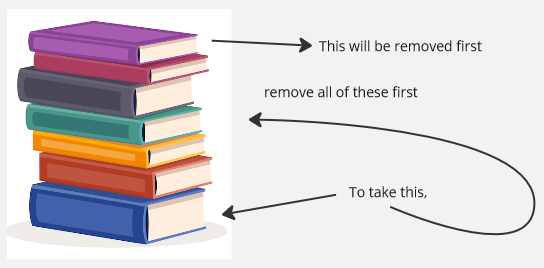
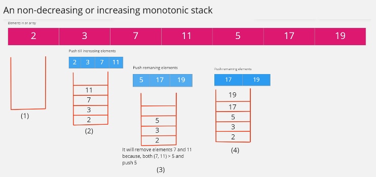

**Main Source:**

- **[Stack (abstract data type) — Wikipedia](/cs-notes/<https://en.wikipedia.org/wiki/Stack_(abstract_data_type)>)**

**Stack** is a data structure where the elements are stacked on top of each other. In stack data structure, we can add and remove element, the behavior of adding and removing element follows the **Last-In-First-Out (LIFO)** principle. This principle says that the last element added to the stack is the first one to be removed.

A book stacked on top of each other can be a good analogy to understand stack data structure. Just like placing books on top of each other, when elements are added to a stack, each new element is stacked on top of the previous ones. In order to take book that is lower in the stack, we will remove the top of the book first, this is because removing the topmost element requires the least amount of effort (imagine if the book is heavy). Similar to stack data structure, accessing an element in stack, we will need to remove the top element first.

  
Source: https://www.freepik.com/free-photos-vectors/book-png (with modification)

The behavior of stack data structure can be beneficial in some applications. For instance, in undo functionality, a stack can be used to store each action performed by the user. When the user wants to undo an action, the most recent action is retrieved from the stack and the action will be reverted. The LIFO properties of stack data structure align perfectly with the goal of undo functionality, this because the last element is the first one to be removed, similar to undoing an action, we expect to revert the most recent action we have done.

### Stack Operation

Stack is a fairly simple data structure, the general implementation typically only includes adding and removing element.

- **Push**: Push is when we add an element to the stack, which is to the top.
- **Pop**: Pop is when we remove an element from the stack, which is the topmost element.

Stack data structure can be implemented using an [array](/cs-notes/data-structures-and-algorithms/array) or [linked list](/cs-notes/data-structures-and-algorithms/linked-list), the important thing is we need to follow the LIFO principle. Even if array allow random access and linked list allow insertion in the middle, we can't use these.

Stack operation is done in O(1) or constant time, no matter what the element is, no matter how large the stack is, removing or adding element always performs the same.

  
Source: https://www.programiz.com/dsa/stack

### Monotonic Stack

**Monotonic Stack** is a variant of stack data structure that maintains a specific order of elements while still adhering to LIFO principles. Monotonic stack enforce a particular order of element, either non-decreasing or non-increasing, from the bottom to the top of the stack.

When we have a non-decreasing or an increasing monotonic stack, this mean from bottom to the top, we must store element in increasing order. When an element doesn't satisfy this condition, we will need to remove them. The process of adding or removing an element is the same as traditional stack.

Here is an example of monotonic stack:

  
Source: https://itnext.io/monotonic-stack-identify-pattern-3da2d491a61e (with modification)

We have an array of numbers, we want to turn it into a non-decreasing monotonic stack. We will push the element from the array to the stack as long as the element we encounter keep increasing. When we encounter an element smaller than the topmost element in the stack, we will remove every element in the stack that is larger than it.
