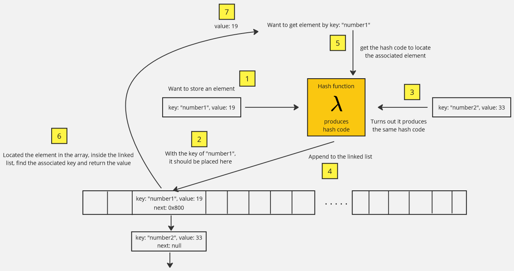

**Main Source:**

- **[Hash table — Wikipedia](https://en.wikipedia.org/wiki/Hash_table)**

**Hash table**, also known as **hash map**, is a data structure where accessing an element is done by providing a unique identifier called **key**. Key is provided along with a **value**, which is the actual value of the element during the insertion process.

### Implementation

Hash table is a very efficient data structure in terms of insertion and retrieval, similar to [array](/data-structures-and-algorithms/array). They provide efficient retrieval of an element in a constant $O(1)$ time.

In array, we use an index to retrieve a specific element. The index of an element may change when we modify the array (e.g., inserting an element at the first index may shift the following elements). A hash table differs in its access method by using a unique identifier that never changes and always maps to the same value.

Under the hood, a hash table is implemented using an array. An array with a predetermined size is allocated in memory, and each value associated with a key is stored in that array. The key determines the position in the array where the value should be stored. This is why the key must be unique, to ensure that the hash table doesn't store different values in the same position in the array.

The position of value in the array is decided with a **hash function**.

#### Hash Function

Hash function is a mathematical function that takes input and output an integer value called **hash code**. In this case, that hash code can be used as the index of the element in the array.

:::tip
See [hash function](/computer-security/hash-function).
:::

#### Collision Mitigation

Hash function doesn't always produce a unique value for different inputs. In other words, it's possible for two different inputs to generate the same hash code, which would result in the same index in the array.

This is called a [collision](/computer-security/hash-function#collision), and one technique to mitigate it is **chaining**. Chaining places a [linked list](/data-structures-and-algorithms/linked-list) at each position in the array, where collided elements are stored. When a collision occurs, the element is appended to the end of the list.

Another technique to mitigate collision, which is a trivial one is just increasing the array size. This may work for hash function that consider the size of array, such as the example below.

### Example

One of a simple hash function for hash table is the **division hash function**. The formula is: $\text{hash code} = \text{key } \% \text{ array size}$.

The hash code for some key will be obtained by calculating the remainder (% modulo) of the key by the array size.

For example, when we have `key = 10` and the `array size = 1000`, the hash code will be $10 \space \% \space 1000 = 3$, which mean the value associated with the key will be stored in the index 3 of the array.

Lastly, we also need to put the key inside the node of the list in the array, so that we can identify which key does a value belong to.
