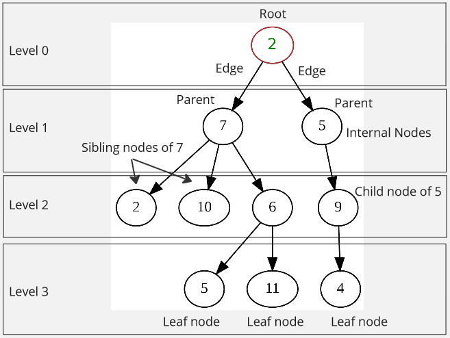
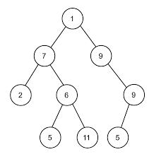
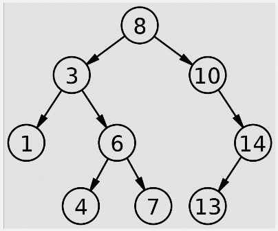
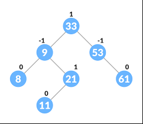
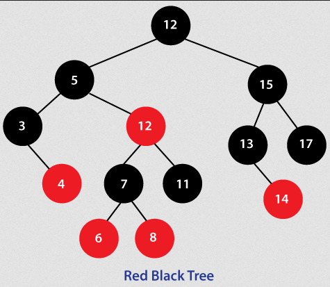
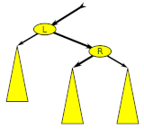
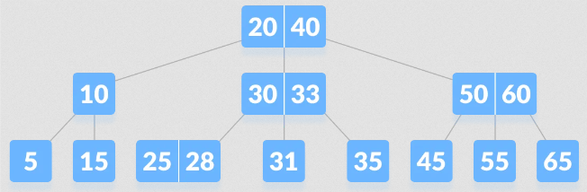

**Main Source:**

- **[Tree (data structure) — Wikipedia](<https://en.wikipedia.org/wiki/Tree_(data_structure)>)**
- **[Red–black tree — Wikipedia](https://en.wikipedia.org/wiki/Red%E2%80%93black_tree)**
- **[AVL tree — Wikipedia](https://en.wikipedia.org/wiki/AVL_tree)**
- **[B-tree — Wikipedia](https://en.wikipedia.org/wiki/B-tree)**

**Tree** is a data structure where the elements are stored in tree-like structure. An element in a tree is called a **node**, the first and the topmost node in the tree is called the **root** node. Each node is connected to each other, it may connect to multiple node, a connection is called an **edge** or a **link**. The node that connect to other node is called the **parent** node, and the connected node is called **child** node.

In essence, tree can be thought as a [linked list](/data-structures-and-algorithms/linked-list) with branches. The connection of each node is similar to linked list, each node stores a value and a reference to the next node. What makes tree different is a tree can connect to multiple node, creating a branch.

Tree can be implemented in linked list, so similar to linked list, tree operation such as insertion and deletion can be done in similar way. The has many variants, depending on the type, the time complexity for each operation can vary.

Other concept:

- **Sibling Nodes**: Sibling nodes are nodes that share the same parent node. They are at the same level in the tree.
- **Leaf Nodes**: Leaf nodes are nodes that have no child nodes. They are the terminal nodes at the bottom of the tree.
- **Internal Nodes**: Also known as inner node, they are every node except the leaf and root nodes.
- **Level or Depth**: Starting from 0 (the root node), it represents the depth of the tree.

  
Source: https://en.wikipedia.org/wiki/Tree_(data_structure) (with modification)

Tree are used where it's needed to represent something in hierarchical structure. For example, a file system often employ a tree structure to represent directories and files, with directories serving as parent nodes and files as leaf nodes.

### Binary Tree

A binary tree is a type of tree data structure in which each node has at most two child nodes, commonly referred to as the **left child** and **right child**. Binary tree is commonly used, it has many other variants.

Binary tree operation are typically done in average of O(log n) time complexity and the worst being O(n), this is because the nature of binary tree. For instance, when we are searching for some node in the tree, we effectively divide the search space in half at each level of the tree, we will always eliminate one of the child subtrees based on a comparison with the current node (we can either choose to go to the left or right child).

  
Source: https://en.wikipedia.org/wiki/Binary_tree

#### Binary Search Tree

**Binary search tree (BST)** is a binary tree in which the values of nodes in the left subtree are less than the value of the node, and the values in the right subtree are greater. BSTs enable efficient searching, insertion, and deletion operations with an average time complexity of O(log n) for balanced trees.

BST can be thought as the representation of the [binary search](/data-structures-and-algorithms/search#binary-search) algorithm in a tree structure.

  
Source: https://en.wikipedia.org/wiki/Binary_search_tree

#### Balanced Tree

In binary trees, some node of the same parent may have more child node than the sibling. When the height of the left and right subtree of node differ more than two, we can say the tree is unbalanced. In other word, a balanced binary tree is one in which the heights of the left and right subtrees of every node differ by at most one.

A balanced tree is important in some tree operation, this ensures we can effectively divide the tree roughly by half, so that choosing left or choosing the right node results in the same elimination.

  
Source: https://www.techiedelight.com/check-given-binary-tree-is-height-balanced-not/

:::note
Balanced tree doesn't only apply to binary tree.
:::

#### AVL Tree

**Adelson-Velsky and Landis (AVL) Tree** is a self-balancing binary search tree. AVL tree achieves self-balance by ensuring that the heights of the left and right subtrees of any node differ by at most one.

In AVL tree, each node is associated with a **balance factor**, it is the difference between the heights of the left and right subtrees of a node. The balance factor can be -1, 0, or 1 for a node to be considered balanced.

- Balance Factor of 1: Have extra node anywhere in the right child
- Balance Factor of 0: Have the equal number of nodes
- Balance Factor of -1: Have extra node anywhere in the left child

  
Source: https://www.programiz.com/dsa/avl-tree

##### Rotation

When the balance factor exceed -1 or 1 (e.g., -2 or 2), a **rotation** will be performed. Rotation is an operation that modifies the structure of the tree.

- **Left Rotation**: A left rotation is performed on a node to rotate it and its right child. It changes the structure of the tree such that the former right child becomes the new root, and the original node becomes the left child of the new root.

- **Right Rotation**: A right rotation is performed on a node to rotate it and its left child. It rearranges the tree structure so that the former left child becomes the new root, and the original node becomes the right child of the new root.

There are also double rotations, which involve performing a sequence of two rotations to restore balance.

- **Left-Right Rotation**: This involves performing a left rotation on the left child, followed by a right rotation on the original node.
- **Right-Left Rotation**: This involves performing a right rotation on the right child, followed by a left rotation on the original node.

  
Source: https://en.wikipedia.org/wiki/AVL_tree#/media/File:AVL_Tree_Example.gif

AVL tree able to achieve a worst-case time complexity of O(log n) for search, delete, and insert operation. In contrast to the O(n) worst-case time complexity of a typical binary tree.

#### Red-Black Tree

**Red-Black tree** is a self-balancing binary search tree that ensures the tree remains balanced even after insertions or deletions. In red-black tree, we will color a node either as red or black. The color in red-black tree is a mechanism used to enforce certain properties and maintain balance within the tree structure.

##### Properties

In order for a red-black tree to be considered as valid, it must adhere to these properties:

1. Every node is either red or black.
2. All NIL (also known as null nodes and leaf nodes) are considered black.
3. A red node does not have a red child (called red property).
4. Every path from a given node to any of its descendant NIL nodes goes through the same number of black nodes. In other words, the number of black nodes encountered when traversing any path in the tree remains constant (called black depth property).
5. (Conclusion) If a node N has exactly one child, it must be a red child, because if it were black, its NIL descendants would sit at a different black depth than N's NIL child, violating requirement 4.

Source: https://en.wikipedia.org/wiki/Red%E2%80%93black_tree (with modification)

Similar to AVL tree, red-black tree can achieve the worst-case scenario time complexity of O(log n).

  
Source: https://www.javatpoint.com/red-black-tree-java

##### Repainting & Rotation

When performing operations on a red-black tree, such as inserting a new node or deleting an existing node, the tree may violate one or more of the red-black tree properties. To restore these properties and maintain the balance of the tree, repainting is performed.

- **Insertion Repainting**:

  1. When a new node is inserted, it is initially colored red.
  2. If the parent of the newly inserted node is also red, repainting is required to restore the red property (red node can't have red child).
  3. Repainting involves changing the colors of certain nodes and performing rotations to maintain the red-black properties.

- **Deletion Repainting**:

  1. When a node is deleted, the tree may violate the red-black tree properties, particularly the black depth property and the red property.
  2. Repainting involves adjusting the color of nodes and performing rotations to restore the properties.
  3. The specific rules for repainting after deletion depend on various cases, such as whether the deleted node is red or black, whether the sibling of the deleted node is red or black, and so on.

**Rotation**:

- **Left Rotation**: During a left rotation, the right child of the node becomes the new root of the subtree, and the node becomes the left child of its original right child.

- **Right Rotation**: During a right rotation, the left child of the node becomes the new root of the subtree, and the node becomes the right child of its original left child.

    
  Source: https://en.wikipedia.org/wiki/Red%E2%80%93black_tree

### B-Tree

**B-Tree** is another self-balancing tree, similar to AVL and red-black trees, but it is not a binary tree. It is a normal tree that can have more than two child nodes per parent, designed to address the limitation of self-balancing binary tree which can only store data in the left and right child.

In b-tree, often times we will hear the word **"key"**. This term probably comes from database system, as b-tree is often used for implementing [database index](/database-system/database-index). B-tree node consist multiple keys, these keys are the actual value within a node. For example, the image below is a b-tree where the root node contains 2 keys, which are 20 and 40. The root node then has 3 child node, each node has key(s): 10, 30 and 33, 50 and 60.

  
Source: https://www.programiz.com/dsa/b-tree

#### Rules & Balancing

B-tree maintains a sorted order of data from left to right, just like binary search tree. This property allows b-tree to be "binary searchable". To make an efficient search, the tree needs to be balanced, b-tree have some rules to maintain the sorted order. B-tree limits the number of node each node can have.

When we say a b-tree with order `m`, it means `m` is the maximum number of children a node can have, more specifically:

- Every node has at most `m` children.
- Every internal node has at least ⌈`m/2`⌉ (ceil) children.
- The root node has at least two children unless it is a leaf.
- All leaves appear on the same level.
- A non-leaf node with `k` children contains `k − 1` keys.

Source: https://en.wikipedia.org/wiki/B-tree

B-tree can be unbalanced after insertion or deletion operation, the balance is achieved by splitting or merging the trees.

- **Splitting**: Splitting occurs when a node becomes overfull, meaning it exceeds its maximum capacity of keys. In this case, the overfull node is divided into two separate nodes, and a median key is chosen to become the separator key that will be moved to the parent node.

- **Merging**: Merging occurs when a node becomes underfull, meaning it has fewer keys than the minimum required. In this case, the underfull node is merged with a sibling node, effectively reducing the number of nodes in the tree.

Inserting a new key involves finding the appropriate position in the tree to insert. Deleting a key from a B-tree involves finding the key and removing it.
