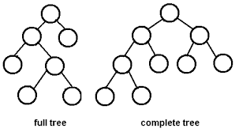
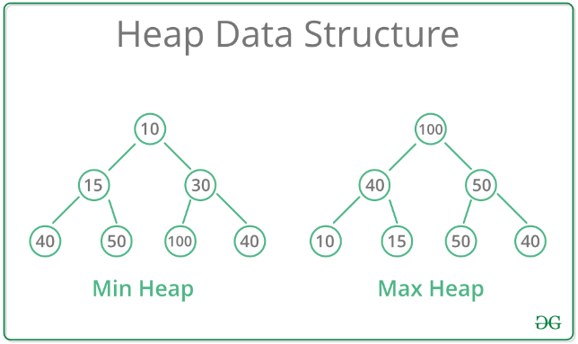
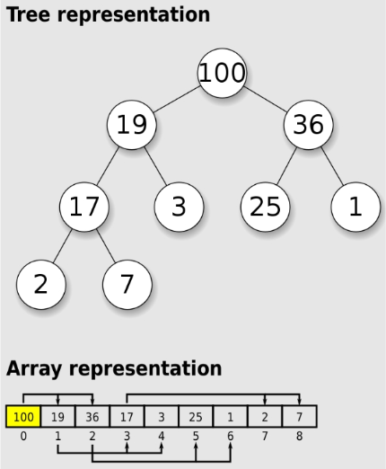
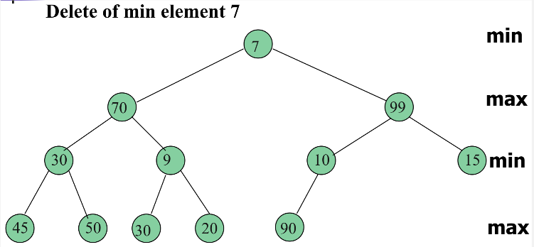

**Main Source:**

- **[Heap (data structure) — Wikipedia](<https://en.wikipedia.org/wiki/Heap_(data_structure)>)**

**Heap** is a data structure where we maintain collection based on some priority (e.g., larger number have larger priority). Heap is an implementation of [priority queue](/cs-notes/data-structures-and-algorithms/queue#priority-queue) using a binary tree (although other variant exist).

In typical binary tree, searching for a value typically results in O(log n) or the worst case in O(n) time. However, in heap, we can search a value with the most priority in a constant O(1) time, making it a suitable data structure for priority based tasks. This is possible because heap structures its element in a neat way.

### Binary Heap

The heap implementation using binary tree is called binary heap. Binary tree used for binary heap is a **complete binary tree**, which is a binary tree in which all levels except possibly the last level are completely filled, and all nodes are as left as possible. This means that the elements in a binary heap are inserted from left to right across each level of the tree.

  
Source: https://www.andrew.cmu.edu/course/15-121/lectures/Trees/trees.html

Heap data structures maintain collection based priority, the common priority is the maximum or minimum value. This mean we can prioritize larger value first or smaller value first. The heap in which it prioritizes larger value first is called **max-heap**, while the one that prioritizes smaller value first is called **min-heap**.

A heap data structures must satisfy the **heap property**, which states that for a max heap, every parent node has a value greater than or equal to its children, and for a min heap, every parent node has a value less than or equal to its children.

This property implies that **the most prioritize element will be on the top of the tree**, this is because every parent node must have larger priority than its children. This implication is what makes heap is very efficient for getting the most prioritized value in some collection, to get the value, we will just extract the root of the tree, which should run in constant O(1) time.

  
Source: https://www.geeksforgeeks.org/heap-data-structure/

#### Restoring Heap Property

When we add element to the heap, it is initially placed in the next available position at the bottom-rightmost spot of the tree. Then, it is compared with its parent node, and if the heap property is violated, the element is swapped with its parent until the heap property is satisfied (can even be swapped up to the root). This process is called **up-heap** or **bubble-up** operation.

Similarly, when the root element is extracted from the heap, which is the highest priority element, the last element in the heap is moved to the root position. Then, this element is compared with its children, and if the heap property is violated, it is swapped with the larger (in a max heap) or smaller (in a min heap) child until the heap property is satisfied. This process is called **down-heap** or **bubble-down** operation.

In conclusion, heap will always operate on the complete binary tree and heap property. After doing any operation on heap, we will always reorganize the tree to make it a complete binary tree. After that, we will restructure the heap so that the highest priority element is on the root, to adhere the heap property.

  
Source: https://www.tutorialspoint.com/data_structures_algorithms/heap_data_structure.htm

:::note
Another commonly used term in heap data structure is the **heapify**, which mean building a heap from an array of elements or restoring the heap property in a heap that has been partially or completely violated.
:::

### Binary Heap Implementation

Binary heap uses array to store the element, however, the array uses some indexing formula to access an element, making it resembles a parent-child relationship in binary tree.

For any given element at index `i` in the array, its left child can be found at index `2i + 1`, and its right child can be found at index `2i + 2`. Similarly, the parent of an element at index `i` can be found at index `⌊(i − 1) / 2⌋` (floor operation).

  
Source: https://en.wikipedia.org/wiki/Binary_heap

The time complexity for binary heap:

- **Heapify**: Building a heap from an unsorted array can result in worst-case scenario of O(n), while just storing the heap property can result in O(n).
- **Peek**: An operation that returns the most prioritized element, which happen in O(1) time. We are just extracting the root of the binary tree without changing anything.
- **Poll**: An operation that remove and returns the most prioritized element, also happen in O(1) time, however, we will need to heapify after to restore the heap property.
- **Search**: Average and worst-case happens in O(n) time, this is because heap doesn't guarantee element in sorted order.
- **Insertion**: Average of O(1) time and the worst-case of O(log n), which happen while heapifying up to the root.
- **Deletion**: Deleting non-root element involve searching it first (O(n) time), removing the element, and then heapifying after (O(log n) time).

### Min-Max Heap

**Min-max heap** is a variation of the binary heap data structure that supports both minimum and maximum operations efficiently. Unlike a standard binary heap that focuses on either the minimum or maximum element, a min-max heap allows for quick access to both the minimum and maximum elements.

Similar to binary heap, the elements are organized in complete binary tree. The heap property is extended to two levels: the even levels store the minimum elements, while the odd levels store the maximum elements.

- At even levels (0, 2, 4, etc.), each node must be smaller than or equal to its parent and its children.
- At odd levels (1, 3, 5, etc.), each node must be larger than or equal to its parent and its children.

Heapify operations after deleting or inserting in a min-max heap are more complex than in a standard binary heap. When inserting an element, it is initially placed at the next available position in the tree and then compared with its parent and ancestors at even and odd levels. The element is swapped with its ancestors if the heap property is violated. Similarly, when deleting an element, it is replaced with the last element in the heap and then moved up or down the tree based on the heap property.

  
Source: https://stackoverflow.com/questions/53888694/try-to-understand-delete-min-of-min-max-heap
