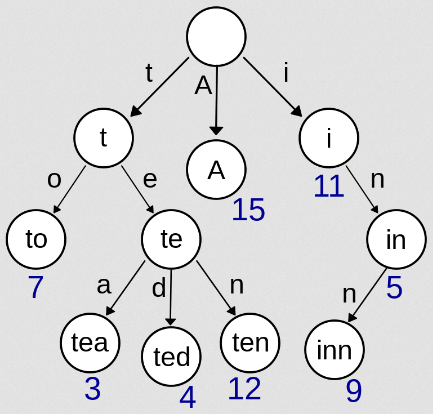

import trie_traversal from "./trie-traversal.mp4";

**Main Source:**

- **[Trie — Wikipedia](https://en.wikipedia.org/wiki/Trie)**

**Trie**, also known as **prefix tree**, is a type of [tree](/data-structures-and-algorithms/tree) data structure, which primarily used for efficient retrieval and storage of strings or sequences of characters.

Just like a typical tree, trie consist a set of node where each node represents a single character or a partial string. The root node represents an empty string, and each path from the root to a leaf node represents a complete string. The edges of the trie are labeled with characters, indicating the next character in the string. By traversing from the root to any path in a trie, the characters encountered along the path form a string.

  
Source: https://upload.wikimedia.org/wikipedia/commons/thumb/b/be/Trie_example.svg/800px-Trie_example.svg.png

For example, in the trie image above, if we traverse to the left ("t"), right ("e"), and left ("a"), sequentially from the root, we will form the string "tea".

One of the main advantages of a trie is its ability to perform prefix matching efficiently and able to store common prefix among strings. Search or matching a given string involves traversing from the root following the character given in the string. All operation including search, insertion, and deletion, all happens in $O(n)$ time complexity, where $n$ is the length of the string we are looking to match, insert, or delete.

:::note
What is a common prefix?  
A prefix is just a part of a string that comes before the rest of the characters. Consider the words "cat," "car," and "dog." We can say "cat" and "car" has common prefix, because both starts with string "ca" in the beginning.
:::

Trie allows for quick lookup and retrieval of all strings that have a given prefix. This property makes tries useful in applications such as autocomplete, spell checking, and searching for words with a common prefix.

  
Source: https://youtu.be/lPgaClbZ90o?si=-WsR_bJBG6JQLgaE

### Trie Implementation

We can implement trie with a tree data structure, which can be implemented using linked list under the hood.

1. Each node will represent either a character or a partial string, except the root node, containing an empty string.
2. The root node should have reference to its child, which can vary depending on the use case. If we only store character, we would only need a maximum 26 children nodes, assuming we are storing the unique alphabets.
3. We will also include a flag or boolean value in each node to indicate if that node represents the end of a complete string or not. For example, when we insert string "tea", we don't want to treat "te" as the complete word, so we will set the flag to false in the "t" and "e" node, while setting the flag to true in "a" node.

- **Searching**: Traverse the trie from the root node, following the path dictated by the characters of the target string. If at any point a character doesn't exist, it indicates that the string is not present in the trie. If we found all the prefix of the string, we will also check if it is a complete string.
- **Insertion**: Similar to search, we will traverse from the root node, when a character exist, we will continue going down there. When a character doesn't exist, we will make a new node for it.
- **Deletion**: Traverse the trie from the root node, once the string is found, we will simply mark the last node as not a complete string. We will not remove the node, to ensure we don't accidentally remove other prefix.

Here is an trie traversal illustration for matching strings.

<video width="695" height="392" controls>
  <source src={trie_traversal} />
</video>
