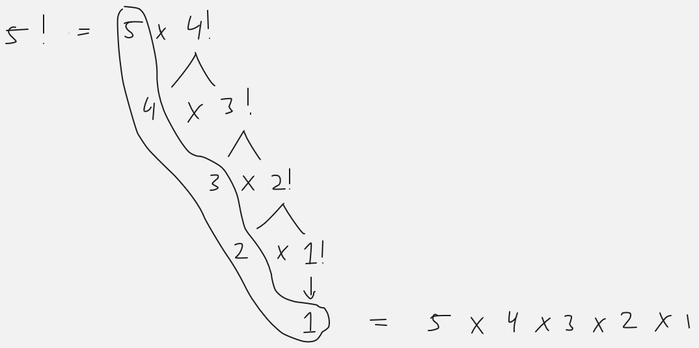
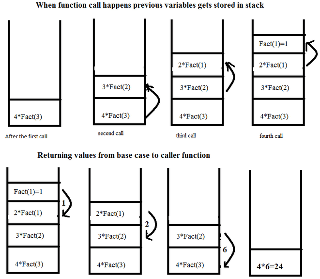
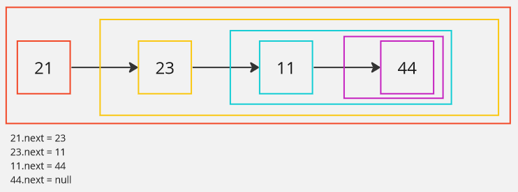

**Main Source:**

- **[Recursion (computer science) — Wikipedia](https://en.wikipedia.org/wiki/Recursion_(computer_science))**

**Recursion** is a programming concept where a function calls itself, either directly or indirectly. Recursion is often used when a problem can be broken down into smaller subproblem. In some cases, breaking down a big problem into a smaller problem make it easier to solve. By solving each smaller subproblem, we will combine the results to solve the overall problem.

Recursive can be an alternative approach for making loops. Instead of creating loops, we can make a function that call itself until certain number of step (similar to a for loop) or until certain condition is reached (similar to a while loop).

### Example

In math, factorial (denoted as $n!$) is an operation that give us the product of all positive integers from the number $n$ up to $1$. If we ask, what is the factorial of $5$ ? Then it will be $5 \times 4 \times 3 \times 2 \times 1$, which is equal to $120$.

Factorial can be seen as a big problem that requires a smaller problem. For example, to calculate factorial of $5$, we will also need to calculate factorial of $4$. The factorial of $5$ which is the $5 \times 4 \times 3 \times 2 \times 1$ can be rewritten as $5 \times 4!$. Expanding further, the factorial of 4, which is $4 \times 3 \times 2 \times 1$ is basically just $4 \times 3!$. If we keep expanding, what is factorial $3$, what is factorial $2$, up to factorial $1$, then the problem will be the same as the original factorial $5$ question.



In other word, we can solve the factorial $5$ problem by breaking it down into smaller subproblem, each calculating its own factorial and we will combine all the result to solve the original problem.

In recursion, we keep breaking down the problem into smaller subproblems, the simplest case or the most fundamental condition of the problem which can be directly solved without further recursion is called the **base case**.

The factorial problem, the last question we will ask is the factorial of $1$, this is because the factorial of $1$ require no additional subproblem. The factorial of $1$ will just be $1$, no other subproblem.

Here is an example of a recursive function in Python programming language. It is a recursive function that calculates factorial.

```python
def factorial(n):
    # Base case
    if n == 1:
        return 1
    # Recursive call
    else:
        return n * factorial(n - 1)

factorial(5) # should be equal to 120
```

In the code, when we call `factorial(5)`, it will first check if the input or `n` is equal to 1 (the base case). If yes, it will just return 1, if no, it will return that input times whatever the result of `factorial(n - 1)` is. Because `n` is 5, it will be conditioned to the else statement, which will return `5 * factorial(4)`. The `factorial(4)` will also return `4 * factorial(3)`. This will go on until we reach `n == 1`.

### Call Stack

When we call a function or methods, the program's [runtime environment](/computer-and-programming-fundamentals/runtime-environment) will keep track the function calls and execution contexts. The data structure used to store the information is a [stack-like data structure](/data-structures-and-algorithms/stack) called **call stack**.

The purpose of using stack data structure is to ensure that the most recently called function is the first one to complete its execution and be removed from the stack (LIFO principles). This order is crucial for maintaining the correct flow and sequence of function calls, such as the case when we expect a function to return something.

While recursion seems like an elegant way to solve big problem by breaking it down into subproblem, it can be quite expensive. Recursion is a function that call itself, because it is a function, every time a recursion happens, the function call will be push into the call stack. In addition, each function call may also contain local variables and function parameters. This is what makes recursion memory-intensive and potentially expensive in terms of computational resources.

Call stack size is typically fixed, when we keep doing recursive call and the call stack exceed its allocated size, then an error called **stack overflow** will occur. This error indicates that there is insufficient space on the call stack to accommodate additional function calls and their associated stack frames. Stack overflow error can also occur in a recursive function where we do not have base case or a valid one. In such a situation, the recursive calls continue indefinitely, similar to an infinite while loop.

  
Source: https://dev.to/muirujackson/call-stack-recursion-40eh

### Linked List Traversal

Traversing a [linked list](/data-structures-and-algorithms/linked-list) from the head to the tail can be implemented using a recursive function. Linked list, contains a node that has reference to the next node, the next node then have another reference to the next node again. This recursive nature allows us to traverse the linked list by recursively visiting each node until we reach the end of the list.

To make a recursive function, we will need a base case, or the problem where another recursive call is not needed. When it comes to traversing a linked list until the tail, the base case occurs when we reach the tail itself, indicating the conclusion of the problem and eliminating the need for another recursive call.

Here is a Python code for traversing linked list

```python
def recursive_traversal(node):
    # Base case: check if the current node is None (end of the list)
    if node is None:
        return

    # Recursively call the traversal function on the next node
    recursive_traversal(node.next)

recursive_traversal(some_linked_list_head)
```

In this code, we do not implement the linked list. Assume that the linked list has attributes `data` which contains the value of the node, and `next`, which is the reference to the next node.

The code checks if the given linked list node is null (known as `None` in Python), else we will call the function itself passing the reference of the next node. When we encounter a null node, we will complete the function.



:::tip
The recursive nature of linked list is similar to the [Matryoshka doll](https://en.wikipedia.org/wiki/Matryoshka_doll).
:::
