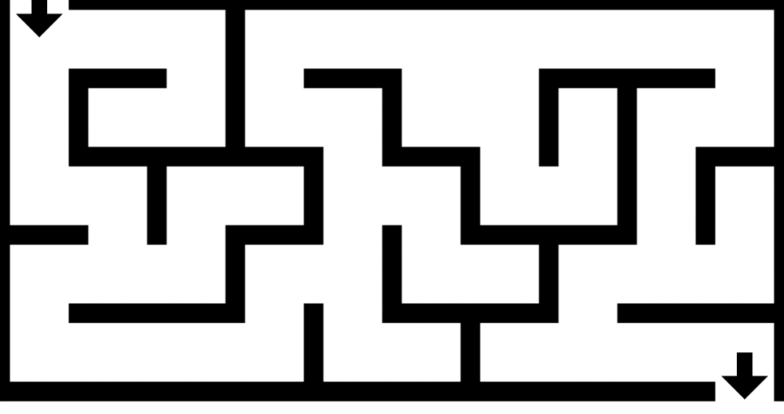

**Main Source:**

- **[Backtracking — Wikipedia](https://en.wikipedia.org/wiki/Backtracking)**

**Backtracking** is algorithmic technique that involves doing certain steps then undoing that steps if it turns out to be incorrect. It is commonly used in a complex problem that require you to adhere to specific constraint. For example, solving a Sudoku puzzle involves constraints such as filling in all empty cells with unique numbers in each row and column.

Backtracking explores all possible solution by trying out different choices at each step. When it does a certain step, it checks if the step we took is valid according to the constraints. If it is valid, we will continue with that step, else, we will undo that step and try out different choice. The behavior of backtracking algorithms makes it result in a high time complexity (e.g., polynomial, factorial, or even higher).

Backtracking typically uses [recursion](/cs-notes/data-structures-and-algorithms/recursion) and traverse the possible solution in [depth-first manner](/cs-notes/data-structures-and-algorithms/traversal#depth-first-search-dfs). The space complexity of backtracking algorithms can also be significant, especially when the depth of the search tree is large.

### Backtracking vs Brute Force

Backtracking approach in solving problem differ with the [brute force](/cs-notes/computer-and-programming-fundamentals/computer-and-programming-terminology) approach. In brute force, we mindlessly try all possible combination. In the case of solving Sudoku, we would fill out all the cell with number 1, and then try again with one cell being number 2, and so on.

On the other hand, backtracking takes into account problem constraints and uses them to efficiently explore the solution space. In the case of solving Sudoku, we would add a constraint such as, not using numbers that are already used in the same grid. Backtracking also involve undoing some steps, instead of starting from zero, we would undo the invalid step and continue from there. This additional characteristics make backtracking faster than a typical brute force solution.

### Solving Maze

Consider a maze with some wall obstacle in it.

  
Source: https://brilliant.org/wiki/depth-first-search-dfs/

A pseudocode to solve it using backtracking:

```
function solve(row, col):
    if (row, col) is the goal:
        return true

    if (row, col) is a valid position in the maze and not a wall:
        Mark (row, col) as part of the solution

        // Try moving in all possible directions: up, down, left, right
        if solveMaze(row - 1, col) is true:   // Try moving up
            return true
        if solveMaze(row + 1, col) is true:   // Try moving down
            return true
        if solveMaze(row, col - 1) is true:   // Try moving left
            return true
        if solveMaze(row, col + 1) is true:   // Try moving right
            return true

        // If none of the directions lead to the goal, backtrack and mark the cell as invalid
        Mark (row, col) as not part of the solution
        return false

    return false

// Start solving the maze from the top-left corner (0, 0)
solveMaze(0, 0)
```

This backtracking solution uses depth-first search (DFS) to traverse the maze. The constraint is quite simple, basically we must navigate to the exit while avoiding wall obstacles.
