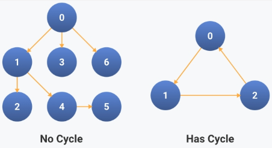
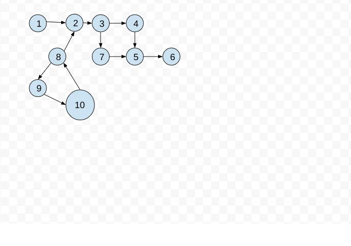
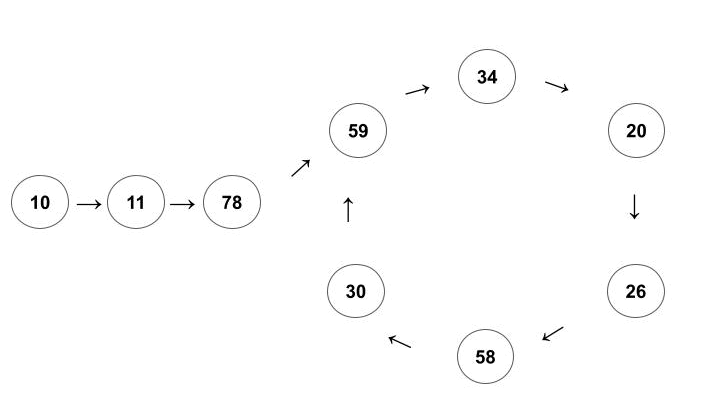

**Main Source:**

- **[Cycle detection — Wikipedia](https://en.wikipedia.org/wiki/Cycle_detection)**

**Cycle Detection** is an algorithm that is used to determine if a sequence of elements or data structures contains a cycle. A cycle refers to a path or sequence of vertices or elements that starts and ends at the same vertex or element, while visiting at least one other vertex or element in between. In other word, a cycle is a situation where you end up back where you started after following a series of steps or connections.

  
Source: https://workat.tech/problem-solving/practice/detect-cycle-in-directed-graph

The data structures include [directed or undirected graph](/cs-notes/data-structures-and-algorithms/graph), [linked list](/cs-notes/data-structures-and-algorithms/linked-list), and [array](/cs-notes/data-structures-and-algorithms/array) with cyclic sequence.

An example of cycle detection in graph would be a simple [DFS traversal](/cs-notes/data-structures-and-algorithms/traversal#depth-first-search-dfs) included with a [set data structure](/cs-notes/data-structures-and-algorithms/set) that stores the visited vertex. DFS traverse the graph as far as possible before going to another branch. Along the traversal, we will check if the vertex is already present in the set, if yes, then there is a cycle in the graph.

  
Source: https://takeuforward.org/data-structure/detect-cycle-in-a-directed-graph-using-dfs-g-19/

### Floyd's Tortoise & Hare Algorithm

**Floyd's Tortoise and Hare Algorithm** is a popular algorithm to detect cycle, it can be applied to sequences and linked structures such as linked list and graph. This algorithm make us the [two pointer technique](/cs-notes/data-structures-and-algorithms/two-pointer) to traverse the data structure and detect the cycle.

We will use two pointers, one pointer is referred as "slow" (or tortoise) pointer, which is used for traversing the data structure gradually, visiting each element one by one, and the "fast" (or hare) pointer for traversing the data structure at a faster pace, advancing two elements at a time.

The idea of this algorithm is that if a cycle exist in a sequence, both pointer will eventually meet at some point. The fast pointer, will eventually catch up with the slow pointer. If there are no sequence, then the fast pointer will finish first before even meeting slow pointer.

Here is the pseudocode for the algorithm to detect linked list:

```
function hasCycle(head):
    slow = head
    fast = head

    while fast is not null and fast.next is not null:
        slow = slow.next
        fast = fast.next.next

        if slow == fast:
            return true

    return false
```

When the pointer becomes null, it indicates the end of the list. If the loop completes, which mean the fast pointer reach the end of the linked list, then there is no cycle.

  
Source: https://turboyourcode.com/algorithm/floyd-s-cycle-finding

This algorithm can also be modified to find the start of the cycle. The start of the cycle can be found by resetting the slow pointer to the head and keep the fast pointer as it is. Both pointer will traverse again normally, **in addition with the same pace, one step at a time**. When they meet again, that meeting point is the starting point of the cycle.
