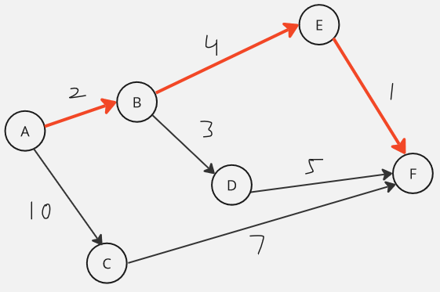
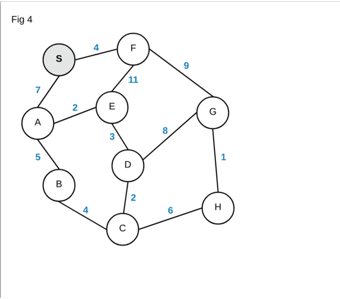
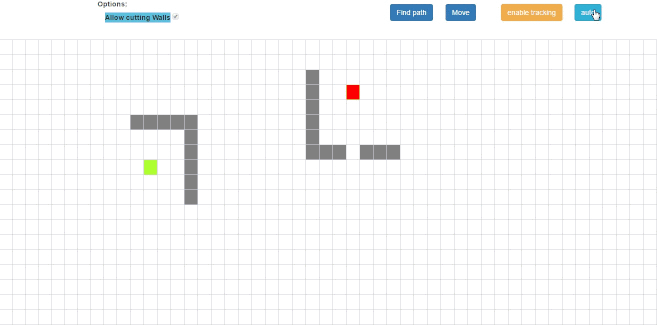

**Main Source:**

- **[Shortest path problem — Wikipedia](https://en.wikipedia.org/wiki/Shortest_path_problem)**
- **[Dijkstra's algorithm — Wikipedia](https://en.wikipedia.org/wiki/Dijkstra%27s_algorithm)**
- **[A\* search algorithm — Wikipedia](https://en.wikipedia.org/wiki/A*_search_algorithm)**

**Shortest Path** is the path between two vertices or nodes in a graph which has minimum total weight or cost among other possible path. A weight refers to a numerical value associated with a edge in a graph. It represents the effort required to traverse that path.

Shortest path is a common problem in graph theory and optimization. It is a common problem even in real life, where it is used to navigate or finding optimal route between locations.



Here is an illustration, in the image above, we are supposed to start from node A and traverse to node F. There are total of three ways to get to node F, which are:

- A → C → F: (10 + 7 = 17)
- A → B → D → F: (2 + 3 + 5 = 10)
- A → B → E → F: (2 + 4 + 1 = 7)

While the first path visits the minimal nodes, it results in the highest cost. The problem become harder when we have a lot of paths, and each of the cost vary within the path. For example, one path may have larger cost at the start, but it may have a lower cost latter, leading to lower total cost overall.

### Dijkstra's Algorithm

**Dijkstra's Algorithm** is a popular algorithm to find the shortest path between a source vertex to **all the other vertex** in a [weighted graph](/data-structures-and-algorithms/graph#weighted). Dijkstra's algorithm works by exploring the graph from the source to each target, the cost of each traversal between nodes is kept track.

Dijkstra's algorithm explores the path systematically. When there are many possible paths, the algorithm prioritize the path with the currently minimum cost. It continues along this path before moving on to others. At the end, the algorithm will explore all the possible paths.

The systematic behavior of Dijkstra's algorithm is similar to [BFS traversal](/data-structures-and-algorithms/traversal#breadth-first-search-bfs), it uses a [queue data structure](/data-structures-and-algorithms/queue), specifically the [priority queue](/data-structures-and-algorithms/queue#priority-queue), which is often implemented using [min-heap](/data-structures-and-algorithms/heap) to keep track of the path with the currently minimum cost. It is also considered as [greedy algorithm](/data-structures-and-algorithms/greedy), because it traverses the optimal path first.

Here is the pseudocode:

```
function Dijkstra(graph, source):
    visited = set()
    distance = []
    previous = []
    heap = minHeap()

    for each vertex v in graph:
        distance[v] = infinity
        previous[v] = undefined

    distance[source] = 0
    heap.add(source, 0)

    while heap is not empty:
        currentVertex = heap.poll()
        if currentVertex is visited:
            continue

        visited.add(currentVertex)

        for each neighbor of currentVertex:
            if neighbor is visited:
                continue

            cost = distance[currentVertex] + weight(currentVertex, neighbor)

            if cost < distance[neighbor]:
                distance[neighbor] = cost
                previous[neighbor] = currentVertex
                heap.update(neighbor, cost)

    return distance, previous
```

  
Source: https://blog.aos.sh/2018/02/24/understanding-dijkstras-algorithm/

1. The `distance` is an array to store the shortest distance from the source vertex to each vertex. The `previous` is another array used to store the previous vertex that leads to the currently known shortest path from the source vertex to each vertex.
2. We initially make all the distance from the source to each vertex in the graph to infinity, indicating they are yet to be determined. Except for the source vertex, we will make it 0, because that is where we are going to start.
3. We add the source to the min-heap and start the loop by polling it (remove and return the minimum element). Whatever vertex is returned, if that vertex has been visited before (present in visited set), then we will skip it, else we will continue the loop and add it to the visited set.
4. We will iterate through every neighbor of that vertex. Next, we will add the vertex to the heap for next visit, but we will only add the one that hasn't been visited before.
5. We will also calculate the cost by adding the previous tracked distance with the new cost from the `currentVertex` to the target `neighbor`. Also update the `distance` and `previous` array with the `currentVertex` and `cost` and update the neighbor's key with the new cost in the min-heap.
6. When the heap is empty, indicating there are no more paths to traverse, we will return the `distance` and `previous` array. The `distance` array contains the shortest path from source vertex to all other vertex, and the `previous` array contains the path that correspond to it.

Using binary heap, we will obtain $(V + E) \log V$ time complexity, where $V$ is the number of vertices and $E$ is the number of edges.

- Initializing the distance and previous arrays is $O(V)$.
- The main part of the algorithm is the while loop, which runs until the priority queue becomes empty. Adding vertex to the heap takes $O(\log V)$ time, if we add a total of $V$ number of vertices, then it will be $O(V \log V)$
- Within the while loop, we iterate over the neighbors of the current vertex. In the worst case, each edge is considered once, resulting in a total of $O(E)$ iterations.
- Performing heap update takes $O(\log V)$. Since the total number of vertex-neighbor pairs in the graph is $E$, the time complexity of these operations is $O(E \log V)$.

We can also optimize this using **Fibonacci heap** instead of binary heap to obtain $O(E + V \log V)$ time complexity.

### Pathfinding

**Pathfinding** is a similar problem to shortest path, it finds the most efficient path from a starting point (source) to a destination point (target). The efficiency of a path is typically measured based on certain criteria.

Dijkstra's algorithm can be used for pathfinding, it works for non-negative edge weights. It explores the graph in a breadth-first manner, iteratively expanding the vertices with the smallest known distance.

#### A\* Search

**A\* search algorithm** is a popular pathfinding algorithm, which is an extension of Dijkstra's algorithm. While Dijkstra solely considers the weight of edges, a\* search algorithm adds another consideration and prioritize that seem more likely to lead to the goal.

The priority value is calculated by:

$f(v) = g(v) + h(v)$

Where:

- $f(v)$: referred as f-score or function score
- $g(v)$: the cost accumulated so far
- $h(v)$: heuristic estimate of the remaining cost from the current vertex to the target vertex.

The key point of a\* is the $h(v)$, Dijkstra's algorithm is the case where the $h(v)$ is 0, or it doesn't consider the heuristic estimate and solely depends on the weights.

The heuristic estimate is an approximation of the distance or cost from some vertex to the goal. The specific implementation of the function depends on the problem. For example, in a map navigation problem, it can be a straight line distance.

The heuristic estimate helps us to only focus on the path that might lead to the target. A\* search algorithm doesn't visit every node, it stops when it reached the goal. This is a reason of why a\* is more suited for goal-directed search problems, where we don't need to know the distance to all the vertex, unlike Dijkstra's algorithm.

Here is the pseudocode:

```
function AStarSearch(start, goal):
    openSet = PriorityQueue()
    openSet.add(start)
    cameFrom = empty map
    gScore = map with default value of infinity
    gScore[start] = 0
    fScore = map with default value of infinity
    fScore[start] = heuristicCostEstimate(start, goal)

    while openSet is not empty:
        current = openSet.removeMin()

        if current is goal:
            return reconstructPath(cameFrom, current)

        for each neighbor in neighbors(current):
            tentativeGScore = gScore[current] + distance(current, neighbor)

            if tentativeGScore < gScore[neighbor]:
                cameFrom[neighbor] = current
                gScore[neighbor] = tentativeGScore
                fScore[neighbor] = gScore[neighbor] + heuristicCostEstimate(neighbor, goal)

                if neighbor not in openSet:
                    openSet.add(neighbor)

    return failure

function reconstructPath(cameFrom, current):
    totalPath = [current]

    while current in cameFrom:
        current = cameFrom[current]
        totalPath.appendAtFirst(current)

    return totalPath
```

  
Source: https://github.com/vittin/A-Star

We can see that the path frequently approach the wall that closely covers the target due to the heuristic function. The algorithm may perceive those paths as potentially shorter or more promising.

1. We initialized some data structures, the `openSet` is a data structure, which is a priority queue that keeps track of the vertices that have been discovered but have not yet been fully explored. Similar to Dijkstra's algorithm, we will initialize the distance as infinity. The heuristic function takes source and target vertex, the implementation depends on the specific problem.
2. The algorithm runs while the `openSet` is not empty. We will always start from the highest priority, or the one that has the lowest f-score.
3. If the current vertex is not the goal, the algorithm explores its neighbors. The tentative g-score represents the cost of reaching a target vertex from the starting vertex via the current path being explored. We will compare each g-score of the neighbor, if we found a lower g-score than the current path we are exploring, we will continue in that path, else we will continue with the current path.
4. If we found the better path, we will update the `cameFrom`, `gScore`, and `fScore`. We will also update that neighbor if it is not already in the open set.
5. If the open set becomes empty and the goal vertex has not been reached, the algorithm returns "failure" to indicate that no path was found.
6. The successful search returns the path constructed by the `reconstructedPath` function. The `reconstructedPath` construct the path that we traversed in reverse manner. It starts from the goal and it finds the source from the `cameFrom` map.

The complexity of a* search algorithm, again, it depends on the heuristic function. In the terms of vertices and edges in the graph, a* search algorithm results in the worst-case performance of $O(E \log V)$, with the space complexity being $O(V)$.

The priority queue operation (e.g., using heap) requires $O(\log V)$ time to remove an element. In the worst case, the number of elements in the priority queue can be proportional to the number of edges, resulting in $O(E \log V)$ time complexity. The space required is $O(V)$, the algorithm needs to store information in the `openSet`, and other data structures such as the `cameFrom`, `gScore`, and `fScore` maps.

Another way to represent the complexity of a\* algorithm is using **branching factor (b)** and **depth of the solution (d)**. (b) represents the average number of neighbors that a node has in a graph. (d) is the length or number of steps required to reach the goal or desired solution from the starting point. Using these, the overall worst-case time complexity becomes $O(b^d)$.
