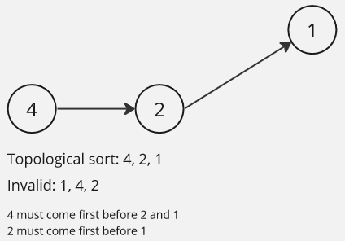

**Main Source:**

- **[Topological sorting — Wikipedia](https://en.wikipedia.org/wiki/Topological_sorting)**
- **[Topological Sort Visualized and Explained — Carl the Person](https://youtu.be/7J3GadLzydI?si=KKS4GPSjS7SAd_om)**

**Topological Sort** is an algorithm used to order the vertices of a [directed graph](/data-structures-and-algorithms/graph#directed), so that each vertex appears before any of its successors in the ordering. It provides a linear ordering of the vertices that respects the directed edges of the graph.



The one that is pointed should be done after the one pointing to it. The main application of topological sorting is in scheduling problems, where certain tasks must be performed before others.

### Algorithm

The algorithm can be implemented using [DFS](/data-structures-and-algorithms/traversal#depth-first-search-dfs) or [BFS](/data-structures-and-algorithms/traversal#breadth-first-search-bfs) traversal.

```
function topologicalSort(graph):
    mark all vertices as unvisited
    initialize an empty stack

    for each vertex in the graph:
        if the vertex is unvisited:
            visit(vertex, stack)

    return reversed(stack)

function visit(vertex, stack):
    mark the vertex as visited

    for each neighbor of vertex:
        if the neighbor is unvisited:
            visit(neighbor, stack)

    push vertex onto stack
```

In this code, it is implemented using DFS, in the `visit` function. For each neighbor of the vertex, if the neighbor is unvisited, the visit function is called recursively on that neighbor. After visiting all the neighbors of a vertex, that vertex is pushed onto the stack. The stack is used to maintain the ordering of the vertices based on the topological sort property.

We will also need to return the reverse order of the stack, to ensure that the top element of the stack represents the first vertex in the topological ordering.

The time complexity for topological sort is $O(V + E)$, where $V$ and $E$ is the number of vertices and edges, respectively. We will need to traverse the whole graph in order to obtain the vertices ordering. The space complexity is $O(V)$ to store the visited vertices.
