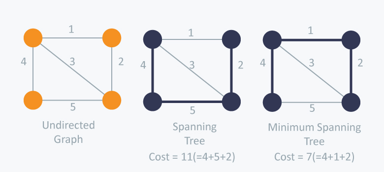

**Main Source:**

- **[Prim's algorithm — Wikipedia](https://en.wikipedia.org/wiki/Prim%27s_algorithm)**
- **[Prim's algorithm in 2 minutes — Michael Sambol](https://youtu.be/cplfcGZmX7I?si=cd3rQ5d0UnaGxECM)**

**Minimum Spanning Tree (MST)** is a concept in [graph](/cs-notes/data-structures-and-algorithms/graph), specifically in a [weighted graph](/cs-notes/data-structures-and-algorithms/graph#weighted), where we need to find the minimum possible total weight for connecting all the vertices. The real world application of this is to make the most effective connection between a set of locations.

  
Source: https://www.hackerearth.com/practice/algorithms/graphs/minimum-spanning-tree/tutorial/

Notice that we don't need to explore the entire graph's edges, we are only needed to connect the vertices. The difficulty of this problem arise when there are a lot of vertices and edges, making us need to choose path carefully, so it can lead to the minimum cost.

### Prim's Algorithm

**Prim's algorithm** is a [greedy algorithm](/cs-notes/data-structures-and-algorithms/greedy) that finds a minimum spanning tree for a [weighted](/cs-notes/data-structures-and-algorithms/graph#weighted) [undirected](/cs-notes/data-structures-and-algorithms/graph#undirected) graph.

```
function prim(graph, start):
    MST = set()
    PQ = PriorityQueue()
    visited = set()

    PQ.add(start, 0)

    while PQ is not empty:
        current = PQ.extractMin()

        if current is not in visited:
            visited.add(current)
            MST.add(current)

            for each neighbor in current's neighbors:
                if neighbor is not in visited:
                    PQ.add(neighbor, weight(current, neighbor))

    return MST
```

Similar to [Dijkstra's algorithm](/cs-notes/data-structures-and-algorithms/shortest-path#dijkstras-algorithm), it uses priority queue to help to prioritize the minimum weight and a visited set to keep track the visited vertex.

1. It begins from the `start` node, which is initially added to the PQ and extracted immediately.
2. Ensure that we only visit the node which hasn't been visited.
3. If it hasn't been visited, add it to the visited set and MST set.
4. Iterate over each neighbor of the current vertex, make sure that only neighbors that have not been visited yet are added.

  
Source: https://en.wikipedia.org/wiki/Prim%27s_algorithm

The complexity depends on the graph representation (e.g., adjacency list or adjacency matrix) and the priority queue implementation (e.g, binary heap or Fibonacci heap). Using adjacency list and binary heap, we can obtain $O(E \log V)$ time complexity. Updating a key in the heap takes $O(\log V)$, updating it for each edge takes $O(E \log V)$. The space complexity would be $O(V)$, which comes from the visited set storing the visited vertices and the heap itself.
