**Main Source:**

- **[SQL — Wikipedia](https://en.wikipedia.org/wiki/SQL)**
- **[SQL syntax — Wikipedia](https://en.wikipedia.org/wiki/SQL_syntax)**
- **Chapter 2, 5, 6 - Database Systems - The Complete Book (2nd Edition)**

**Query Language** is a specific programming language designed to make [queries](/database-system/relational-data#query) in a database.

### SQL

One of the commonly used query language is the **Structured Query Language (SQL)**. SQL is a form of [declarative language](/computer-and-programming-fundamentals/declarative-functional-programming#declarative-programming), meaning users specify what data they want to retrieve or manipulate, rather than the traditional programming that specify what should a program does.

:::tip
SQL is just a query language, it is not an actual database. The actual database that is based on relational model (or called relational database) are database like MySQL, Oracle, Microsoft SQL Server, etc. These databases use SQL as the language in their relational database management systems (RDBMS).
:::

#### Syntax

In order to query from a database, we will need to enter SQL commands. SQL commands consist of a series of instructions that are human-readable. Each SQL command consists of one or more keywords, clauses, and expressions that together form a statement with a specific purpose. For example there is a keyword called `SELECT` which allow you to retrieve data. To retrieve data from a specific table in the database, the `SELECT` clause is followed by a list of columns and table name that we want to retrieve.

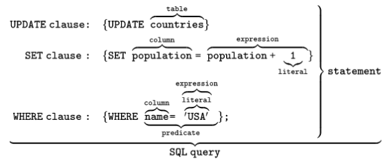  
Source: https://en.wikipedia.org/wiki/SQL

##### Clauses

SQL clauses are keywords or reserved words that perform specific functions in the statement. Some commonly used clauses include `SELECT`, `FROM`, `WHERE`, `GROUP BY`, `HAVING`, `ORDER BY`, `INSERT INTO`, `UPDATE`, and `DELETE FROM`. It's worth noting that some of these clauses are optional.

- `SELECT`: As mentioned earlier, it is a keyword used to retrieve data. To retrieve data, we will need to specify the specific columns that we want to retrieve from one or more tables in the database that we also need to specify.
- `FROM`: This keyword specifies the table from which we want to retrieve data. It is followed by the name of the table. Using `SELECT` and `FROM` together, it will be like `SELECT * FROM customers`, which mean we are going to retrieve all the data from the `customers` table. The `*` is actually a symbol that represents all columns in a table.
- `WHERE`: It is a clause used to filter the rows based on specified conditions. For example `SELECT * FROM customers WHERE age = 33`, this mean we are going to retrieve all column from `customers` table, but only the data "where" column named `age` is equal to 33. The `=` is symbol that checks for equality, it is an example of **operator**, which is explained more below.
- `GROUP BY`: The `GROUP BY` groups rows based on one or more columns. It is typically used in a situation where there are multiple row, each with different value in a specific column. Grouping them allows us to see the data based on the different column in the perspective of those rows combined.

  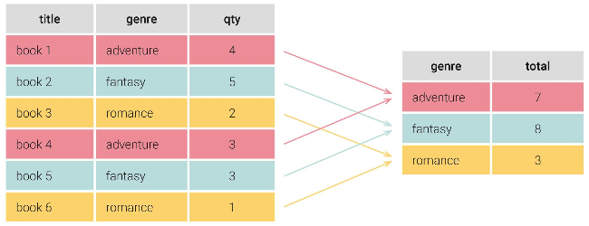  
  Source: https://learnsql.com/blog/group-by-in-sql-explained/

- `HAVING`: The `HAVING` clause is used to filter the groups created by the `GROUP BY` clause. It specifies extra conditions that must be met by the groups in order to be included in the result query.
- `ORDER BY`: The `ORDER BY` clause is used to sort the result set based on one or more columns. For example, we may sort the resulting query of customer table by their age, based on the age column. Without using this clause, by default it will sort the data in ascending (explicitly, `ORDER BY ASC`) order. We can make it to sort it in descending order by using the `ORDER BY DESC`.

SQL clauses perform specific functions, they have particular order of execution:

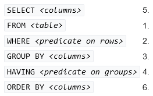  
Source: https://en.wikipedia.org/wiki/SQL_syntax

:::info
The `SELECT` statement is also known as the **projection** operator. Projection is simply selecting a set of columns, eliminating the rest of larger set of columns. Also, the `WHERE` statement is a **selection** operation. Selection is the operation of filtering rows that satisfies certain condition.
:::

##### Operators

Operators are symbols or keywords that are used to perform comparisons, calculations, or logical operations on values or expressions.

- Comparisons:

  - `=` (equal to)
  - `<>` or `!=` (not equal to)
  - `<` (less than)
  - `>` (greater than)
  - `<=` (less than or equal to)
  - `>=` (greater than or equal to)

  With the example earlier, we used the `=` to check if particular row has its age column equal to 33. We can also check if the age column is less than some number in order to filter the result to only include rows where the condition is met.

- Arithmetic Operators, they are used to perform mathematical calculations.

  - `+` (addition)
  - `-` (subtraction)
  - `*` (multiplication)
  - `/` (division)

  When retrieving student data, maybe we want to check if the total of their score reaches the minimum threshold. We can do this by selecting all the student from the table and add each score's column and then combine it the comparison operator to compare it with the minimum threshold. This way we can easily retrieve the relevant student data.

- Logical Operators, these operators are used to combine or negate conditions and evaluate logical expressions.

  - `AND` (logical AND)
  - `OR` (logical OR)
  - `NOT` (logical NOT)

  For example, we can select data that meets two conditions simultaneously by using the `AND` operator. Or maybe choose data if at least one of the conditions is satisfied by using the `OR` operator.

##### Literals

Literals are fixed values that are directly specified in an SQL statement. They can be numeric literals (e.g., 123, 3.14), string literals (e.g., 'Hello', "World"), date literals (e.g., '2024-01-25'), or Boolean literals (e.g., TRUE, FALSE), etc.

##### Expressions

Expressions are combinations of SQL syntax components that produce a single value. For example, in the statement `SELECT score1 + score2 FROM student`, the `score1 + score2` is an expression. The `score1` and `score2` is a specific column in the `student` table. Because they are column, adding them means we are combining the value of both column into a single new column. The overall statement will retrieve the new column for each row in the `student` table.

Expressions can be used in different parts of an SQL statement, such as the SELECT list, WHERE clause, and ORDER BY clause. For example, column1 + column2 is an expression that adds the values of two columns.

##### Predicates

Predicates are conditions or expressions that produces a condition or logical value, such as true, false, or unknown. It is used in the `WHERE` clause to filter rows based on specified criteria.

Predicates are produced by comparison operator such as `=` (equal to), `<>` (not equal to), `>` (greater than), `<` (less than). For example, `age > 18` is a predicate that filters rows where the `age` column is greater than 18.

##### Example

Another example of fully working SQL statement that retrieves the column `airport_name`, `iata_code`, `passengers` from the table `airport`, but only includes rows where the number of passengers is greater than 10,000,000.

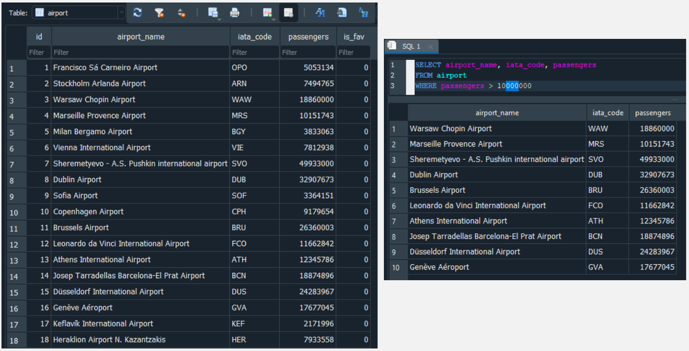

:::info
SQL statement can be placed in multi or single line. The end of a statement is marked with the semicolon `;`.
:::

#### Data Types

- **Numeric**:
  - `INT` or `INTEGER`: Integer values (whole numbers).
  - `FLOAT` or `REAL`: Floating-point numbers (decimal numbers).
  - `DECIMAL(p, s)`: Fixed-point numbers with specified precision p and scale s.
  - `NUMERIC(p, s)`: Synonym for DECIMAL.
- **Character**:
  - `CHAR(n)`: Fixed-length character string with a maximum length of n.
  - `VARCHAR(n)`: Variable-length character string with a maximum length of n.
  - `TEXT`: Variable-length character string with no maximum length.
- **Date and Time**:
  - `DATE`: Date values in the format "YYYY-MM-DD".
  - `TIME`: Time values in the format "HH:MI:SS".
  - `DATETIME` or `TIMESTAMP`: Combination of date and time values.
  - `INTERVAL`: Represents a duration or time span.
- **Binary**:
  - `BINARY(n)`: Fixed-length binary data with a maximum length of n.
  - `VARBINARY(n)`: Variable-length binary data with a maximum length of n.
  - `BLOB`: Variable-length binary data with no maximum length.
- **NULL**: `NULL` is a special value that represents the absence of data or the unknown value for a particular column in a table.

:::info
Some SQL database typically do not have boolean data types, they typically represent true as integer 1 and false as integer 0
:::

### DDL, DML, DQL, DCL

SQL statements are categorized into 4 types based on their functionalities.

- **Data Definition Language (DDL)**: Consist of statement that define and manage the structure of database objects. This includes creating, altering, and dropping database objects such as tables. Examples of DDL statements include `CREATE`, `ALTER`, and `DROP`.
- **Data Manipulation Language (DML)**: Statements that manipulates the data within the database objects, including insert, update, delete, and retrieve data from tables. Examples of DML statements include `INSERT`, `UPDATE`, `DELETE`, and `SELECT`.
- **Data Query Language (DQL)**: Statements that makes up for querying and retrieving data from the database. The primary DQL statement is `SELECT`, which allows to specify the columns, tables, and conditions to retrieve the desired data.
- **Data Control Language (DCL)**: Database may also be provided with specific permissions. DCL statements are used to manage the permissions and access rights within the database. They control the security aspects of the database by granting or revoking permissions to users and roles. Examples of DCL statements include `GRANT` and `REVOKE`.

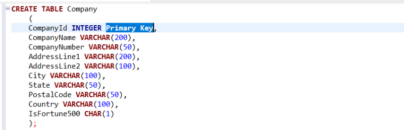  
Source: https://allthingssql.com/sql-create-table-examples/

The above is an example of creating a table in SQL (`CREATE TABLE` is a form of DDL). We will need to provide the [schema](/database-system/relational-data#schema) of the database, or basically the structure of how the database. For example, there is a column called `CompanyId` with the type of `INTEGER`, and it is defined as the [primary key](/database-system/relational-data#primary--foreign-key).

#### Other Operations

There are too many operations to cover on SQL. Also, each RDBMS such as MySQL or SQL server may provide their own custom function as extras.

##### Functions

SQL provides various built-in functions to perform calculations, manipulate data, and retrieve information from the database. Functions can be used in SQL statements to transform data, aggregate values, extract substrings, perform mathematical operations, and more. Examples of SQL functions include `COUNT`, `SUM`, `AVG`, `MAX`, `MIN`, `UPPER`, `LOWER`, and `SUBSTRING`.

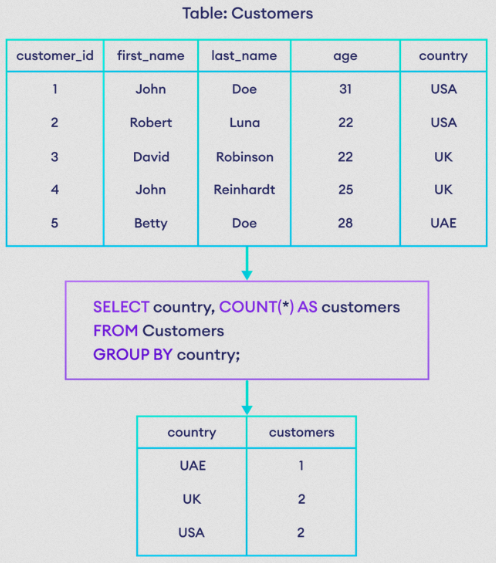  
Source: https://www.programiz.com/sql/count

The image above is an example of the usage of `COUNT` function, which returns the number of rows that match a specified condition.

:::info
The `AS` is a keyword that assign an alias or a temporary name to a column, table, or result set. The purpose is to provide more meaningful or concise names to the columns or tables in the queries, making the output easier to understand or work with.
:::

The query originate from the table `Customers`, it selects column `country` along with the count of the customer, which is grouped by the `country` column. The `*` symbol which we have used for `SELECT` statement earlier, can also be used as the condition of the `COUNT`. Using `*` on `COUNT` would count all the rows in a table, regardless of the values in specific columns or any conditions. It essentially returns the total number of rows in the specified table or the result set.

##### INTERSECT & UNION

Another operations of SQL are `INTERSECT` and `UNION`.

The `INTERSECT` operation is used to retrieve the common rows between two `SELECT` statements. It returns only the distinct rows that exist in both result sets of the `SELECT` statements.

Example:

```sql
SELECT column1, column2 FROM table1
INTERSECT
SELECT column1, column2 FROM table2;
```

The `UNION` operation is used to combine the result sets of two or more `SELECT` statements into a single result set. It returns all the distinct rows from all the `SELECT` statements, eliminating duplicates.

Example:

```sql
SELECT column1, column2 FROM table1
UNION
SELECT column1, column2 FROM table2;
```

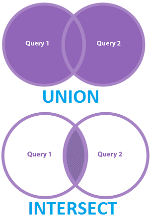  
Source: https://www.c-sharpcorner.com/article/the-complete-reference-set-operations-in-ms-sql-union-all-intersect-excep/

##### JOINS

SQL joins are used to combine rows from two or more tables based on a related column between them. There are many types of joins operations in SQL, they allow us to retrieve data by establishing relationships between tables.

- `INNER JOIN`: Returns only the rows that have matching values in both tables being joined.
- `LEFT JOIN`: Returns all the rows from the left table and the matching rows from the right table.
- `RIGHT JOIN`: Returns all the rows from the right table and the matching rows from the left table.
- `FULL OUTER JOIN`: The FULL JOIN returns all the rows from both tables, regardless of whether they have a match or not. This is same as `UNION`, the difference is how it is processed by the database engine under the hood.

For left and right join, if there is no match for a row in either table, `NULL` values are returned for the table's columns.

Example of the statement:

```sql
SELECT column1, column2
FROM table1
INNER JOIN table2 ON table1.column = table2.column;
```

Regardless of what joins, the syntax is roughly the same, they only differ in how the data is processed under the hood.

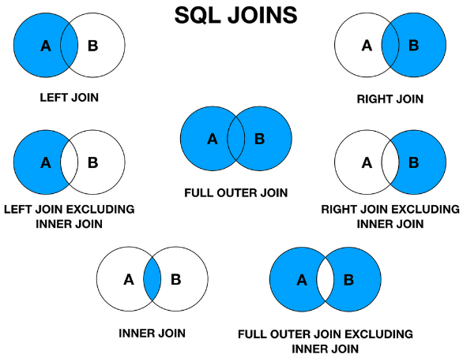  
Source: https://medium.com/@iammanolov98/mastering-sql-joins-coding-interview-preparation-innerjoin-e96bef58afc2

Below is an actual example of `LEFT JOIN`. Two tables are "joined" together on the column `Student ID`. Only the ID 1004 that exist in both table, therefore it will be the only one that has non-null value on `Department` column. Also, we are left joining them, thus all the row from first table is preserved.

It is worth noting that the behavior of `JOIN` differ in what order we specify the table. Left joining table1 with table2 will yield different result with left joining table2 and table1.

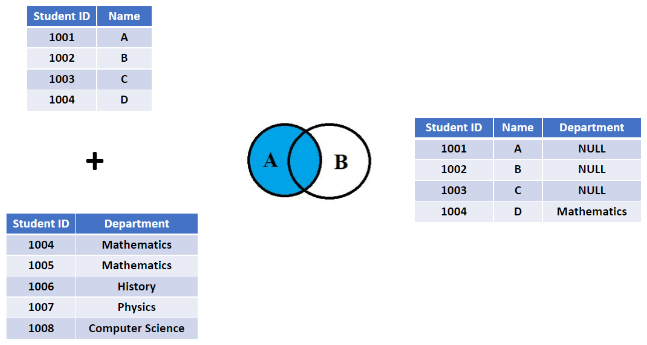  
Source: https://www.shiksha.com/online-courses/articles/sql-left-join-examples-and-syntax/

### How SQL works

#### Math

Relational database, relational model, and SQL is originally based on several mathematical studies:

- **Set theory**: Set theory is the foundation of the relational model in database systems. It encompasses the concepts of sets, relations, and operations on them. The relational model represents data as sets and uses set theory principles to define operations such as union, intersection, and difference.
- **Relational algebra**: Relational algebra is a mathematical system used to manipulate and query data in the relational model. It expresses operations on relations, such as selection, projection, join, and set operations.
- **Relational calculus**: Relational calculus is a formal language for expressing queries in the relational model. It defines the logical and declarative approach to query formulation, where queries are expressed as formulas or rules. There are two types of relational calculus: tuple calculus and domain calculus. Tuple calculus operates on individual tuples, while domain calculus operates on the attributes and values of tuples.
- **Predicate logics**: Predicate logic is a mathematical system used for formalizing logical statements and reasoning about them. It involves the use of predicates, which are statements that can be true or false depending on the values of their variables. Predicate logic are operators like logical (`AND`, `OR`, `NOT`) and comparison (`=`, `<`, `>`).

Because SQL is [declarative](/computer-and-programming-fundamentals/declarative-functional-programming#declarative-programming), as a user, we will never be concerned in how the engine process the query. Under the hood, given a complex SQL statement, it is common for the database engine to process the operation based on these mathematical principles.

For example, the SQL INTERSECTION is an easy example of set theory application. In mathematics, a set is defined as a collection of distinct elements. In SQL, tables can be thought of as sets of rows.

Suppose we have two sets $A$ and $B$: $A = \{1, 2, 3, 4\}$, $B = \{3, 4, 5, 6\}$

It can be thought as table $A$ that has row $\{1, 2, 3, 4\}$ and only a single column, similarly for table $B$.

Mathematical representation: $A \cap B = \{3, 4\}$

In this case, the set intersection operation results in a new set that contains the common elements between sets $A$ and $B$, which are 3 and 4.

#### Projection

In the relational model, everything is represented as **tuples**. A tuple is a finite ordered sequence of elements, where each element corresponds to a specific attribute or column in a relation or table. Tuples in the relational model are analogous to rows in a database table.

:::info
Same terminology:  
Table -> relation  
Row -> tuple  
Column -> attribute
:::

Consider a table called `Employees` with the following columns: `EmployeeID`, `FirstName`, and `LastName`. Each row in the `Employees` table can be represented in the following tuple:

```
Tuple 1: (1, "John", "Doe", 50000)
Tuple 2: (2, "Jane", "Smith", 60000)
Tuple 3: (3, "David", "Johnson", 55000)
```

As explained earlier, the `SELECT` statement is also known as projection. Using `SELECT` effectively selects certain column from a table. Mathematically, the projection operation refers to the extraction of specific attributes from a relation or set of tuples. It can be represented using mathematical notation as follows:

Let $R$ be a relation or set of tuples, and let $A_1, A_2, ..., A_n$ be the attributes or columns to be selected from $R$. The projection operation, denoted as $\pi$, selects the specified attributes from the relation $R$.

If we have $n$ number of columns, mathematically it would be: $\pi A_1, A_2, ..., A_n$

If we choose to query the `EmployeeID` and `FirstName` column, the SQL statement would be: `SELECT EmployeeID, FirstName FROM Employees`. In math representation: $\pi \text{ EmployeeID}, \text{FirstName}$.

#### Query Processing

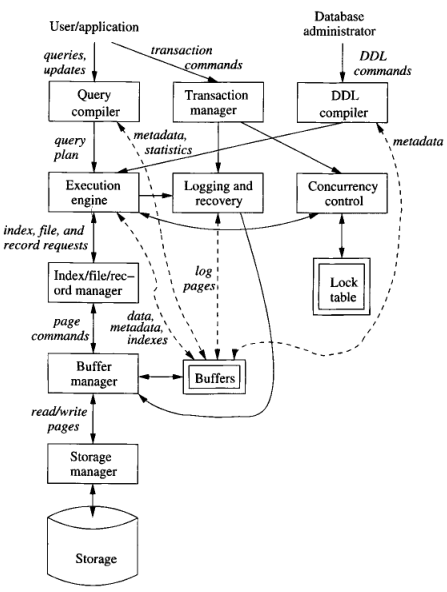  
Source: Book page 6

A database query goes to several processes:

1. **Parse & Compilation**: User made a query through DML, the query compiler will parse the query, breaking it down into a parse tree. The query preprocessor takes the parsed query and performs semantic check to ensure its correctness. The query will be transformed into the mathematical representation of relational algebra. The transformed representation will be optimized by finding the most efficient sequence of operations on the actual data. The optimizer will keep the metadata and statistics of the database.

   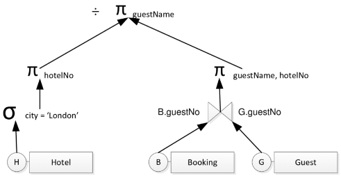  
   Source: https://www.researchgate.net/figure/A-Relational-Algebra-Tree_fig11_305333879

2. **DDL Commands**: The DDL commands provided by the database administrator, which include the schema of the database will be passed to the DDL compiler, serving information about the database for the query process.
3. **Transactions & Concurrency Control**: The query and other database operation will be grouped together into one unit of execution, called [transactions](/database-system/transactions). This is done to ensure the execution of all operations as a single unit, preventing the possibility of executing only some of them and being unable to complete the remaining operations due to system failures.

   A piece of transaction is delegated to concurrency control, which is a component that handles concurrency mechanism. Two or more database operations that are reading and writing the same data, needs to be prevented to access it at the same time to prevent [data races](/computer-and-programming-fundamentals/concurrency#race-condition). The information of concurrency is stored in the lock table. The concurrency control decides the execution order and send it to execution engine.

4. **Execution Engine**: The query will be planned into a sequence of actions that the DBMS will perform. The execution engine is responsible to plan which operation is done first, in the case of multiple operation carried out within single query.

   For example, in a student database, let's say we wanted to get student name that has score greater than 80 and is a male.

   - We would filter the table for the condition separately. In the first filter, we take data with score greater than 80. In the second filter, we will take data that satisfy male condition.
   - We will find the intersection between the two filter, and then we will project or take the data with the specified column.

   We will also save some information about the query to the logging and recovery manager.

5. **Resource Manager**: Execution engine issue commands to the resource manager, which is a component that knows the information about the table and the location of them in the storage.
6. **Buffer Manager**: Buffer manager is the component that manages memory. The storage stores data in a form of block, which is a fixed-size unit of data for storage. The buffer manager will partition the main memory into buffers, which is a fixed-size unit of data for memory. The buffers serve as the memory region where disk block transfer take place.
7. **Storage & Storage Manager**: The storage is typically a secondary storage such as hard disk. Disk stores nothing but blocks of data, it will require a component that knows the placement of block in the disk. In other word, the component know the file structure of disk. The component that know it is **storage manager**, it will be responsible for controlling the data transfer between buffer manager and the underlying storage. In simple database system, the storage manager can be the [file system](/operating-system/file-system) of the operating system.
