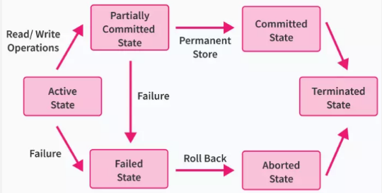

**Main Source:**

- **[Database transaction — Wikipedia](https://en.wikipedia.org/wiki/Database_transaction)**
- **[ACID — Wikipedia](https://en.wikipedia.org/wiki/ACID)**

**Transaction** is a technique to group together related database operation.

### Two purpose of Transactions

Database operation often times includes more than one related operation. For example, in a customer database, maybe we store the count of order a customer has and the total amount of money the customer has spent on the orders. The count of order and amount of money is related, if the customer order an item, the total money would also increase.

So, let's say the customer order something, we want to increase the count of order and amount of money spent. However, there is a possibility of system fails in one of the operation. In a real application that is integrated with a DBMS, it can be a very bad situation if somehow other component of the app causes the whole app to crash in the middle of database operation. We may have increased the count of order, but the app immediately crash before we get the chance to update the amount of money spent.

:::tip
In some cases, a partial change can be worse than no change at all.
:::

The purpose of transaction is to group these operations together. Grouping them allows the operation to be treated as a whole, if some operation failed, then we would reverse the chance and decide to not execute the subsequent operation.

:::tip
An analogy would be sending several mails together in a box rather than sending each mail on its own. If some mail get lost, you would lose some piece of information, resulting in incomplete message. On the other hand, with a box of mail, you would either send all the information or lose all the information.
:::

Another purpose of transactions is to control concurrency in the case of multiple database operation. Transaction allows us to isolate a group of operation. Whenever a group of operation is on the fly, other group of operation shouldn't do anything. This will prevent concurrency issues such as [data races](/cs-notes/computer-and-programming-fundamentals/concurrency#race-condition), that is when two or more database operation access the same data, and at least one of them is writing. This makes the other operation that reads the data, accidentally read the data before update or after the update, causing unexpected behavior.

### Transactions State

  
Source: https://www.scaler.com/topics/dbms/transaction-in-dbms/

1. **Active**: The transaction is in progress and actively performing database operations.
2. **Partially Committed**: In partially committed state, all database operation has been completed, but only on memory (volatile memory such as RAM). Changes made by the database operations are not permanently saved to the database, they are instead performed on memory. This mean other unit of transactions cannot see the changes made by this transaction until it is fully committed. In the case of failure, it will go to the failed state.
3. **Committed**: If there is no failure, the database changes will be permanently stored on the real database (non-volatile memory such as hard disk). The changes made by the transaction are now visible to other transactions.
4. **Terminated**: The terminated state indicates the end of transaction.
5. **Failed**: In failed state, the transaction will be rolled back.
6. **Aborted**: The transaction has been aborted or rolled back. This means that all the changes made by the transaction are discarded.

The ability to roll back is possible because when transaction begins, the DBMS keep tracks an **undo log**, which is a record of the original values of any data that the transaction modifies. When the system needs to roll back, the data in the log will be applied to the database again.

### ACID

**ACID (atomicity, consistency, isolation, durability)** is a set of properties that guarantee reliable and predictable behavior of database transactions.

- **Atomicity**: Atomicity ensures that a transaction is treated as a single, indivisible unit of work. It means that either all the operations within the transaction are successfully completed, or none of them are.
- **Consistency**: Consistency ensures that a transaction brings the database from one consistent state to another. It means that the data must satisfy certain constraints defined by the database schema before and after the transaction.
- **Isolation**: Isolation ensures that concurrent transactions do not interfere with each other. Each transaction operates as if it is the only transaction running on the database, and the intermediate states of a transaction are not visible to other transactions until it is committed.
- **Durability**: Durability ensures that once a transaction is committed, its effects are permanent and will survive any subsequent failures, such as power outages or system crashes. The changes made by the committed transaction are stored in non-volatile memory (such as a hard disk) to make it persistent.
