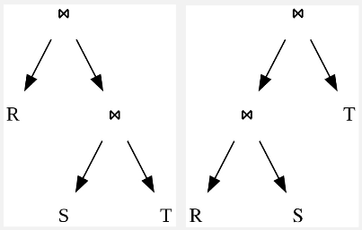

**Main Source:**

- **[Query optimization — Wikipedia](https://en.wikipedia.org/wiki/Query_optimization)**
- **[Partition (database) — Wikipedia](<https://en.wikipedia.org/wiki/Partition_(database)>)**
- **Chapter 6, Designing Data Intensive Applications — Martin Kleppmann**

[Query language](/cs-notes/database-system/query-language), typically being a declarative language, allows it to make its own optimization. It is up to the database engine how will it perform the database operation. Query language doesn't rely on specific instruction from the programmer, this makes the compiler able to produce a highly optimized query in a controlled way.

### Query Optimization

#### Query Plan

It is possible for single query to have multiple valid execution plans, with different performance. For example, consider the following query:

```sql
SELECT *
FROM table1
JOIN table2 ON table1.id = table2.id
WHERE table1.column = 'value'
```

There are three ways to join both table:

- **Nested Loop Join**: The optimizer scans each row from `table1` and looks up matching rows in `table2`. This plan is suitable when one table is significantly smaller, or when the join condition is selective, meaning it filters out a relatively small portion.
- **Hash Join**: The optimizer builds [hash tables](/cs-notes/data-structures-and-algorithms/hash-table) for both `table1` and `table2`. The hash table serves as a quick lookup for matching rows between two tables. Hash join can be more efficient when both tables are large and the join condition is not selective.
- **Merge Join**: Merge join efficiently merge the sorted data to perform the join. It scans the sorted tables simultaneously, comparing the values of the join columns. Merge join can be efficient when the data is already sorted and the join condition is not selective.

#### Join Ordering

**Join Ordering** is the process of determining the order in which tables are joined in a database query. The goal of join ordering is to find the most efficient sequence of join operations that minimizes the overall cost of executing the query.

The query plan is represented as tree.

  
Source: https://en.wikipedia.org/wiki/Query_optimization

Join order is determined using [dynamic programming](/cs-notes/data-structures-and-algorithms/dynamic-programming) algorithm pioneered by IBM's System R database. This algorithm works in two stages:

1. **Enumeration**: The optimizer generates all possible join order for the given tables.
2. **Cost-Based Selection**: The algorithm estimates the cost of each generated join order and choose the best way.

#### Cost Estimation

A cost of query plan is estimated by several factors such as disk I/O operations, CPU time, connectivity (in the case of distributed systems), and selectivity and cardinality.

- **Selectivity**: refers to the proportion of rows in a table that satisfy a particular condition or predicate. Selectivity information helps the optimizer to plan and optimize query execution by estimating the number of rows that will be returned by a given query or predicate.

  For example, if a predicate has a high selectivity, meaning it filters out a large portion of the rows, it might be advantageous to push the predicate closer to the data source to reduce the amount of data that needs to be processed.

- **Cardinality**: Cardinality is the number of distinct values or rows in a table or a column. Cardinality is important for estimating the number of rows that will be returned by a query or the number of distinct values that will be involved in a join.

The information and metrics collected about the data and structure of a database is stored in a database statistics. These can be table, column, index statistics, which stores data types, size, cardinality, or any other metadata. Statistical summaries such as frequency and distribution of values can also be stored in a histogram.

:::tip
More about [query processing](/cs-notes/database-system/query-processing) and [query compiler](/cs-notes/database-system/query-compiler).
:::

### Caching

DBMS can introduce [caching](/cs-notes/computer-and-programming-fundamentals/caching) mechanism to improve database queries.

- **Buffer caching**: Buffer pool is a region of memory that is allocated by the buffer manager as the place to transfer disk blocks. It is basically the "transit" area between the disk storage and the CPU. When query happens, the DBMS may check the buffer pool if the required data is available already.
- **Query caching**: When a query is executed, the DBMS checks if the same query with the same parameters has been executed before and if the result is already present in the query cache. If the result is found in the cache, it can be directly returned without the need for re-executing the query and accessing the disk, resulting in performance improvement.

### Partition

Database partitioning is a technique to logically divide a large database into smaller, more manageable partitions. Partitioning is particularly useful when dealing with large datasets or when performance bottlenecks occur due to the size and complexity of the database.

Partitioning also improves scalability and availability, it ensures that a failure of one database instance does not affect the availability of the whole system. Partitions can be distributed across multiple servers in distributed system.

For example, a global company with customers in multiple regions could partition its customer data by region. A server located in Asia would primarily hold data from customers coming from Asia as well. This would improve data locality and reduce latency.

Type of database partitioning:

1. **Range Partitioning**: Data is divided based on a specific range of values from a chosen attribute. For example, a date attribute could be partitioned into monthly or yearly ranges. Each partition contains data that falls within that specific range.
2. **List Partitioning**: Divides data based on specific values or a list of values from a chosen attribute. For instance, a database could be partitioned based on region attribute, where each partition contains data related to a specific region.
3. **Composite Partitioning**: Composite partitioning combines multiple partitioning techniques to create more complex partitioning strategies.
4. **Round-robin Partitioning**: Round-robin partitioning evenly distributes data across partitions circularly. Each new record is inserted into the next partition cyclically. This technique can be useful when the data distribution is expected to be uniform and there is no specific criterion for partitioning.
5. **Hash Partitioning**: Hash partitioning distributes the data across partitions based on a [hash function](/cs-notes/computer-security/hash-function) applied to a chosen attribute. The hash function ensures an even distribution of data across partitions, making it useful when there is no natural range or list criterion for partitioning. One technique for this is the [consistent hashing](/cloud-computing-and-distributed-systems/distributed-systems-communication#distributed-hash-tables).

   A scenario where partition is not fair, where one instance hold more than the other, we would call the system _skewed_. Unfair partition would make certain instance experience more workload (being a _hotspots_) and some are potentially idle.

     
   Source: https://www.enjoyalgorithms.com/blog/data-partitioning-system-design-concept
