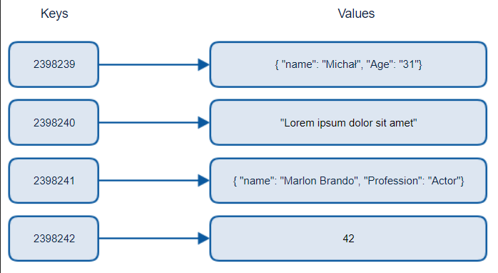
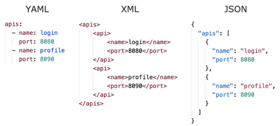
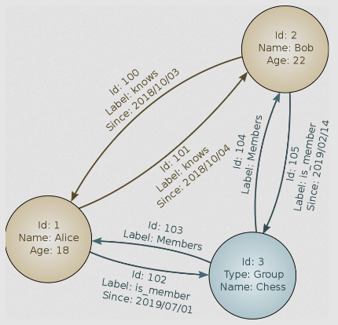
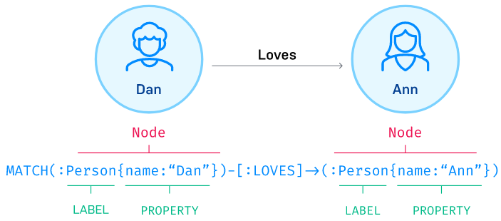
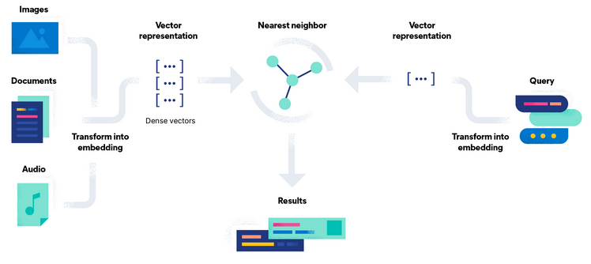

**Main Source:**

- **[NoSQL — Wikipedia](https://en.wikipedia.org/wiki/NoSQL)**
- **[Key-value database — Wikipedia](https://en.wikipedia.org/wiki/Key%E2%80%93value_database)**
- **[Graph database — Wikipedia](https://en.wikipedia.org/wiki/Graph_database)**
- **[How Neo4j stores data internally? — stackoverflow](https://stackoverflow.com/questions/24366078/how-neo4j-stores-data-internally)**
- **[How is data stored in a graph database? [duplicate] — stackoverflow](https://stackoverflow.com/questions/48777704/how-is-data-stored-in-a-graph-database)**
- **[Vector database — Wikipedia](https://en.wikipedia.org/wiki/Vector_database)**
- **[What are BASE Properties? — dremio](https://www.dremio.com/wiki/base-properties/)**
- **Various Google searches**

**NoSQL (or non-relational database)** is a type of databases that doesn't follow the relational model principles. Unlike [relational databases](/database-system/relational-data), which store data in tables with predefined schemas, NoSQL databases is more flexible in approach to data storage and management. NoSQL typically relies on a specific data structure to handle large volumes of data, including unstructured and semi-structured data.

### Key-Value

A key-value NoSQL database stores data in a key-value pair. A key is a unique identifier for the data item, and the value is the data item itself.

One way to implement key-value database is to use [hash table](/data-structures-and-algorithms/hash-table). Hash table is a data structure that stores data in an [array](/data-structures-and-algorithms/array), using a [hash function](/computer-security/hash-function) to map keys to array indices. This allows for very fast lookups and insertions, which is suitable for storing random or unstructured data.

  
Source: https://www.michalbialecki.com/2018/03/18/azure-cosmos-db-key-value-database-cloud/

The above is an example of key-value database that stores different data types as its values, one key may correspond to an integer, string, or another key-value pairing.

Advantages & Disadvantages:

- Simple, flexible, and easy to use.
- Very quick for read, insert, delete, and update.
- Limited query abilities, one key can only map to single data.
- Because it's not relational, we can't connect data together.

### Document

Document database is a subclass of key-value database. It extends the simple key-value mapping by allowing specific format or encoding to represent a more complex structure.

Document database may organize or groups document by:

- **Collections**: Collections are analogous to tables in relational databases. A collection consists of a group of documents (analogous to records) that share a similar structure or purpose.
- **Tags**: Tags are keyword or label within a document, which provide information about the content or characteristics of the document.
- **Non-visible metadata**: Non-visible metadata include information such as timestamps, versioning, access control, or any additional attributes related to the documents that doesn't impact the visual content.
- **Directory hierarchies**: Document database such as XML organizes its data into a hierarchical, directory-like structure through the use of nested tags.

Document database includes [JSON](/digital-media-processing/json), [XML](/digital-media-processing/xml), and YAML.

  
Source: https://thedeveloperstory.com/2021/10/03/everything-you-need-to-know-about-yaml-files/

Advantages & Disadvantages:

- Same as key-value database, they are flexible. They allow documents of varying structures and fields to be stored within the same collection.
- A more advanced way to store data, we can provide additional metadata or label which helps us for complex queries.
- Unlike relational databases, document databases have limited support for [transactions](/database-system/transactions). This can make it challenging to maintain data consistency and integrity in certain scenarios.

### Graph

A graph NoSQL database uses a [graph](/data-structures-and-algorithms/graph) structures to represent and store data.

Graph structure consist of:

- **Nodes**: An entity or object that exist within the graph structure, analogous to record in relational database.
- **Properties**: Information associated with nodes.
- **Edges**: Edges are connection between two nodes, they are lines that connects nodes together. Edges can be directed, which mean they have a one-way relationship, or undirected, which mean a symmetric relationship. Edges can also be labeled to indicate their relationship.

  
Source: https://en.wikipedia.org/wiki/Graph_database#/media/File:GraphDatabase_PropertyGraph.svg

One example of graph database is Neo4j, the query language used to access the graph structure is called Cypher, below is an example:

  
Source: https://neo4j.com/product/cypher-graph-query-language/

A two node of `Person`, named `Dan` and `Ann`, respectively is matched together in a `LOVES` relationship.

Under the hood, node is represented as a fixed-size record or object on the disk. An edge relationship is represented as [doubly linked list](/data-structures-and-algorithms/linked-list#doubly-linked-list), it has pointer to the start and end nodes. Node's properties are organized in a linked-list, with each node being a key-value pair.

The query engine traverse the graph, following the graph relationship. It decides whether to continue the traversal or include the node and properties in the result set based on the given query.

Advantages & Disadvantages:

- Can represent connection between entities, this allows for complex queries and analysis of complex relationships.
- Flexibility in storing different types of data.
- The graph database ecosystem is relatively diverse, with multiple database systems and query languages available. This lack of standardization can lead to concerns regarding vendor lock-in and interoperability.
- Can be harder to learn compared to relational database. This involves learning specific query language and understanding graph modeling principles.

### Vector

Vector database stores data in a mathematical object called **vectors**. Vectors are mathematical representations of objects or data points in a multidimensional space. Each dimension of the vector corresponds to a specific attribute of the object (called **features**). The location of vector in the multidimensional space represent their characteristics.

The process of turning data, such as words, phrases, documents, images, audio, or any other data, is called **embedding**. Each data is transformed into a numerical representation. Embedding involves mapping all numerical representation of the data into a common representation in the single multidimensional space. The embedding process typically uses [machine or deep learning techniques](/machine-learning).

  
Source: https://www.elastic.co/what-is/vector-database

Vector databases excel at similarity search, where the goal is to retrieve similar data from the given data. Searching for similar data involves turning the given data into another vector and finding the closest vector (also known as nearest neighbor) that is available in the multidimensional space with the query vector. The method to find distance can use metrics like Euclidean distance or cosine similarity.

#### Example

Consider the scenario where we are constructing a vector database to store words. The primary objective of this database is to facilitate the identification of similar words.

We have the following words:

- Word: "cat" — Embedding: [0.2, 0.3, 0.1, 0.5]
- Word: "dog" — Embedding: [0.1, 0.4, 0.2, 0.6]
- Word: "elephant" — Embedding: [0.4, 0.1, 0.6, 0.5]
- Word: "lion" — Embedding: [0.7, 0.6, 0.8, 0.1]
- Word: "tiger" — Embedding: [0.6, 0.5, 0.3, 0.7]

A machine model should be trained on the word dataset, and it should produce some numerical representation. For simplicity, let's say the embedding is like above. The word "cat" with embedding [0.2, 0.3, 0.1, 0.5] means it will be located on coordinate (0.2, 0.3, 0.1, 0.5) in the multidimensional space.

Let's say we have the word "kitten" as the query, and the embedding is [0.25, 0.35, 0.15, 0.55].

- Similarity with "cat" ≈ 0.997798
- Similarity with "dog" ≈ 0.973726
- Similarity with "elephant" ≈ 0.792752
- Similarity with "lion" ≈ 0.640261
- Similarity with "tiger" ≈ 0.969144

### BASE Properties

NoSQL typically lacks strong consistency and true transactions compared to relational databases. BASE properties are in contrast to [ACID properties](/database-system/transactions#acid) in relational database.

- **Basically Available (BA)**: The importance of providing high availability for read and write operations, even in the presence of failures or network partitions. A system should strive to remain operational and responsive, even under challenging conditions.
- **Soft State (S)**: NoSQL tolerate temporary inconsistencies, but the state across system should eventually be consistent.
- **Eventually consistent (E)**: Eventually consistency means that the system will eventually reach a consistent state across all system or replicas. While updates may take some time to propagate and synchronize, the system guarantees that, given enough time and absence of further updates, all replicas will converge to a consistent state.

We can infer that NoSQL tends to prioritize availability over consistency.
