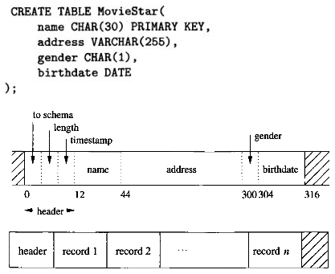
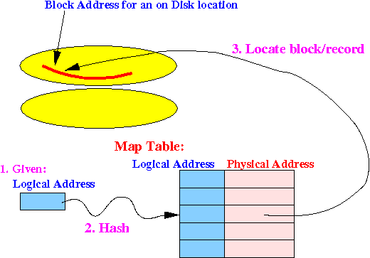
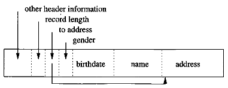
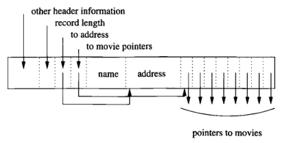

**Main Source:**

- **Chapter 13 - Database Systems - The Complete Book (2nd Edition)**
- **Some previous notes, attached in tip callout**

In computer system, storage can be organized in hierarchy, from the lowest level registers and cache, up to secondary storage (such as hard disks) or even tertiary storage.

:::tip
Find more about [memory hierarchy](/cs-notes/computer-organization-and-architecture/registers-and-ram#memory-hierarchy).
:::

### Disks

Database operates in main memory and secondary storage. The main memory is typically abstracted by [file system](/cs-notes/operating-system/file-system) and [virtual memory](/cs-notes/operating-system/memory-management#virtual-memory).

When referring to disk, we typically refer to magnetic disk. Disk consist of platter stacked on top each other, the plate has special coating that hold magnetic field. The magnetic field become the place where data is stored. In the hardware level, disk access will be handled by **disk controller**. Disk controller controls the write/read head component on the platter to write or read data.

A concentric circular path on the platter is called a **track**. Within a section of track, the smallest addressable unit of storage and is fixed in size is a **sector**. When operating system or DBMS accesses disk, it will be abstracted by the file system, disk access will be in another fixed-size unit called **block**.

:::tip
Find more about [disk management](/cs-notes/operating-system/disk-management).
:::

### Data Arrangement

One way to store database table and records on disk is the **fixed-length record** technique. A table is created by providing columns and its data types. We will accommodate the largest possible data attribute within a table. This ensures that all records have the same length, regardless of the actual data values stored in them.

We may also include header that stores pointer to the database schema, the length of the record, and timestamp that indicates the time record was last modified or read.

  
Source: Book page 591, 592

For example, the image above creates a table with column: name, address, gender, and birthdate. The name has `CHAR` data type, a single char typically worth 1 byte. For accommodation, we allocate 30 bytes for the name field and include an additional 2 bytes (12 + 30 = 42 + 2 = 44) because certain machines operate more efficiently when reading/writing addresses that are multiples of 4 or 8.

Records are stored consecutively within a block, the block serves as the unit of data transferred between the disk and main memory.

### Block & Record Addresses

Each block and record on the disk has a physical address, which consists of the device ID for the disk, the cylinder number, the track number within the cylinder, the block number within the track, and sometimes the offset of the beginning of the record within the block.

On the other hand, main memory uses logical addresses to identify blocks and records. The location of block of record in the main memory is different with the block of record that is stored in actual disk. This is because main memory is abstracted by virtual memory, making the way we access memory different.

Each block or record will need to store a logical address. When we need to locate a specific block or record on the disk, we will consult to **map table**. A map table is a table that exists somewhere in a known location on the disk and stores information about the mapping between logical addresses to physical addresses.

  
Source:http://www.cs.emory.edu/~cheung/Courses/554/Syllabus/2-disks/ident.html

The different addressing between main memory and secondary storage does not affect block and record alone, it also affects pointer inside them. A pointer stores the memory address of something, it is necessary to also translate its addresses. The process of translating pointers between the database address space and the virtual address space is called **pointer swizzling**, and the opposite **pointer unswizzling**.

One way to swizzle pointer is to store another table (called **translation table**) that maps between database addresses and memory addresses. The pointer will store a bit indicating whether the pointer is currently a database address or a memory address, and the actual database or memory pointer.

### Variable-Length Record

In some cases, we want to store record in varying size. One approach is to keep the fixed-length portion of the record first, followed by the variable-length fields. To achieve this, we will include pointers (offsets) to the beginnings of the variable-length fields.

  
Source: Book page 604

In this example, the gender, birthdate, and name is fixed-length, while the address is variable-sized. We also included header, record length, and the pointer to the address field.

In the case of a record that contains repeating field, we can store the pointers to the place where each repeating fields begin and the amount of repetitions or where the repetitions end.

  
Source: Book page 605

Alternative approach of storing variable-length record is to store them separately from the record, in a separate block or blocks. This allows for flexibility in terms of storage allocation and retrieval. However, it also increases the number of disk I/O operations required to access all the components of the record.

### BLOB

**Binary Large Object (BLOB)** refers to very large values, such as images and videos, that need to be stored across multiple blocks. BLOB must be stored consecutively to be retrieved efficiently. Also, we may not need to retrieve the entire BLOB. For example, it is not necessary to retrieve the entire 2-hour movie if the movie is played at a slow rate or only at the end. We may retrieve the several blocks gradually.

If fast real-time access is required, it may be necessary to distribute BLOB across several disks. This involves distributing the blocks of the BLOB among multiple disks, to allow multiple blocks to be retrieved simultaneously.

### Record Modifications

- **Insertion**: In the case of unsorted table, we can find an empty space and insert the record there. To maintain sorted table on insertion, we will need to find where the record should be placed and potentially sliding the records around the block. If we can't find enough space to insert record in a particular block, we can either reorganize the record with the adjacent block or create another block (called **overflow block**) and associate that block with a pointer in the original block.
- **Deletion**: We can delete a record and slide the block. If we cannot do it, we may maintain an available-space list in the block header. We will store a marker that indicates whether a block is free or not. Another thing is, there could be pointer associated with the particular deleted block, so it is necessary to keep information within the block associated with the record. The information is called **tombstone**, it is a permanent bit which must exist until database is reconstructed.
- **Update**: If the resulting record size after update is same, then there is no issue. Otherwise, we will need to create more space on the block, then the problem becomes similar to insertion.
