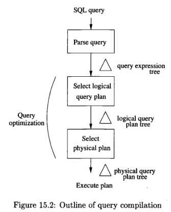
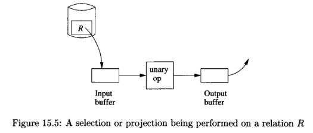
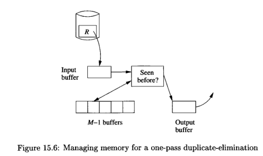
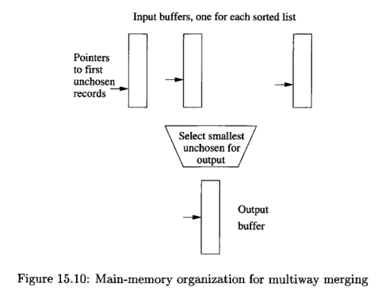
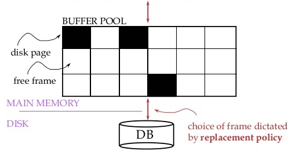
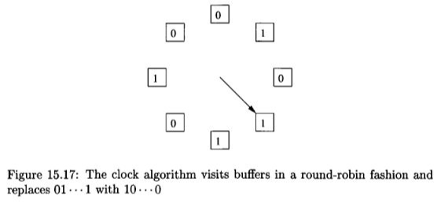

**Main Source:**

- **Chapter 15, 16 - Database Systems - The Complete Book (2nd Edition)**

The process of query goes from parsing, creating the unoptimized initial query plan (also called logical query plan) in algebraic representation, and transforming it into optimized physical query plan.

  
Source: Book page 703

### Physical-Query-Plan Operators

**Physical-Query-Plan Operators** are the component of query planning that does a specific step of a plan, which often correspond to an operation in relational algebra.

The physical query plan is generated after the query has been compiled into a logical query plan, which is similar to expressions of relational algebra. The generation of physical query plan involve these operators.

An example of physical-query-plan operator is **scanning table**. Scanning table operators read table and its record, they are useful for us to know the table's data. There are three approach of scanning table:

- **Table-scan**: Read record in the block one by one.
- **Index-scan**: Uses index to read the blocks and records.
- **Sort-scan**: If the table can fit in main-memory, we may sort it and read the records.

### One-Pass Algorithms

In the case of database, **one-pass algorithms** are category of algorithms that reads data from the disk, process it, and write the results back in the disk, all in one pass.

There are three types of one-pass algorithms:

- **Tuple-at-a-time, unary operations**: Read and process one block at a time, require a small amount memory. This type of algorithms is used in operation like projection and selection. These kinds of operations are implemented by loading records from the disk into the input buffer and the operation is performed on them (e.g., checking for `WHERE` condition). The result of the operation goes to the output buffer.

    
   Source: Book page 711

- **Full-relation, unary operations**: Require most or all record, the amount of record processed at once is limited to the memory buffers available, this includes grouping and eliminating duplicate operation.

  The process of eliminating duplicate is similar to the previous operation. Before sending the result to the output buffer, we will first check if the record has been seen before. The previously seen record is stored at another buffer, we may use hash table to speed up the search.

    
   Source: Book page 713

- **Full-relation, binary operations**: Require most or all record and performed on two table or records, such as union and intersection. For example, set intersection can be done by storing the record of one set (table) into some buffer, and read the other set and see if the record is present in the buffer. If so, we can copy to the output buffer.

:::info
Unary operations are operation performed on single input, while binary is performed on two inputs.
:::

### Nested-Loop Join

**Nested-Loop Join** is a family of algorithms that joins two tables. There are some variants of nested-loop join:

- **Tuple-Based**: A straightforward algorithm that loops over two sets (tables) and produce another tuple that satisfy certain join condition.

    
   Source: Book page 719

- **Block-Based**: The block-based algorithm is an improvement over tuple-based algorithm. It involves considering a block of tuples instead of individual tuple, to reduce the disk I/O operation. Furthermore, we will store as many tuple from the outer set in main memory.

### Two-Pass Algorithm

One-pass algorithms read data from disk, process it, and write the result back to the disk. In contrast, **two-pass algorithms** read from the disk again after writing the result.

Two-pass algorithm can be based on sorting and hash. Sorting-based algorithms use sorting technique to organize data in the first and second pass. Hashing-based algorithms use hash functions to partition the data into buckets in the first pass and second pass.

#### Sorting-Based

Example of sorting-based algorithms:

- **Two-Phase, Multiway Merge-Sort (TPMMS or 2PMMS)**: Algorithm to sort very large relations in two passes, consisting two phases. This algorithm is a variant of [merge sort](/data-structures-and-algorithms/divide-and-conquer#merge-sort) that is designed to handle large data that cannot fit in the main memory.

  In phase 1, the algorithm sort the tuples from one relation in the main memory. The table is not entirely sorted, instead it repeatedly sorts the sublist of the relation. The sorted sublist is then written to the secondary storage.

  In phase 2, the sorted sublists generated in phase 1 are merged together. However, there is a limitation on the number of sorted sublists that can be merged in this phase. The maximum number of sorted sublists allowed is $M - 1$, where $M$ is the number of available main-memory buffers.

  In the merging process, the smallest key among the remaining element in the sublist will be moved into the output block. This is done until the output block is full, if it is, then write it to the disk and create a new output block.

    
  Source: Book page 724

- **Eliminate Duplication**: Based on sorting, we can remove duplicate tuples in a table easily. The first pass involve sorting the tuple into sublists, similar to the first phase of 2PMMS. In the second pass, we repeatedly select the tuples in the sorted sublists and copy the unconsidered tuple to the output block.
- **Join**: Given relations (tables) R(X, Y) and S(Y, Z) to join, where X and Y are attributes belong to R, same for Y and Z, which are attributes that belong to S. The process is as follows:

  - Sort R and S using the 2PMMS algorithm, with Y as the sort key.
  - Merge the sorted S and R using two buffers, the merge process is the next step:
    - Find the smallest value based on the join attributes Y that appears at the front of both R and S.
    - If that Y value doesn't appear at the front of the other relation, remove the tuple(s) with that Y value.
    - If the Y value appears at the front of both R and S, identify all the tuples in R and S that have that Y value. If necessary, read more blocks from R and/or S until there are no more Y value in either relation.
    - Output all the tuples that can be created by joining the identified tuples from R and S based on their common Y value.
    - If either relation has no more unprocessed tuples in the memory, load more tuples from that relation into the buffer.

#### Hashing-Based

In comparison to sorting-based algorithms:

- **Duplicate Elimination**: The idea is, same record will hash to same hash code, and will fall into the same bucket. Each record is hashed, so it is partitioned into different bucket. Within a bucket, only one copy of the duplicate records is kept, and the rest are removed. This method works as long as the table is small, so that no non-duplicate record in the same bucket.
- **Join (Hash Join Algorithm)**: Similar to other operation, we will hash the record and partition them into buckets. Within a bucket, if the join attribute values match, the tuples are considered a match and can be combined.

### Index-Based Algorithms

**Index-based algorithms** is a set of algorithms that leverage [database indexes](/database-system/database-index), such as selection and join. In some cases, clustered indexes may be faster than non-cluster index, because the physical ordering of data in disk is already known.

- **Selection**: Index stores a pointer to record given an attribute that is used as the search key. An index-based selection would be straightforward retrieval.
- **Index Join**: Consider two relation R(X, Y) and S(Y, Z), and S has index on attribute Y. To join them together on attributes Y, we compare each tuple in relation R with the tuple(s) of S, which we retrieve using the index on attribute Y.

### Buffer Management

Buffer management is concerned with the management and allocation of buffers in main memory, which is an area to hold data recently read from or written to disk. The buffer manager stores the used/free buffer in a buffer pool. It has two options for managing buffers: it can either directly control the usage of main memory or use the virtual memory provided by the operating system.

  
Source: http://dbmsfortech.blogspot.com/2016/05/buffer-management.html

Buffer manager has several strategies to control the use of buffers, it decides which block/page should be provided when requested:

- **Least Recently Used (LRU)**: This strategy evicts the buffer that has been accessed the least recently. In other word, the block that has not been used for long time is chosen to be replaced. It assumes that recently accessed buffers are more likely to be accessed again in the near future. The buffer manager will keep track the time in a table.
- **First-In, First-Out (FIFO)**: This strategy removes the buffer that has been in the buffer pool for the longest duration. It operates on the principle that the buffer that has been present for the longest time is less likely to be needed again soon.
- **Clock (Second Chance)**: The clock strategy uses a circular list to manage the buffers and a clock hand that will rotate clockwise to find the buffer. Buffers are marked with a reference bit, either 0 or 1 (initially 0). When the clock hand reaches a buffer, it checks the reference bit. If the reference bit is set (1), indicating recent use, the bit is set to 0, and the clock hand moves to the next buffer. If the reference bit is not set (0), the buffer is chosen for replacement.

    
  Source: Book page 749
