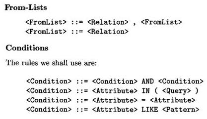
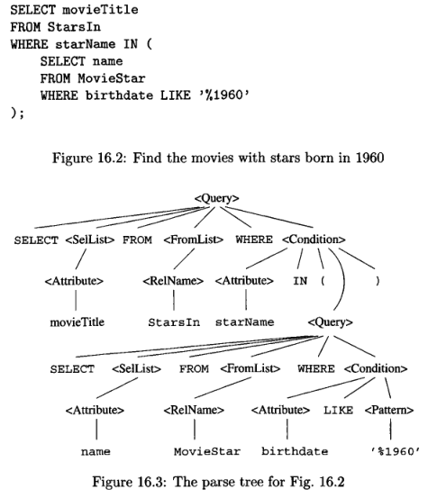
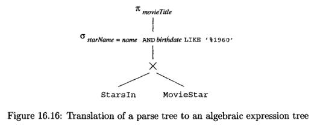
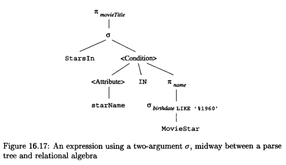
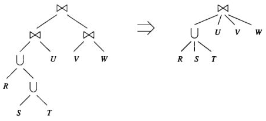

**Main Source:**

- **Chapter 16 - Database Systems - The Complete Book (2nd Edition)**

### Parsing & Preprocessing

#### Syntax & Parse Tree

The query written in language like SQL is parsed and converted into a **parse tree**. In the parse tree, a node can either be an **atom** or **syntactic categories**.

Atoms are lexical elements like built-in keywords (e.g., `SELECT`), names of attributes or relations, constants, parentheses, and operators.

Syntactic categories are category of syntax, they are typically represented as descriptive name enclosed with triangular brackets. For example, a `<Condition>` means an expression that represents a condition. A syntax category have children, which describe how the expression is constructed. The children must follow the grammar or the rules of the language.

For example, the rules for query is `<Query>::= SELECT <SelList> FROM <FromList> WHERE <Condition>`. This mean that a query expression "can be expressed as" (denoted by `::=` symbol) the right hand side syntax. `<SelList>` and `<FromList>` represent another syntax category that can be used with `SELECT` and `FROM` statement.

The rules for `<SelList>` is `<SelList>::= <Attribute>, <SelList>` or `<SelList>::= <Attribute>`. This mean `<SelList>` can be represented with a single attribute, or another `<SelList>`, which can be another attribute (recursive).

Other syntax category:

  
Source: Book page 761, 762

An example of a query and its subquery; and it's parse tree:

  
Source: Book page 763

#### Preprocessor

After a parse tree is constructed, the preprocessor is responsible for checking the semantic rules. For example, the preprocessor may check if the relation used in the `FROM` clause is really a relation. It also checks if attributes and data types is valid and conform to the database schema.

Once the semantic checks are complete, the preprocessor performs some tree transformations to convert the parse tree into a tree of algebraic operators. This transformed tree represents the initial or logical query plan. The nodes of parse tree are replaced with algebraic operators that represent the operations of relational algebra that need to be performed.

For example, the previous parse tree example can be turned into this expression tree:

  
Source: Book page 782

The produced expression tree now does not have subqueries, they are all replaced with relational algebra operators.

- $\pi_{\text{movieTitle}}$: Projection operator or the `SELECT movieTitle` clauses.
- $\sigma_{\text{starName = name AND birthdate LIKE '\%1960'}}$: selection operator or the `WHERE ...` clauses.

Another example of expression tree, where the query contains another subquery in the condition:

  
Source: Book page 784

After constructing the expression tree, the preprocessor may improve the logical query plans based on some relational algebra laws.

- In some cases, when we have a projection or selection query with one or multiple conditions, we can split and push each condition down the expression tree separately. By doing this, we can filter out unnecessary data as early as possible, which reduces the amount of data that needs to be processed.
- Some grouping operators such as joins are associative or commutative. By rearranging the order and grouping of these operators, we can minimize the number of operations needed to perform the join.

    
  $\bowtie$ and $\bigcup$ are symbol for natural join and union, respectively  
  Source: Book page 791

### Cost Estimation

To turn logical query plan into physical query plan, we will need to know what physical plans are possible. After that, we will choose the physical query plan that will be executed by the engine based on the cost of operations. The least estimated cost will be chosen, this method is called **cost-based enumeration**.

Depending on the physical plan, we may choose different method to process the data.

- The order and grouping for associative-and-commutative operators such as joins, unions, and intersections.
- Choosing which algorithm should we use to implement the operator, for example, deciding whether a [nested-loop join](/database-system/query-processing#nested-loop-join) or a [hash-join](/database-system/query-processing#hashing-based) should be used.
- Operator such as scanning or sorting to support the query.
- Method to pass data after each operator, for example, storing results in disk, processing one tuple, or one main-memory buffer at a time.

Some example to estimate operations:

- **Projection**: The projection operation cannot be exactly computed. The only certainty is that the size will always be less than or equal the size of the relation by some factor.

- **Selection**: Depending on the condition, the estimation for selection may differ. In simple case where we select the attributes equal to some value, then it would be $T(S) = T(R) / V(R, A)$. $T(S)$ represent the number of tuple, $T(R)$ represent the total number of tuple in relation $R$, and $V(R, A)$ represent the number of distinct values in relation $R$ for attribute $A$.

- **Join**: Join involve matching together same attributes of tuple from two relations. Join estimation would consider how relate are the two relations. The join estimation formula is: $T(R \bowtie S) = T(R)T(S)/\text{max}(V(R, Y), V(S, Y))$.

  The intuition behind this formula is that the size of the join result depends on the number of possible combinations between tuples from R and S that share a common value in Y. If the number of distinct values in Y is large, the probability of finding matching tuples between R and S decreases, resulting in a smaller join size. On the other hand, if the number of distinct values in Y is small, the probability of finding matching tuples increases, leading to a larger join size.

### Plan Enumeration & Selection

After estimation of operators are determined, the optimizer needs to estimate the cost of evaluating certain expressions. They are based on the number of disk I/O operations performed, which can be influenced by [similar factors as before](#cost-estimation):

- **Choice of logical operators**: The selection of logical query plans includes decisions such as join methods, sorting, and filtering.
- **Sizes of intermediate results**
- **Physical operators used**: The choice of physical operators to implement logical operators. For example, the decision to use a one-pass or two-pass join, or whether to sort a relation or not.
- **Ordering of similar operations**, which join on which relations to be performed first.
- **Method of passing arguments**

There are several approaches to enumerate or explore all possible physical plans:

- **[Top-down approach](/data-structures-and-algorithms/dynamic-programming#top-down)**: Start from the root of the logical query plan down to bottom of the tree. For each possible implementation, we enumerate the physical plans and evaluate their costs.
- **[Bottom-up approach](/data-structures-and-algorithms/dynamic-programming#bottom-up)**: Keeps track of the plan of the least cost for each subexpression. By considering the cost of each subexpression, the overall cost of the query plan can be obtained by combining them all.
- **Heuristic Selection**: Heuristic plans follows rules or guidelines that are likely to produce good results. For example, we can start by joining the pair of relations with the smallest estimated size and then repeating the process for the result of that join and the remaining relations. This heuristic aims to minimize the intermediate result sizes and reduce computational overhead by joining smaller relations first.
- **Hill climbing approach**: This approach involves searching for a "valley" in the space of physical plans and their costs. It starts with a heuristically selected physical plan and makes small changes to the plan, such as replacing one execution method with another or reordering joins using associative and commutative laws. The goal is to find nearby plans that have lower costs. When no further modifications yield a plan with a lower cost, the current plan is chosen as the physical query plan.

### Completing the Physical-Query-Plan

The last step to turn logical query plan into physical query plan are:

- **Algorithm Selection**: The algorithms to implement each operation are selected based on factors such as available indexes, statistical information about relation sizes, and other metadata.
- **Materialization and Pipelining**: Decision of whether to materialize intermediate results or pipeline them depends on factors such as available memory, disk space, and the size of the intermediate results.
  - Materialization involves creating the entire intermediate result and storing it on disk, which can be useful when the result is large or needs to be reused later.
  - Pipelining involves creating the intermediate result only in main memory, without necessarily keeping it in its entirety at any given time.
- **Physical Plan Implementation**: The specific details regarding access methods for stored relations and algorithms for implementing relational-algebra operators. Access methods refer to the techniques used to retrieve tuples from stored relations, such as [table scans, index scans, or sort scans](/database-system/query-processing#physical-query-plan-operators).
