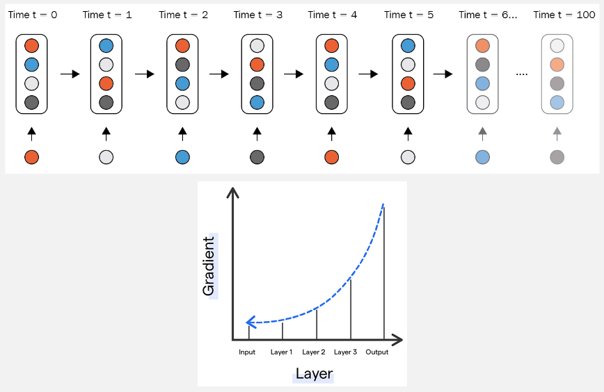
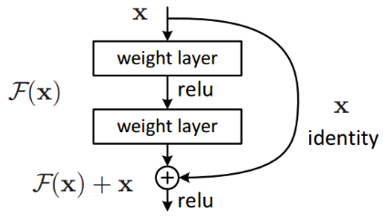
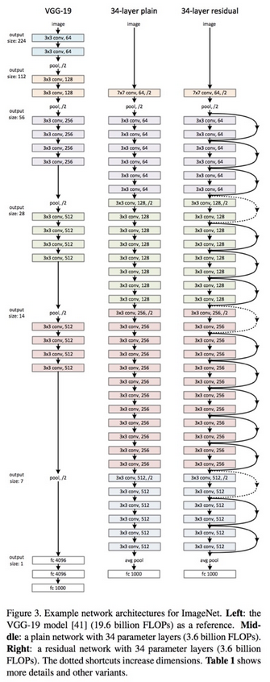

**Main Source:**

- **[ResNet (actually) explained in under 10 minutes — rupert ai](https://youtu.be/o_3mboe1jYI?si=3i-uFFu0MD8UJoQu)**
- **[What is ResNet? (with 3D Visualizations) — Prof. Ryan Ahmed](https://youtu.be/nc7FzLiB_AY?si=4g1qmNPChEPZ4rj5)**

**Residual Network (ResNet)** is a type of [neural network](/deep-learning/neural-network) developed to address the problem of training a very deep neural network (consist many hidden layers). It is to address the [vanishing gradient problem](/deep-learning/neural-network#vanishing-gradient-problem), which occurs in the learning process of neural network, specifically in the backpropagation process.

### The Problem

The how wrong our model's predictions is calculated using a loss function. As usual, we want to minimize the loss function. Minimizing the loss function involves calculating the gradient of the loss function with respect to the parameters (such as weights) used in the prediction.

Once the gradient is calculated, the network adjusts all of its parameters, including the preceding layers. The gradient of the preceding layer is calculated based on the subsequent layer using the chain rule aspect of backpropagation. In very deep networks, the gradient becomes smaller and smaller as we go into the first layer. When the gradient becomes small, it can slow down the learning process by only updating the parameters by a small amount.

  
Source: https://botpenguin.com/glossary/vanishing-gradient-problem

### Residual Connection

The idea of ResNet is to skip some layer in the network, this will prevent the gradient from vanishing. ResNet introduces **residual connection**, also known as **skip connections**. These connections bypass one or more layers and directly connect the output of one layer to the input of a later layer.

### Identity Function

When we skipped a layer, for example, the output from layer 1 is sent directly to the input of layer 3. This makes us skipped some of the information that should be brought by the layer 2 before going to the layer 3. Skip connection uses comething called **identity function**.

Identity function is used to capture and bring that lost information from layer 2 to the output of layer 1. It can be thought as a bridge that connect the previous layer to the next layer by combining the information lost from the skipped connections.

  
Source: https://towardsdatascience.com/residual-blocks-building-blocks-of-resnet-fd90ca15d6ec

In the image above, the output of previous layer is considered as $x$, it then bypass the next layer and goes into the `+` symbol directly. If we consider the skipped layer as a function $f(x)$, which means it transform the previous layer's output $x$ to a new output. The input of the next layer (`+` symbol) is produced from adding the first layer with the skipped layer. Basically it combine the output from the bypassing route (**identity path**) with the route without bypassing (**residual path**).

When we skip some of the layer in ResNet, the output layer may receive raw output or less transformed input from the early layers that have skipped many intermediate layers. Typically, when calculating gradients, we consider all subsequent layers in the network, making it result in small gradients. This is when ResNet prevent vanishing gradient, by skipping certain layers, the gradient can become larger because we don't calculate them with respect to all subsequent layers.

For example, with the same illustration as the above image, normally the first layer's gradient is calculated with respect to function $f$ which is the next layer, and then it is calculated with respect to $x$ itself (chain rule). This what makes vanishing gradient occurs in deeper networks, the gradient will become smaller and small as we multiply them in chain rule.

However, after skipping the second layer and sending its input directly to the input of third layer, we can calculate the gradient with respect to $x$ directly, making the resulting gradient larger. We also add the result as if it passes the skipped layer, so that the skipped layer can still adjust its parameters.

#### Residual Block

Residual block is the building block of ResNet, it combines each individual layer that includes [convolution layer](/deep-learning/cnn#convolution-1), [pooling layer](/deep-learning/cnn#pooling-1), activation function, and any other layer with the skip connection.

This image below compare the normal network architecture with the ResNet-34 architecture, which is the variant of ResNet that consist of 34 layers.

  
Source: https://towardsdatascience.com/understanding-and-visualizing-resnets-442284831be8
