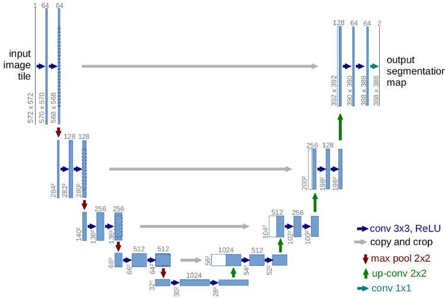
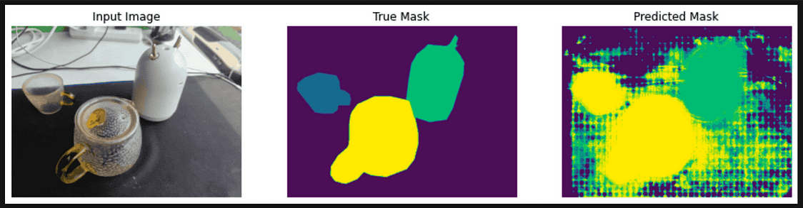

**Main Source:**

- **[The U-Net (actually) explained in 10 minutes — rupert ai](https://youtu.be/NhdzGfB1q74?si=BiC8L1cs-YRLn9T4)**

**U-Net** is a U-shaped [convolutional neural network](/cs-notes/deep-learning/cnn) architecture that follows the encoder-decoder network with a [skip connection](/cs-notes/deep-learning/resnet#residual-connection).

An encoder-decoder network consist of an encoder and a decoder. The encoder is a component responsible for processing input data and extracting relevant features. The decoder reconstructs or generates the desired output based on the encoded information produced by encoder.

### Architecture

As the name suggests, the architecture has a "U" shape and is symmetric. It begins by extracting the features of input image, downsampling, and then the reverse process.

  
Source: https://towardsdatascience.com/unet-line-by-line-explanation-9b191c76baf5

1. **Input**: U-Net typically used for image segmentation tasks, the input of U-Net is an image that requires segmentation.
2. **Encoder**: The encoder, which is the left part of the architecture, extracts the features of the image, it consists of a series of convolutional layers with ReLU activation function followed by pooling or down-sampling operations.
3. **Skip Connection**: Each encoder's layers level is included with skip connection that connects directly to decoder, allowing the features to flow without being sampled in the encoder's layer.
4. **Decoder**: The last level of encoder's layer produced the highly abstract and global information about the input image. The decoder takes it and perform the reverse process of encoder including upsampling followed by convolutional layers.

The skip connection combined with decoder makes U-Net suitable for tasks requiring image segmentation, particularly in domains like biomedicine. The decoder is able to combine high-level features from the output of encoder with the information from multiple level of encoder's layer accessed using skip connection.

### Output & Learning

The output of U-Net is a segmentation mask or a probability map that indicates the presence or absence of different classes or regions in the input image. The initial output will obviously be messed up.

  
Source: https://catchzeng.medium.com/the-easiest-way-to-train-a-u-net-image-segmentation-model-using-tensorflow-and-labelme-fe130de45a19

The loss is calculated by comparing the output of U-Net with the ground truth segmentation masks. This mean we need labeled segmentation masks for each input we have. The loss will then backpropagated through the network and the gradients with respect to network's parameters will be adjusted.
