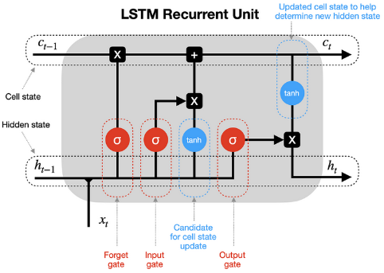
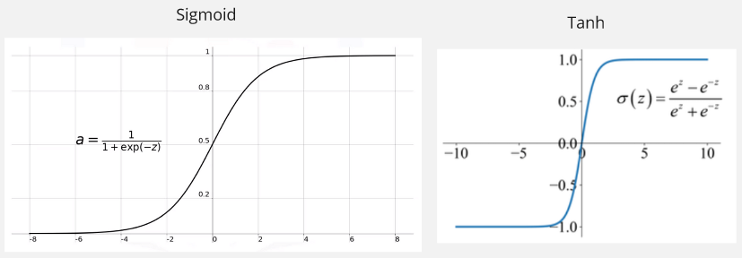
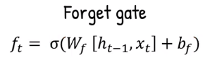
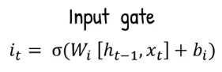
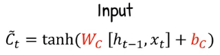
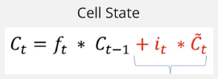
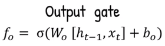
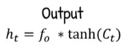
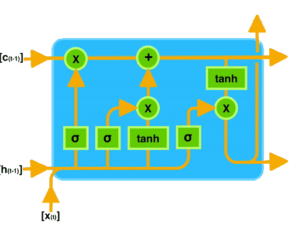

- **[Mengenal LSTM — Anak AI](https://youtu.be/orG90H9E-nI?si=mFRahv2yU1JaEK0M&t=301)**
- **[Illustrated Guide to LSTM's and GRU's: A step by step explanation — The AI Hacker](https://youtu.be/8HyCNIVRbSU?si=DZYSTyT_VWRdaLnq)**

**Long Short-Term Memory (LSTM)** is a type of [recurrent neural network (RNN)](/deep-learning/rnn) designed to address the limitation of traditional RNN in capturing and remembering long-term dependencies in sequential data.

In RNN, often times the information from previous time step is not required or doesn't provide meaningful context for the overall processing. Yet, RNN forces the previous output to be combined with current input in the hidden state.

The idea of LSTM is, we will only take the important information and we will only pass them to the next input if required. All the information will be stored in something called **memory cell** or **cell state**. The flow of information within the memory cell is determined by a mechanism called **gating mechanism**. There are 3 gates, these gates determine which information should be stored, discarded, or exposed to the next input from the memory cell.

This way, we can prevent the vanishing gradient problem while adjusting parameters by calculating the gradient with respect to each parameters, as we will only update the one that needs to be updated (the one that actually affect current prediction).

### LSTM Architecture & Process

  
Source: https://towardsdatascience.com/lstm-recurrent-neural-networks-how-to-teach-a-network-to-remember-the-past-55e54c2ff22e

The 3 gates consist of:

- **Forget Gate**: Determines which information from the previous time step should be discarded or forgotten.
- **Input Gate**: Decides which new information should be stored in the memory cell.
- **Output Gate**: Controls which information from the memory cell should be exposed to the subsequent layers or the final output.

LSTM also consist of 2 kind of activation function, sigmoid and tanh.

- **Sigmoid**: The sigmoid activation function is used in the gating mechanism, this function squeezes values from 0 to 1.
- **Tanh**: Squeezes the value from -1 to 1.

  
Source: https://medium.com/@toprak.mhmt/activation-functions-for-deep-learning-13d8b9b20e, https://paperswithcode.com/method/tanh-activation

#### The Process

1. **Forget Gate**: LSTM takes the first input combined with the previous hidden state, if it's the first input, the previous hidden state can be zero. They are combined and multiplied by the **forget gate weight** ($W_f$), added with the **forget gate bias term** ($b_i$), and then goes into the **sigmoid activation function**.

   The sigmoid that squeezes the value helps the forget gate to determine which information should be discarded. The closer it to 0, means we should forget it, the closer it to 1, meaning we should remember it.

     
   Source: https://youtu.be/orG90H9E-nI?si=BmMpVi4UI8RPa2gD&t=171

2. **Input Gate**: LSTM calculates the input gate value, which decides how much of the new information should be stored in the memory cell. It takes the same input as forget gate which is the current input $x_t$ and previous hidden state $h_{t - 1}$. The same operation will be done, which multiplying them by weight, but now its the **input gate weights** ($W_i$). It will be added with the **input gate bias term** ($b_i$) and transformed into the **sigmoid activation function** again.

     
   Source: https://youtu.be/orG90H9E-nI?si=6fcGWak25y9tnh4m&t=219

3. **Input Candidate**: Again, with the same input which is the current input $x_t$ and previous hidden state $h_{t - 1}$, multiplied by the **candidate weight** ($W_c$), added with the **candidate bias term** ($b_c$), but now it goes into the **tanh activation function** instead. The tanh is used instead of sigmoid to also capture the positive and negative information.

     
   Source: https://youtu.be/orG90H9E-nI?si=FcDF1MEPfOE0PLxR&t=231

4. **Cell State**: The memory cell or the cell state for current time step is now calculated. It is calculated by multiplying the result of forget gate with the previous cell state value and added with input gate result which is multiplied by the input candidate value.

   The first term ($f_{t} * C_{t - 1}$) represent how much information from the previous cell state should we forget. The second term ($i_{t} * \tilde{C_{t}}$) represent how much information should be stored in the current cell state.

     
   Source: https://youtu.be/orG90H9E-nI?si=p3hDGT7jSJIhssxC&t=246

5. **Output Gate**: The LSTM calculates the output gate value, it will be used to calculate the hidden state. It takes the same as before which is current input $x_t$ and previous hidden state $h_{t - 1}$, multiplied by **output gate weight** ($W_o$), added by **output gate bias term** ($b_o$), and squeezed in the **sigmoid activation function**.

     
   Source: https://youtu.be/orG90H9E-nI?si=wZkEiANJPbV7PAHw&t=261

6. **Output & Hidden State**: The current time step hidden state is calculated by multiplying the result of output gate with the current cell state fed into the tanh activation function. The result of hidden state will then be used for the next time step processing. The hidden state is also the output of the current time step.

     
   Source: https://youtu.be/orG90H9E-nI?si=SJx5evYA1N3L41B4&t=284

Below are the process of LSTM in gif  
Source: [Introduction to Long Short-Term Memory (LSTM) by Archit Saxena — Medium](https://medium.com/analytics-vidhya/introduction-to-long-short-term-memory-lstm-a8052cd0d4cd)

After all the process and the model produced the final output, the similar learning process will be done to adjust all the parameter including the weights and bias on each the gate. The model will adjust the weights to improve the gating mechanism, to forget the unrelevant information, store, or sent the relevant information to the next time step.
