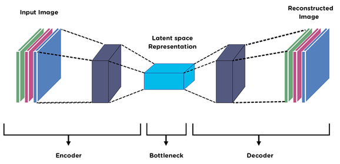
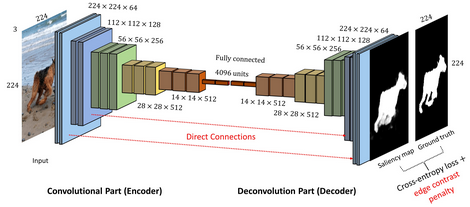
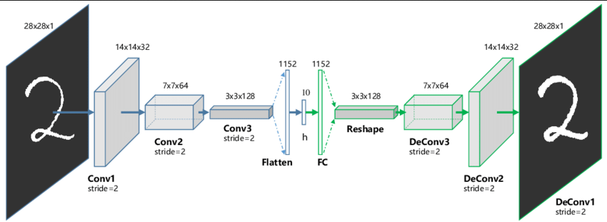

**Main Source:**

- **[Encoder Decoder Network — Computerphile](https://youtu.be/1icvxbAoPWc?si=h_INIqnLio0jnUw6)**
- **[What is an Autoencoder? | Two Minute Papers #86 — Two Minute Papers](https://youtu.be/Rdpbnd0pCiI?si=CxZ0egCEEmxiIAIo)**

**Autoencoder** is a type of [neural network](/deep-learning/neural-network) used for unsupervised learning, where the data doesn't have correct label or output, this makes the model learns the pattern in the data without explicit guidance.

Autoencoder is used to reconstruct input data, given a data, it will be reconstructed for specific purpose such as:

- **Dimensionality Reduction**: Dimensionality reduction is the process of compressing high-dimensional data into a lower-dimensional representation while retaining its important characteristics. For example, in the case of image data, a higher-resolution image can be downscaled into a lower-resolution image without the loss of information.
- **Data Denoising**: When a data is nosied, meaning it has unwanted information, we can reconstruct it to get the clean version of the input data.
- **Anomaly Detection**: In autoencoder, the model know how to reconstruct a data. When an unusual pattern or anomalies exist in the data, the model should be able to identify it.

### Encoder & Decoder

  
Source: https://medium.com/@birla.deepak26/autoencoders-76bb49ae6a8f

Autoencoder network consist of two components:

#### Encoder

Encoder is responsible for taking the input data and transforming it into a lower-dimensional representation, this process is also called **encoding** or **latent space representation**.

The encoder consists of several layers of neural network such as [convolutional neural network](/deep-learning/cnn) that gradually reduce the dimensionality of the input data and capture the essential charateristics. The networks has model's parameters such as weight and bias which will be adjusted later in the learning process. [Activation function](/deep-learning/deep-learning-foundation#activation-function) will also be included inside to introduce non-linearity.

The result of the layers will be flattened and fed into a fully-connected layer, similar to traditional CNN. The output of fully-connected layer is connected to another layer called **bottleneck**, this is where data is represented in latent space.

  
Source: https://www.gabormelli.com/RKB/Convolutional_Autoencoder

#### Decoder

The bottleneck layer which has the lower-dimensional representation of the data serve as the input for the decoder. Decoder is the reverse process of encoder, it has direct connection with it, meaning they will have the identical layers.

From the bottleneck layer, the data is fed into a fully-connected layer and will be reshaped into the same size before it was flattened. Continuing the process, the decoder will have the same convolution layers and if pooling layers were used in the encoder, the reverse process will be done.

The final layer of decoder is responsible for outputting or reconstructing the input data. Keep in mind that because autoencoder is an unsupervised learning, loss calculation will be different with the traditional CNN. The loss will be calculated by comparing the original input data with the reconstructed data. The model will measure how different is the reconstructed data and will adjust its parameters to be able to reconstruct a more similar data.

  
Source: https://analyticsindiamag.com/how-to-implement-convolutional-autoencoder-in-pytorch-with-cuda/
