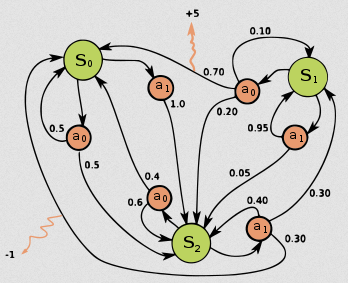

**Main Source:**

- **[Markov decision process — Wikipedia](https://en.wikipedia.org/wiki/Markov_decision_process)**

**Markov Decision Process (MDP)** is a mathematical framework used to model sequential stochastic decision-making problems. MDP extends [Markov chain](/deep-learning/reinforcement-learning/markov-models#markov-chain) to include decision-making, actions, and rewards. Similar to Markov chains, the decision-making process in MDP is operated in a discrete time step.

The environment in a reinforcement learning problem can be modeled in MDP, it will be a stochastic environment where the transition is influenced by probabilistic transitions. The agent that operates in the environment will observe the current state and select which action to take. The environment then transitions to a new state based on the chosen action, and the agent receives a reward or penalty associated with the state transition.

  
Source: https://en.wikipedia.org/wiki/Markov_decision_process

The image above shows an example of an MDP, the green circles are the states, orange circles are the actions, the number in black arrows are the probability of transitioning from one state to another when a specific action is taken, and the orange arrows are the reward and penalty.

For example if we are at state 1 ($S_1$), we can choose to take action 0 ($a_0$) or action 1 ($a_1$). Choosing action 0, there are 3 chances, we can either transition to state 2 ($S_2$) with 0.2 chance or back to state 1 with 0.1 chance or to state 0 ($S_0$), which will give us reward of 5 in the chance of 0.7.

:::tip
MDP is a [model-based](/deep-learning/reinforcement-learning/reinforcement-learning-fundamental#model-based--model-free) technique, meaning we need to know the information about the environment such as the transition probabilities and rewards.
:::

### Component of MDP

An MDP contains four key component, they are represented in 4-tuple ($S, A, P_a, R_a$):

- **[State space ($S$)](/deep-learning/reinforcement-learning/reinforcement-learning-fundamental#state)**: Represent all the possible state in the MDP
- **[Action space ($A$)](/deep-learning/reinforcement-learning/reinforcement-learning-fundamental#action)**: Represent all the possible action the agent can take. Alternatively, $A_s$ represent all the possible action from state $s$.
- **Transition Probabilities ($P_a$)**: A function that defines the probability of transitioning from one state to another when a particular action a is taken. The function is defined as: ${\displaystyle P_{a}(s,s')=\Pr(s_{t+1}=s'\mid s_{t}=s,a_{t}=a)}$, probability transitioning from state $s$ to state $s'$ is equal to the probability of being in state $s'$ at the next time step $t + 1$ given that at current time step $t$, the state is $s$ and action taken is $a$.
- **[Reward Function](/deep-learning/reinforcement-learning/reinforcement-learning-fundamental#reward-return--horizon)**: Which is a function defined as ${\displaystyle R_{a}(s,s')}$, it tells the reward or penalty received for transitioning from state $s$ to $s'$ when action $a$ is chosen.

Last but not least, the [policy function](/deep-learning/reinforcement-learning/reinforcement-learning-fundamental#policy) ($\pi$) (potentially probabilistic) which is a rule that tells the agent what action to take at some specific state.

### Objective

[Similar to the main objective of RL](/deep-learning/reinforcement-learning/reinforcement-learning-fundamental#rl-main-objective), the optimization objective of MDP is to find an optimal policy that maximizes the expected cumulative rewards ([return](/deep-learning/reinforcement-learning/reinforcement-learning-fundamental#reward-return--horizon)) over time. The return can be represented in [value function](/deep-learning/reinforcement-learning/reinforcement-learning-fundamental#value-function) which is a function that tells us the expected return an agent can obtain from a state under a given policy.

The formula are formulated in [Bellman equation](/deep-learning/reinforcement-learning/reinforcement-learning-fundamental#bellman-equation):

- $V(s):= \sum\limits_{s'} P_{\pi(s)} (s,s') \left( R_{\pi(s)} (s,s') + \gamma V(s') \right)$  
  The first formula represent the **value function update**. According to the formula, when calculating the expected return from state $s$, we consider the immediate reward $R_{\pi(s)}(s, s')$ received while transitioning to state $s'$ from state $s$, as well as the discounted future reward from $\gamma V(s')$.

- $\pi ( s ):= \operatorname{argmax}_a \left\{ \sum\limits_{s'} P_a (s , s') \left( R_a (s , s') + \gamma V(s') \right) \right\}$  
  The second formula represent the **policy function update**. It will select the action $a$ that yields the highest return from the value function.

The goal is to find the best value and policy function. In order to achieve this goal, we employ these two formulas to iteratively estimates the value function and policy. The technique to approximate value function is also called **value function approximation**.

:::note
The two formula above with the four in the [Bellman equation](/deep-learning/reinforcement-learning/reinforcement-learning-fundamental#bellman-equation) demonstrate the same usage of Bellman equation to update the value function and policy iteratively.
:::

#### Value & Policy Iteration

Both value and policy iteration are the actual algorithm that uses the formula explained above to solve MDP by estimating the optimal function. It demonstrates **[dynamic programming](/data-structures-and-algorithms/dynamic-programming)** or the technique to solve a problem by breaking it down into smaller subproblem.

The algorithm starts with an initial function and proceeds to iteratively compute it until reaching a point of convergence. The value of a state depends on another state, in other word, a problem depends on another problem, this can be referred as subproblem. This is where dynamic programming comes, we can start solving the subproblem first and then build up to the main problem. When we encounter a subproblem that has already been solved subproblem, we can efficiently use the information we have previously acquired.

The iteration involves updating the estimated value and policy based on the current estimate itself, this is known as **bootstrapping**

:::note
By converge, it means the result stabilizes and does not change abruptly or significantly between iterations.
:::
