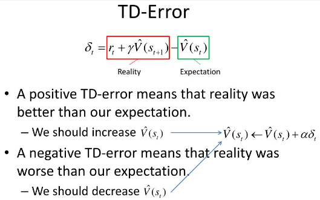

**Main Source:**

- **[Temporal Difference Learning - Reinforcement Learning Chapter 6 — Connor Shorten](https://youtu.be/L64E_NTZJ_0?si=4qVOFTxGu6789Xth)**

**Temporal Difference (TD)** is [model-free](/cs-notes/deep-learning/reinforcement-learning/reinforcement-learning-fundamental#model-based--model-free) method to estimate value of a state or state-action pair in an iterative manner by comparing the current estimate with a newly observed estimate.

TD can be thought as the combination of [MDP](/cs-notes/deep-learning/reinforcement-learning/markov-decision-process) and [Monte Carlo method](/cs-notes/deep-learning/reinforcement-learning/monte-carlo-method), it updates value in iterative manner without the complete knowledge of the environment.

### TD Error

The key idea of TD is by predicting the value and see how wrong is the prediction and use that knowledge to make better prediction. In essence, it is similar to the traditional machine learning algorithm: [linear regression](/cs-notes/machine-learning/linear-regression).

The how wrong our prediction is called **TD error**, it is the difference between our current prediction or estimate for the value with the value we are getting in the current state. The value we are getting in the current state also depends on the value of the next state (similar to MDP).

Here is the formula for TD error:

  
Source: https://www.slideserve.com/menefer/reinforcement-learning-part-2

$r_t$: The immediate reward received after taking an action in the current state.  
$\gamma$: Discount factor.  
$\alpha$: Learning rate.

After calculating the error, we will then update the value with the formula on the right. The formula says that the new value will be the current value plus the error multiplied by some constant called **learning rate**, basically it controls how big do we want to update the value. Value can increase or decrease depending on the TD error, which can be positive or negative. The update process is very similar to [gradient descent](/cs-notes/machine-learning/linear-regression#gradient-descent).
