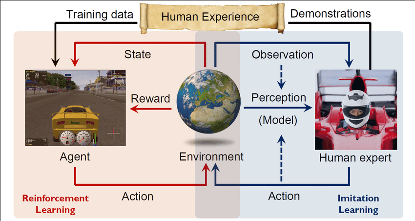

**Main Source:**

- **[A brief overview of Imitation Learning by SmartLab AI — Medium](https://smartlabai.medium.com/a-brief-overview-of-imitation-learning-8a8a75c44a9c)**

**Imitation Learning** is technique where an agent learns a policy by imitating the behavior of an expert. An expert refers to a knowledgeable or skilled agent that already knows how to perform a task. An expert can be another reinforcement learning agent, or a human that provides demonstrations for the learning agent. Instead of doing trial and error exploration, the agent can leverages the knowledge of the expert to accelerate the learning process, this is useful when it is hard to define the desired behavior or reward function.

  
Source: https://www.researchgate.net/figure/The-framework-of-Reinforcement-Learning-Imitation-Learning-and-their-integration-The_fig4_322094035

### Behavioral Cloning

Behavioral cloning is a direct imitation learning technique, it is a simple technique where the agent directly imitating the behavior of an expert. Behavioral cloning is a supervised learning technique where the data is the expert behavior in state-action pair.

The agent can use standard supervised learning architecture such as classifier or regressor, the model will aim to minimize the difference between predicted actions and the expert actions using a loss function.

Behavioral cloning can be beneficial if a well-defined expert demonstration is available, however, this assume the demonstration is optimal or near-optimal so that the agent doesn't replicate the expert's mistakes.

### Inverse Reinforcement Learning (IRL)

In behavioral cloning, the agent imitate the expert behavior. In other word, the agent try to learn its state-action map. On the other hand, **Inverse Reinforcement Learning (IRL)** instead learns the reward function and find the optimal policy that maximizes the reward function.

Same as behavioral cloning, IRL takes state-action pair from the expert, it also assume they are optimal or near optimal behavior. The goal is to infer the reward function that best explains the observed expert behavior. Once the reward function is inferred, the next step is to find the optimal policy. We will then compare the learned policy with the expert's policy.

This process is repeated until the learned policy is close enough to the expert's policy. Overall, IRL is valuable in scenarios where the reward function is hard to define.

An IRL problem can be divided into two, the first case is when we know the environment **(model-based)**, and the other case is when we do not have explicit model of environment **(model-free)**. The model-free case relies on trial and error approach, it can potentially have large state-action spaces.
