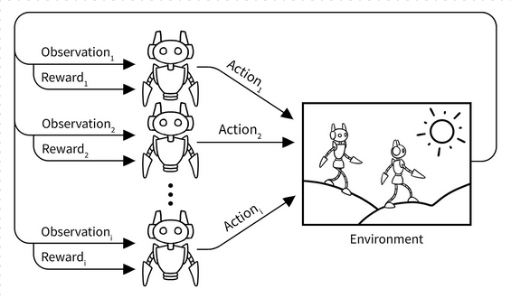
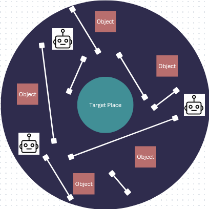

**Main Source:**

- **[Introduction to Multi-Agent Reinforcement Learning — MATLAB](https://youtu.be/qgb0gyrpiGk?si=X7_dix618_wHpfqs)**

**Multi-Agent** is a reinforcement learning settings where there are multiple agents that interact with each other in the environment simultaneously.

Here's an overview how multi-agent RL operates:

- **Environment**: The environment consist of multiple agent that receives observations which can include information about the state of the environment, the actions, state, and reward of other agents. Observations can be either global (shared among all agents), or local (specific to each agent).

- **Policy & Action**: Each agent has its own policy, which can deterministic or stochastic, it determines the agent's behavior in the environment. The actions of each agent can affect the state of the environment and potentially impact the observations and rewards of other agents.

- **Rewards**: Agents receive rewards from the environment based on their actions and the state of the environment. Rewards can be individual rewards specific to each agent, shared rewards that reflect the collective performance of all agents, or a combination of both, depending on the problem.

- **Collaboration**: Depending on the RL problem, the agents can either collaborate, compete, or have mixed interactions with each other.

  
Source: https://towardsdatascience.com/multi-agent-deep-reinforcement-learning-in-15-lines-of-code-using-pettingzoo-e0b963c0820b

### Example

Let's consider an example, a tasks where several robot works together to move object scattered around to a desired place. The objective is to move all the object efficiently. The goal is to teach the robot to not collide with each other while efficiently moving objects to their desired locations in the presence of obstacles.

The action is the movement of the agent (e.g. left, right, up, down) and also manipulating object (e.g. dropping or taking an object). The positive reward is awarded for successful object delivery, collision avoidance, and transportation efficiency, while the negative is the opposite of these.

The agent should have proper coordination in order to efficiently move scattered object. A mechanism like sharing task to each agent can be useful, this will enable them to communicate their intentions to handle specific objects. The agents should prioritize handling objects that are closer to their own positions and allow other agents to handle objects that are further away.

