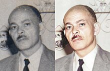
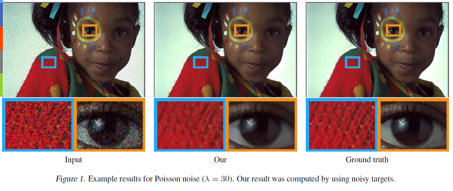

**Main Source:**

- **[Image restoration by artificial intelligence — Wikipedia](https://en.wikipedia.org/wiki/Image_restoration_by_artificial_intelligence)**
- **[Point spread function — Wikipedia](https://en.wikipedia.org/wiki/Point_spread_function)**

**Image restoration** is the process of improving the quality or appearance of a digital image that has been degraded or corrupted. By degradation or corrupted, this means image may have noise, blurring, compression artifacts, or other forms of distortion.

  
Source: https://en.wikipedia.org/wiki/Image_restoration_by_artificial_intelligence

### Unblur

Image restoration works by reversing the corresponding distortion.

For example, if we have a blurred image, it means that the pixel colors are blended or smoothed out with their neighboring pixels, resulting in a loss of sharp edges and fine details. To unblur the image, we can apply a sharpness filter.

To really recover the original image, we will need the appropriate sharpness filter (e.g., how intense our sharpness filter should be). In other word, we will need to figure out what was the method and the parameters likely used to blur the image, such as the blur size, orientation, or intensity, to be able to determine the detail of our sharpness filter.

### Image Restoration by AI

Image can also be restored using AI technology. The AI model will be trained with a large dataset of images that have been labeled with their ground truth (original) state. This allows the algorithms to learn the patterns that are present in natural images and to use this knowledge to restore degraded images.

  
Source: https://developer.nvidia.com/blog/ai-can-now-fix-your-grainy-photos-by-only-looking-at-grainy-photos/
