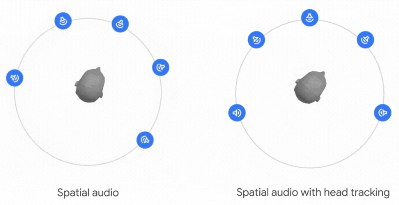
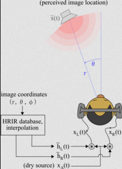

**Main Source:**

- **[Sound effect — Wikipedia](https://en.wikipedia.org/wiki/Sound_effect)**
- **[3D audio effect — Wikipedia](https://en.wikipedia.org/wiki/3D_audio_effect)**

In digital audio processing, **Audio effects** are processing techniques that alter the sound of an audio signal in some way. The purpose is to modify sound characteristic, such as slowing down the sound, creates illusion of sound coming from multiple direction, creates echo or repetition, changing pitch of sound, etc.

Audio effects involve manipulating frequency, amplitude, timing, and characteristics of environment of an audio.

The two types of manipulating audio:

- **Time-based Effects**:

  - **Speed**: Speed is a time-based effect that alters the playback speed of an audio signal. It can be used to make audio playback faster (increasing speed) or slower (decreasing speed).
  - **Echo**: Creates repetitions or delays of the original audio signal. It simulates the sound bouncing off surfaces in a physical space, resulting in audible repetitions of the sound.
  - **Chorus**: Duplicates the original audio signal, slightly varying its pitch and timing. It creates a thicker, richer sound by combining the original signal with these slightly detuned duplicates.
  - **Reverb**: Helps to create simulation for audio playback in physical space, such as a room or a hall. It adds a sense of space, depth, and ambience to the audio signal.
  - **Flanger**: Flanger combines the original audio signal with a delayed and modulated version of itself. It creates a sweeping, whooshing sound with a characteristic "jet-plane" effect.

- **Frequency-based Effects**:

  - **Bass**: Focuses on modifying the low-frequency content of the audio signal. It can involve boosting or cutting specific bass frequencies to enhance or attenuate the low-end response.
  - **Pitch**: Alters the perceived pitch of an audio signal. It can be used to raise or lower the pitch, resulting in a higher or lower sounding audio.
  - **Tempo**: Adjusts the speed or timing of an audio signal without changing its pitch. It can be used to speed up or slow down the tempo of a musical piece or audio recording.
  - **Timbre**: Modifies the tonal quality or character of an audio signal. It involves shaping the frequency response to achieve a desired timbrel characteristic, such as making the sound brighter, warmer, or more mellow.
    

### Spatial Audio

Spatial audio create a three-dimensional sound experience that simulates the perception of sound in physical space. It aims to reproduce sound in a way that resembles how we perceive sound in the real world, including the sense of direction, distance, and location of sound sources.

Spatial audio uses multiple channels (sources) to produce sound. Some techniques to achieve spatial audio:

- **Head Tracking**: Spatial audio uses the device's built-in gyroscope and accelerometer to track the movement of the listener's head. This allows the soundscape to be adjusted in real time to reflect the listener's current position.

  For example, if the listener turns their head to the left, the soundscape will be adjusted so that the sound sources appear to be coming from the left. One way to do this is to delay the sound in the right ears, this will create illusion in human brain as if it's coming from the left.

    
  Source: https://android-developers.googleblog.com/2023/04/delivering-immersive-sound-experience-with-spatial-audio.html

- **Binaural Audio**: Binaural audio is a technique that uses two audio channels to create a sense of depth and space. The two channels are played back through headphones, and the listener's brain interprets the difference in timing and volume between the two channels to create a 3D soundscape.

  Binaural audio can also use sound delay, for example a sound coming from further will perceived later than a closer sound in human ear.

- **Ambisonics**: Ambisonics is a more advanced form of binaural audio that can create a more realistic 3D soundscape. Ambisonics use spherical soundfield. In simple term, the person is simulated in a sphere and a position around listener will have information: horizontal (azimuth), vertical (elevation), and distance (radius) components.

    
   Source: https://en.wikipedia.org/wiki/3D_audio_effect
