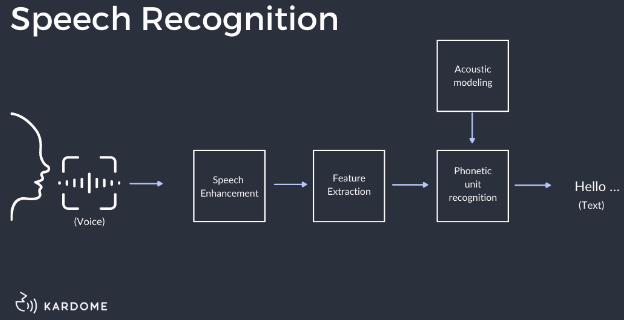

**Main Source:**

- **Various source from Google and YouTube**

**Speech processing** is the analysis, synthesis, and understanding of spoken language. It involves various techniques and algorithms including speech recognition, speech synthesis, speaker recognition, and speech enhancement. Speech processing involves a lot of [machine learning](/cs-notes/machine-learning-intro) and [deep learning](/cs-notes/deep-learning-intro) techniques.

Speech processing involves some steps, here is a high-level overview:

1. **Speech Capturing**: The first thing is to capture the speech sound signal using recording devices like microphone. Analog sound signal will be converted into digital signal using an analog-to-digital converter (ADC).
2. **Pre-processing**: Digital signal is then pre-processed, this may include enhancing quality, such as [filtering](/cs-notes/digital-signal-processing/filtering), [noise reduction](/cs-notes/digital-signal-processing/denoising), and removing unwanted elements like background noise.
3. **Feature Extraction**: Feature extraction means we identify and capture sound characteristics such as loudness, pitch, rhythm. This will be give us more information which will be useful later on.
4. **Speech Recognition**: This is the main process of speech processing, it includes:

   - Acoustics Modeling: Predict the likelihood of a specific word or phrase being spoken given the current state of the audio signal based on probability. For example, in the English language, after a subject is spoken, a verb will have a higher chance than an adjective to be spoken next.
   - Language Modeling: Language modeling uses statistical properties and patterns of natural language to predict the next word or phrase that is likely to be spoken. The machine learning language model is trained a lot of text data.
   - Decoding: In the decoding stage, the acoustic, and language models are combined to find the most likely sequence of words that matches the speech input.

     
   Source: https://www.kardome.com/blog-posts/difference-speech-and-voice-recognition

:::tip
See also [natural language processing (NLP)](/cs-notes/deep-learning/deep-learning-tasks#natural-language-processing-nlp).
:::
